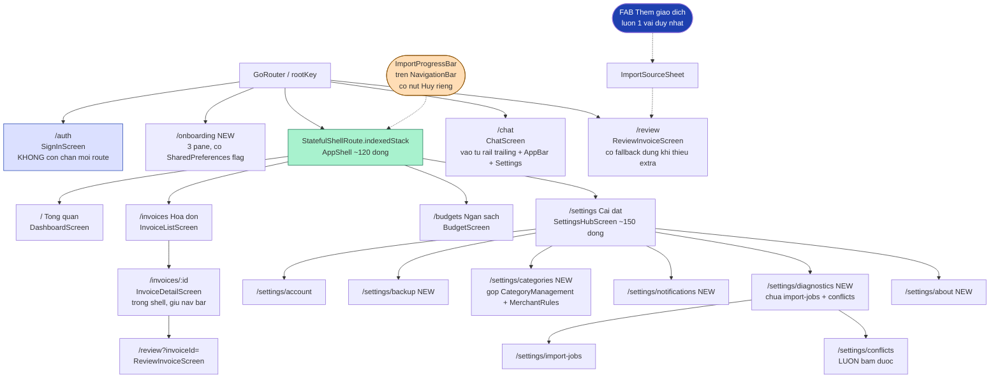
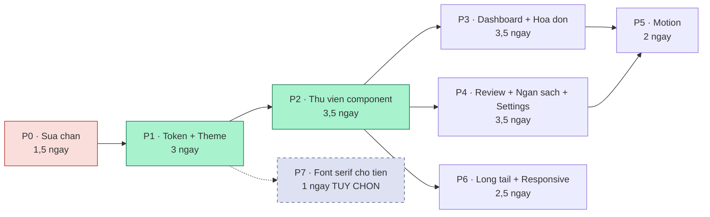

# Kế hoạch Refactor UI/UX — Quản lý Tài chính (`hoadon_insight`)

> **Trạng thái:** Bản kế hoạch để thực thi. Không phải bản triển khai.
> **Phiên bản Flutter:** 3.41.6 (`.fvmrc`, khớp `.github/workflows/ci.yml:20`). Mọi API trong tài liệu này đã được đối chiếu với tag `3.41.6` của SDK.
> **Ngôn ngữ UI:** 100% tiếng Việt. Định danh code, tên file, tên API giữ nguyên tiếng Anh.
> **Mọi tỉ lệ tương phản trong tài liệu này đều được tính bằng công thức WCAG 2.x từ chính các giá trị hex được liệt kê, không phải ước lượng.**

---

## Mục lục

1. [Tóm tắt](#1-tóm-tắt)
2. [Hiện trạng](#2-hiện-trạng)
3. [Định hướng thiết kế](#3-định-hướng-thiết-kế)
4. [Design tokens](#4-design-tokens)
5. [Thư viện component](#5-thư-viện-component)
6. [Kế hoạch từng màn hình](#6-kế-hoạch-từng-màn-hình)
7. [Trạng thái, phản hồi và chuyển động](#7-trạng-thái-phản-hồi-và-chuyển-động)
8. [Khả năng tiếp cận và tiếng Việt](#8-khả-năng-tiếp-cận-và-tiếng-việt)
9. [Responsive và hiệu năng](#9-responsive-và-hiệu-năng)
10. [Lộ trình thực hiện](#10-lộ-trình-thực-hiện)
11. [Kiểm thử và nghiệm thu](#11-kiểm-thử-và-nghiệm-thu)
12. [Rủi ro và quyết định mở](#12-rủi-ro-và-quyết-định-mở)

---

## 1. Tóm tắt

### 1.1. Năm vấn đề lớn nhất hôm nay (số liệu đã đo, không phải cảm tính)

1. **Con số quan trọng nhất trong app không đọc được, ở cả hai theme.** `dashboard_screen.dart:341-346` vẽ gradient `[scheme.primary, scheme.primaryContainer]` rồi đặt cả bốn dòng chữ lên đó bằng `scheme.onPrimary` (`:355, :364, :370, :378`). Đo thực tế: sáng `#FFFFFF` trên `#DDE1FF` = **1.29:1**; tối `#1F2D61` trên `#364379` = **1.39:1**. Tổng chi tháng — thứ duy nhất người dùng mở app để xem — mờ dần về phía dưới-phải của thẻ.

2. **Toàn bộ chrome điều hướng gần như vô hình.** FAB "Thêm giao dịch" (`app_shell.dart:137`) không có `floatingActionButtonTheme` nên rơi về `primaryContainer` mặc định: **1.23:1** so với nền. Pill tab đang chọn dùng `secondaryContainer` mặc định: **1.24:1**. Nhãn tab chọn và không chọn *giống hệt nhau từng byte* vì `app_theme.dart:101` dùng `WidgetStatePropertyAll` chứ không phải `resolveWith`. Thẻ card so với nền: **1.06:1** (sáng) / **1.03:1** (tối), viền duy nhất phân tách chúng ở **1.29:1**.

3. **Theme là nguồn sự thật duy nhất nhưng bản thân nó mâu thuẫn.** `app_theme.dart:9-32` gọi `ColorScheme.fromSeed` rồi ghi đè tay `primary/secondary/tertiary/surface/error` mà bỏ mặc các vai `on*`/`*Container` cho thuật toán. Hệ quả: `tertiary` là xanh lá `#047857` nhưng `tertiaryContainer` là **hồng `#FFD7F4`** — nghĩa là quy tắc "xanh lá cho ngân sách an toàn" trong `IMPLEMENTATION.md` **không thể dựng được** theo cách M3 chuẩn. `_base()` chỉ lấp 5/23 slot component theme; 18 slot còn lại (ListTile 41 chỗ dùng, SnackBar 36, IconButton 20, TextButton 19, Dialog 13, Divider 8, Chip 10…) rơi về mặc định stock.

4. **App có đúng 1 shared widget và 39 private widget bị khoá cứng trong file màn hình.** `lib/shared/widgets/month_selector.dart` (67 dòng) là tất cả. 39 class `_Widget` = 2.029 dòng nằm trong 12 file màn hình. Đo được: 41 lần dựng `Card(`, 8 cách render lỗi khác nhau (chỉ 2 có nút thử lại), 7 kiểu "callout màu" với 5 bán kính bo góc khác nhau (0/12/14/16/20/999), 11 `AlertDialog` tự dựng (chỉ 2/6 dialog phá hủy dùng màu error), 6 kiểu typography cho tiền, 139 `SizedBox` khoảng cách hardcode, 8 giá trị bán kính, 11 giá trị spacing. `_categoryIcon` bị fork thành **3 bản không khớp nhau**: chọn icon `pets`/`home`/`flight`/`fitness_center` thì đúng ở màn Ngân sách nhưng thành ô vuông xám ở Dashboard và Chi tiết hóa đơn.

5. **Không có motion, không có state design, và lỗi kỹ thuật rò ra tận mặt người dùng.** Toàn bộ `lib/` có đúng **một** animation (`chat_screen.dart:312`, một lệnh `animateTo`); 4 tab đều là `NoTransitionPage`. Có **39 chỗ** nội suy thẳng đối tượng exception vào chuỗi tiếng Việt (`'Không thể đồng bộ: $error'`), mà phần lớn throw site là `StateError`/`FormatException`/`PostgrestException` nên người dùng đọc được nguyên văn `Bad state: Cloud sync chưa được cấu hình.` **36 `showSnackBar`, 0 `SnackBarAction`** — không có undo ở bất kỳ đâu, kể cả sau "Đã xóa toàn bộ dữ liệu trên thiết bị." Đổi tháng trên Dashboard thì xoá trắng ~600px xuống còn một spinner 36px.

### 1.2. Sau refactor, app trông và cảm giác thế nào

Một **sổ cái phân tầng (tonal ledger)**: nền giấy trầm, thẻ nổi lên bằng bậc tông màu chứ không bằng viền, một sắc xanh thương hiệu duy nhất được *phân phối có định mức* (tối đa 3 lần xuất hiện mỗi màn hình) đặt đúng chỗ có tiền và có hành động. Số tiền là thứ duy nhất được phép to, luôn dùng chữ số đều bề ngang (`FontFeature.tabularFigures()`) nên cột tiền không còn "nhảy". Các dòng trong danh sách phân tách bằng đường kẻ tóc **thụt lề treo theo cột chữ** (indent 68) thay vì bằng 50 cái thẻ chồng lên nhau. Mọi trạng thái tài chính là bộ ba **(icon + chữ tiếng Việt + màu)** — chụp màn hình đen trắng vẫn đọc được. Hero tháng có một hình khối bo góc bất đối xứng, **chỉ dùng đúng một lần trong toàn app**, để tổng chi có một bóng dáng nhận ra được từ xa. Chuyển tab trượt ngang; chạm một dòng hóa đơn thì chính dòng đó nở ra thành trang chi tiết; tổng tháng đếm lên trong 500ms. Tất cả đều tắt sạch khi hệ điều hành bật giảm chuyển động.

### 1.3. Ước lượng công sức

| Giai đoạn | Nội dung | Ngày công |
|---|---|---|
| P0 | Sửa chặn: auth gate, `PopScope` review, provider `autoDispose` | 1,5 |
| P1 | Token layer + 2 `ColorScheme` + 23 component theme + `ThemeExtension` + test tương phản + `themeModeProvider` | 3 |
| P2 | Thư viện component dùng chung (18 widget) + `ErrorPresenter` | 3,5 |
| P3 | Dashboard + Invoice list + Invoice detail | 3,5 |
| P4 | Review + Budgets + Settings tách trang | 3,5 |
| P5 | Motion + reduced-motion gate + skeleton | 2 |
| P6 | Long tail (chat, import history, conflicts, account) + responsive/tablet | 2,5 |
| P7 *(tuỳ chọn)* | Font serif cho tiền — chỉ sau khi verify U+20AB | 1 |
| | **Tổng** | **~19–21 ngày công** (P7 không tính) |

Cột mốc quan trọng: **hết P1, app đã hết toàn bộ lỗi tương phản nghiêm trọng** mà chưa động vào một file màn hình nào — vì tất cả chúng đều là mặc định `ThemeData`. Đây là lý do chọn định hướng này.

---

## 2. Hiện trạng

Đây là bản audit thật, giữ nguyên bằng chứng `file:line`. Mọi quyết định ở phần sau đều truy ngược về đây.

### 2.1. Design tokens, màu sắc và typography

Cả tầng theme là **một file 107 dòng** (`lib/app/theme/app_theme.dart`) định nghĩa đúng 5 component theme và vá 6/15 vai `TextTheme`. Kỷ luật ở call site thực ra tốt (chỉ 13 dòng trong toàn `lib/` nhắc tới `Color(0x…)`/`Colors.*`, 10 trong số đó nằm ngay trong file theme) — vấn đề không phải là màu bị rải khắp nơi, mà là **nguồn sự thật duy nhất tự mâu thuẫn**.

| Lỗi | Bằng chứng | Đo được |
|---|---|---|
| Hero gradient vs `onPrimary` | `dashboard_screen.dart:341-346`, `:355/:364/:370/:378` | 1.29:1 sáng, 1.39:1 tối |
| `tertiary` xanh nhưng `tertiaryContainer` **hồng** | `app_theme.dart:14` (`tertiary: _accent` = `#047857`), `:27`; container do thuật toán sinh = `#FFD7F4` (HCT H=335.8) | — |
| Thẻ vs nền | `app_theme.dart:38` + `:63` | 1.06:1 sáng, 1.03:1 tối |
| Viền thẻ (thứ duy nhất phân tách) | `app_theme.dart:66` `outlineVariant.withValues(alpha: 0.6)` | 1.29:1 sáng, 1.41:1 tối |
| FAB không được theme | `app_shell.dart:137`; không có `floatingActionButtonTheme` trong `_base()` | 1.23:1 sáng, 1.89:1 tối |
| Nav indicator + nhãn không phân biệt | `app_theme.dart:99-104` dùng `WidgetStatePropertyAll` | 1.24:1 sáng, 1.90:1 tối |
| Bong bóng chat | `chat_screen.dart:352-354` | 1.05:1 sáng, 1.52:1 tối |
| `Colors.green` hardcode | `import_job_history_screen.dart:295` (nhánh duy nhất không dùng theme trong switch) | 2.51:1 trên thẻ sáng |
| Icon trắng trên màu danh mục | `category_management.dart:295-298` với `0xFFCA8A04` | 2.94:1 (cam `0xFFEA580C`: 3.56:1) |

**Không có `ThemeExtension` nào** (`rg -n "ThemeExtension" lib` → rỗng), **không có token spacing/radius/elevation/motion**: 11 độ lớn spacing, 8 bán kính bo góc, 6 kích thước icon rải trên 230 chỗ literal. Không có màu tài chính ngữ nghĩa nên `scheme.tertiary` đồng thời mang ba nghĩa: "ngân sách OK" (`dashboard_screen.dart:431`), "bất thường mức thấp" (`:279`), "đã lên lịch thử lại" (`import_job_history_screen.dart:300`). Cùng một thanh ngân sách được vẽ **cao 10 bo 999** ở Dashboard (`dashboard_screen.dart:427-432`) và **cao 8 bo 8** ở Ngân sách (`budget_screen.dart:268-272`).

Typography: chỉ 6/15 vai được đặt (`app_theme.dart:42-59`) nên `titleLarge` w700 nằm cạnh `titleSmall` mặc định w500. `rg -n "FontFeature|tabular|fontFamily" lib` → **0 kết quả**, trong khi `MoneyFormatter.format` nuôi các cột tiền canh phải ở `invoice_list_screen.dart:398-401` và `dashboard_screen.dart:621-624`. `letterSpacing: -1` trên `displaySmall` (`app_theme.dart:45`) được áp thẳng lên chuỗi `1.234.567 ₫` làm bẹp dấu chấm phân nhóm. `dashboard_screen.dart:353-358` `.toUpperCase()` tiếng Việt rồi `letterSpacing: 1` — đẩy dấu chồng (Ổ, Ệ, Ứ) vào vùng ascender.

`app.dart:17` `themeMode: ThemeMode.system` là **tham chiếu `ThemeMode` duy nhất trong toàn `lib/`** — người dùng không có cách nào chọn sáng/tối, dù màn Cài đặt dài 1.225 dòng và `shared_preferences` đã là dependency.

### 2.2. Kiến trúc thông tin, điều hướng và app shell

Bảng route nhỏ và dễ đọc (9 route), nhưng IA quanh nó mất cân đối và shell là một god-object.

- **[Chặn phát hành]** `app_router.dart:30-31` chặn *mọi* route sau session Supabase, mà `SupabaseBootstrap.clientOrNull` trả `null` khi build không có `--dart-define` — chính xác là cách `ci.yml:27` build APK. Build mặc định redirect về `/auth` vĩnh viễn rồi hiển thị `_ConfigurationMissingCard` (`account_screen.dart:454-465`) **không có nút nào**. Mâu thuẫn trực tiếp với `README.md:28`.
- `app_shell.dart` 460 dòng, trong đó **~300 dòng (`:159-459`)** là file-picking, OCR, quét QR, resume pending import, hẹn giờ retry, điều phối hàng đợi và snackbar — không dòng nào là chrome điều hướng.
- FAB **đổi vai** từ hành động sáng tạo sang phá hủy tại cùng toạ độ (`app_shell.dart:137-147`). Trong batch import, `/review` được push lên root navigator (`:452`) **che chính cái FAB "Hủy"** người dùng cần, còn `import_queue.dart:100` `await onOutcome(...)` khoá cả hàng đợi cho tới khi họ thoát form.
- 4 tab đều `NoTransitionPage` (`app_router.dart:46,55,73,82`) → **motion identity bằng 0**.
- Route `/review` phụ thuộc `state.extra`; khi sai kiểu thì trả `Scaffold` **không có AppBar** (`app_router.dart:115-119`) → không có nút quay lại.
- `review_invoice_screen.dart:333` và `invoice_detail_screen.dart:88` dùng `context.go('/invoices')` sau khi lưu → xoá sạch stack, ném người dùng sang tab khác.
- `grep -rn "PopScope\|canPop\|WillPop" lib/` → **rỗng**. Form review 701 dòng không có bảo vệ thay đổi chưa lưu.
- Scaffold lồng nhau: shell `Scaffold` (`app_shell.dart:100`) + 1 `Scaffold` mỗi màn hình → SnackBar hiển thị ở offset không xác định, FAB không được nâng lên.
- 3 màn hình thật (account, import-jobs, conflicts) chỉ tồn tại dưới Cài đặt; tile conflicts còn `onTap: conflicts.isEmpty ? null` (`settings_screen.dart:245`) nên chỉ tới được đúng lúc đang có xung đột.

### 2.3. Dashboard và trực quan hoá dữ liệu

- Số quan trọng nhất nằm **~270dp** xuống dưới màn hình đầu tiên, sau `SliverAppBar.large` (`:62`, ~152dp cho chữ "Tổng quan" mà nav bar đã nói rồi) và `MonthSelector` (`:78-83`).
- Biểu đồ cột vẽ **chỉ số mảng chứ không phải ngày trong tháng** (`:560-562` `BarChartGroupData(x: index, …)`), mà `dailyTotals` là map thưa (`drift_invoice_repository.dart:821-824` chỉ `GROUP BY day`). Tháng có chi vào ngày 1, 15, 28 sẽ vẽ 3 cột cách đều → **biểu đồ nói dối về thời gian**.
- Chỉ giữ 12 điểm cuối (`:516-518`) trong khi tiêu đề vẫn ghi "Chi tiêu theo ngày"; nhãn semantics `:525-526` báo "Có 12 ngày có chi tiêu" cho tháng có 31 ngày chi.
- Tắt sạch mọi tham chiếu định lượng: `gridData: show:false`, `borderData: show:false`, `leftTitles: showTitles:false` (`:536-548`), `BarTouchData(enabled: true)` **không có `touchTooltipData`** → tooltip mặc định in số `double` thô `1250000.0`.
- `MonthSelector` mở `showDatePicker` cấp *ngày* (`month_selector.dart:58-64`, `firstDate: DateTime(2000)`) rồi vứt bỏ ngày qua `MonthUtils.normalize` — người dùng phải chọn 1 trong 31 ô mà 30 ô bị bỏ qua. Nó cũng là một `Card`, nên **control trông y hệt content**.
- `_CategoryBreakdown` (`:600-630`) không phải trực quan hoá: `ListView.separated` của `ListTile`, không phần trăm, không thanh tỉ trọng, không tổng, **không `onTap`**.
- `MoneyFormatter.format` không có bảo vệ tràn: `displaySmall` 36sp, `w700`, `letterSpacing: -1` trong bề ngang khả dụng ~280dp trên máy 360dp — `1.234.567.890 ₫` (15 glyph) chắc chắn xuống dòng chỉ còn ký hiệu `₫`.
- `progress.clamp(0.0, 1.0)` (`:397`) → 110% và 400% vượt ngân sách trông giống hệt nhau.

### 2.4. Invoice list / detail / review (1.495 dòng)

- Danh sách **sắp xếp theo `updatedAt`** (`drift_invoice_repository.dart:695-698`) nhưng mỗi dòng in `issuedAt` (`invoice_list_screen.dart:358`) → ngày hiển thị lộn xộn, không có control sắp xếp.
- "Tải thêm hóa đơn" (`:112`) tăng `_limit` → đổi key của provider family (`invoice_filters.dart:110` đưa `limit` vào `hashCode`) → provider vào `AsyncValue.loading` → `SliverFillRemaining` spinner toàn màn (`:80-83`) → **scroll về 0**.
- Ô tìm kiếm + 6 chip lọc nằm trong `SliverAppBar.large` không pinned (`:56-78`) → cuộn một đoạn là mất hẳn.
- Phần tử nổi bật nhất mỗi dòng là `CircleAvatar` 48dp mã hoá **phương thức import** (`:368-371`), còn **danh mục — trục tổ chức của toàn bộ ngân sách và dashboard — không xuất hiện**.
- Review 701 dòng: không `PopScope`; `autovalidateMode` không đặt (so với `account_screen.dart:77` đã có); summary lỗi **hardcode đúng 2 thông báo** (`:269-280`) nên lỗi dòng hàng (`:442`) hay tiền (`:611`) làm nút "Xác nhận và lưu" **im lặng không làm gì**; ô tiền hiển thị `1250000` thô (`:46-52`) trong khi hoá đơn giấy in `1.250.000`; `rg "inputFormatters" lib` → **0 kết quả**.
- **Không có ảnh nguồn nào được lưu**: `app_database.dart:9-47` không có cột ảnh, còn `FieldEvidences.rawValue` (`:65-79`) được lưu nhưng **không widget nào trong `lib/` đọc** — trong khi `review_invoice_screen.dart:643` bảo người dùng "hãy đối chiếu".
- `invoice_detail_screen.dart:17-19` tạo `Future` mới **trong `build()`** → mỗi lần `categoriesProvider` phát là màn hình nháy về spinner; không có nhánh `snapshot.hasError` (`:40-49`) → lỗi DB bị báo là "Không tìm thấy hóa đơn."
- `invoice_detail_screen.dart:226-228` in thẳng định danh nội bộ: người dùng đọc `sellerName / IMAGEOCR / 82%`.

### 2.5. Long tail (settings, account, budgets, chat, import history, conflicts) — 3.447 dòng

- `settings_screen.dart` 1.225 dòng: 7 section không liên quan, 27 `ListTile`, 7 `showDialog`, 20 `showSnackBar`, **10 khối try/catch→snackbar copy-paste** (`:305-318, :348-359, :367-390, :400-422, :434-463, :476-529, :533-557, :587-629, :633-650, :658-671`, ~230 dòng). Hành động phá hủy nhất app ("Xóa toàn bộ dữ liệu") là **dòng thứ 3 của card đầu tiên** (`:66-76`), chỉ khác nhau ở màu của icon 24px. 6/27 dòng là văn xuôi không bấm được nhưng trông y hệt dòng điều hướng. Là `ConsumerWidget` stateless → 6 thao tác dài không có phản hồi loading nào.
- `account_screen.dart` vừa là cổng đăng nhập vừa là trang cài đặt; AppBar ghi "Tài khoản và đồng bộ" còn H1 ghi "Đăng nhập Supabase" — tên nhà cung cấp backend là ấn tượng đầu tiên. Một cờ `_busy` duy nhất điều khiển 4 thao tác → bấm "Đổi mật khẩu" thì nút "Đồng bộ ngay" quay (`:265-271` vs `:396`).
- `budget_screen.dart` **không hiển thị chi tiêu theo danh mục** dù `dashboard.categoryTotals` được watch ngay dòng `:18`. Xoá ngân sách **không cần xác nhận** (`:108-116, :134-137`) trong khi xoá một merchant rule thì có dialog. Nhập sai thì nút "Lưu" **không làm gì cả** (`:122-126` `return` trống). Không có tầng cảnh báo 80% dù `budget_alert_policy.dart:23` bắn thông báo ở ngưỡng đó.
- `chat_screen.dart`: empty state là **code chết** (`:198` đảm bảo `_messages.length >= 1`, `:98` không bao giờ chạy); chip gợi ý biến mất vĩnh viễn sau câu hỏi đầu tiên (`:132`); `onChanged: (_) => setState(() {})` (`:170`) dựng lại toàn bộ danh sách tin nhắn mỗi phím; `ChatReply.usedExternalData` được parse (`chat_api_client.dart:71`) và **không nơi nào đọc**.
- `sync_conflicts_screen.dart:165` `static String _money(int value, String currency) => '$value $currency';` → màn hình duy nhất bắt người dùng ra quyết định không thể hoàn tác lại hiển thị `5000000 VND` thay vì `5.000.000 ₫`, và danh mục là id thô `food`. Giải quyết xung đột **tức thì, không xác nhận, không undo** (`:25-36`), và nút "Giữ bản trên máy" là `FilledButton` còn "Dùng bản cloud" là `OutlinedButton` → ngầm khuyến nghị một bên không lý do.
- `import_job_history_screen.dart:171-180` in nguyên văn `job.lastError` (`drift_import_job_store.dart:118` `Value(error.toString())`).
- **Ba** bộ format ngày `dd/MM/yyyy HH:mm` viết tay (`settings_screen.dart:1061-1068`, `sync_conflicts_screen.dart:167-173`, cộng chuỗi `DateFormat` ad-hoc ở `import_job_history_screen.dart:161,167`) trong khi `intl` đã là dependency.

### 2.6. Loading / empty / error / feedback / motion

- 12 surface async đều rơi về 3 primitive: `CircularProgressIndicator` giữa màn, `Text` có `$error`, và đôi khi một thẻ rỗng.
- **39 chỗ** nội suy exception thô vào copy tiếng Việt. `app_exception.dart:8` `String toString() => message;` an toàn, nhưng throw site thật là `StateError` (`sync_gateway.dart:39`), `FormatException` (`qr_scanner_service.dart:16`), `PostgrestException`, `SqliteException`. `app_shell.dart:420-421` còn hiển thị `error.toString()` **trần không có câu nào bọc quanh**.
- **36 `showSnackBar`, 0 `SnackBarAction`, 0 `duration:`, 0 `SnackBarBehavior`, 0 `MaterialBanner`.** `app_shell.dart:456-458` gọi `hideCurrentSnackBar()` trước → 4 file lỗi trong batch thì chỉ thấy cái cuối.
- Cảnh báo trùng hoá đơn — một quyết định người dùng phải đưa ra — được giao bằng SnackBar rồi app điều hướng đi ngay (`app_shell.dart:441-446` → `:452`).
- Tiến trình import duy nhất trong app là **nhãn text của FAB** (`:144-147`); tên file đang xử lý chỉ tới được qua `Tooltip` (`:139-141`) — trên điện thoại phải nhấn giữ, mà nhấn giữ nút đó rất nguy hiểm.
- Đổi tháng → `SliverFillRemaining` spinner (`dashboard_screen.dart:87-91`), layout nhảy hai lần mỗi lần bấm chevron.
- `rg "Animated|Transition|Hero|Tween|AnimationController|Curves\."` → đúng 1 kết quả thật. Không `pageTransitionsTheme`, không `splashFactory`. `rg "disableAnimations|accessibleNavigation" lib` → **0**. `MediaQuery` xuất hiện **đúng 1 lần** trong toàn app (`app_shell.dart:97`, chỉ để lấy width).
- `RefreshIndicator` tồn tại ở **đúng 1 màn hình** — và là màn hình ít quan trọng nhất (`import_job_history_screen.dart:51`).

### 2.7. Khả năng tiếp cận và tiếng Việt

- Không có `flutter_localizations` (`pubspec.yaml:30-56`), `rg "localizationsDelegates|supportedLocales" lib` → **0**. `showDatePicker` (`month_selector.dart:58-64`) render chrome tiếng Anh và tuần bắt đầu **Chủ nhật** trong một app thuần Việt; chỉ mỗi `helpText` là tiếng Việt.
- 12 `ChoiceChip` icon trong trình sửa danh mục **không có tên khả truy cập nào** (`category_management.dart:219-224`); 8 ô màu đều đọc lên cùng một câu `'Chọn màu'` (`:236-251`) và chỉ cao **40dp**, dưới ngưỡng 48dp mà `IMPLEMENTATION.md` tuyên bố là ràng buộc.
- `navigationBarTheme.height: 72` (`app_theme.dart:100`) thấp hơn mặc định M3 **80dp** đúng bằng phần dư mà bộ kẹp `_kMaxLabelTextScaleFactor = 1.3` của Flutter cần.
- Nhãn trục ngày của fl_chart không đặt `reservedSize` (`dashboard_screen.dart:549-557`) — mặc định 22dp, trong khi nhãn `bodySmall` cao 21dp @1.3 và 26dp @1.6, cộng 6dp padding → **cắt cụt từ textScale 1.3**.
- Chip gợi ý chat bị kẹp cứng 40dp ở **mọi** textScale (`chat_screen.dart:139-150`, `SizedBox(height: 48)` trừ padding).
- Ba `Row` không có `Flexible`/`Expanded` → chắc chắn `RenderFlex overflow` khi tăng cỡ chữ: `budget_screen.dart:234-245`, `invoice_list_screen.dart:399-403`, `import_job_history_screen.dart:147-155`.
- `rg "liveRegion" lib` → 4 kết quả; summary validation live-region thật chỉ có ở **1/9 màn hình** (`review_invoice_screen.dart:666`). Dialog ngân sách và dialog danh mục fail **im lặng**.
- 6 `Semantics` wrapper **làm xấu đi** trải nghiệm screen reader vì thiếu `excludeSemantics` (TalkBack đọc "Chọn Tháng 09 2026, Tháng 09 2026, nút").
- `dashboard_screen.dart:301-307` cố tình opt-out 48dp: `minimumSize: const Size(0, 32)` + `tapTargetSize: shrinkWrap` cho nút bỏ cảnh báo.

### 2.8. Trùng lặp component

| Chỉ số | Giá trị |
|---|---|
| Shared widget | **1** (`month_selector.dart`) |
| Private `_Widget` class | 39 (2.029 dòng) trong 12 file |
| `Card(` dựng tay | 41 |
| Cách render lỗi | 8 (2 có retry) |
| Empty state | 5 (3 cỡ icon khác nhau) |
| Callout màu | 7 (5 bán kính) |
| `AlertDialog` tự dựng | 11 (5 có `icon:`, 6 không → M3 canh giữa/canh trái lẫn lộn) |
| Typography cho tiền | 6 |
| `SizedBox` spacing hardcode | 139 |
| `Theme.of(` call | 110 |
| Bản `_categoryIcon` | 3 (không khớp nhau) |
| Bản `_findCategory` | 4 (2 bản `where().firstOrNull` chạy trong `itemBuilder`) |

### 2.9. Responsive, nền tảng, hiệu năng

- `rg "MediaQuery" lib` → **1**; `rg "LayoutBuilder"` → **0**. Breakpoint duy nhất là literal `840` inline (`app_shell.dart:98`).
- Trên >840dp mọi màn hình tab vẫn giữ layout điện thoại và giãn hết bề ngang: `maxWidth` duy nhất trong tầng feature là `BoxConstraints(maxWidth: 560)` ở `account_screen.dart:44`. Trên cửa sổ web 1440dp, một `ListTile` Cài đặt rộng ~1300dp.
- `SafeArea` bị đặt **ngược**: bọc body (`app_shell.dart:101`) nên cướp mất inset status bar của 4 `SliverAppBar.large`, còn `NavigationBar` (`:130`) và FAB (`:137`) lại nằm ngoài.
- Padding đáy `112` hardcode ở 3 màn hình nhưng ở chế độ rail **không có nav bar** (`:130-131`) → thừa 112dp chết.
- Web là target đã ship (`web/drift_worker.js`, `web/sqlite3.wasm`) mà CI **không build** (`ci.yml:24` chỉ `flutter build apk --debug`) và **ném lỗi ngay frame đầu** vì `_resumePendingImports()` (`app_shell.dart:40`) đi qua `dart:io` + `path_provider`.
- `rg "autoDispose" lib` → **0**. `filteredInvoiceSummariesProvider` (`app_providers.dart:210-215`) là family key theo `(filter, limit)` → mỗi chuỗi tìm kiếm để lại một drift `.watch()` sống mãi.
- Dashboard watch 6 provider ở cấp màn hình (`:51-58`) rồi đổ vào `SliverList.list` (`:98`) dựng eager → tắt một cảnh báo bất thường là dựng lại `_DailyChart` và re-animate 12 cột.
- Điểm sáng: **0 `BoxShadow`, 0 `BackdropFilter`, 0 `ClipRRect`** trong `lib/` hôm nay. Đây là lợi thế cần được bảo vệ bằng văn bản.

---

## 3. Định hướng thiết kế

### 3.1. Bảng điểm hội đồng (nguyên văn, để kiểm toán được)

Ba định hướng đã được đề xuất và chấm bởi ba giám khảo với ba lăng kính khác nhau (craft / engineer / a11y). Thang 10 cho mỗi tiêu chí.

| Định hướng | Giám khảo | beauty | finance-fit | a11y | feasibility | vietnamese | **Tổng** |
|---|---|---|---|---|---|---|---|
| **Tonal Ledger** | craft | 8 | 9 | 9 | 10 | 8 | **44** |
| | engineer | 7 | 8 | 9 | 10 | 8 | **42** |
| | a11y | 6 | 7 | 6 | 10 | 6 | **35** |
| | | | | | | | **121/150** |
| **Giấy & Mực** | craft | 9 | 7 | 8 | 5 | 8 | **37** |
| | engineer | 9 | 9 | 7 | 5 | 9 | **39** |
| | a11y | 9 | 8 | 6 | 5 | 9 | **37** |
| | | | | | | | **113/150** |
| **Vault — Kho báu** | craft | 7 | 7 | 7 | 5 | 8 | **34** |
| | engineer | 8 | 8 | 8 | 6 | 9 | **39** |
| | a11y | 8 | 9 | 9 | 7 | 9 | **42** |
| | | | | | | | **115/150** |

Phiếu nhất: **Tonal Ledger 2**, Vault 1. → **Người thắng: Tonal Ledger (121/150).**

### 3.2. Hội đồng đã chia rẽ, và sự chia rẽ đó là tín hiệu

Giám khảo **a11y bất đồng** và chọn *Vault*. Lý do của họ rất cụ thể và không thể phủ nhận: **dòng hóa đơn là một tap target, nên biên của nó phải đạt 3:1 theo WCAG 1.4.11.** Tonal Ledger bản gốc bỏ hẳn viền thẻ và chỉ dựa vào chênh lệch tông 1.21:1 (sáng) / 1.17:1 (tối), rồi lập luận rằng 1.4.11 không áp dụng cho "container được nhận diện bằng nội dung của nó" — lập luận đó **không đứng vững với một tap target**. Vault là định hướng duy nhất cho mọi thẻ một viền `outline` ở độ mờ đầy đủ và đo được 3.28–3.97:1 ở cả bốn tổ hợp.

Đồng thời, giám khảo **craft** — dù bỏ phiếu cho Tonal Ledger — nói thẳng rằng bản gốc "sẽ ship một app M3 tốt chứ không phải một app đáng nhớ", và đó chính là yêu cầu thật của người dùng: *"làm cho nó thật đẹp mắt"*. Một kế hoạch thắng nhờ khả thi mà thua về cái đẹp là một kế hoạch thất bại.

**Cách kế hoạch này hấp thụ cả hai:**

- **Với a11y (Vault):** quy tắc biên được viết lại thành một điều kiện có thể kiểm toán, không phải một lập luận — xem §3.4 "Quy tắc biên thẻ". Mọi tap target không phải là dòng trong danh sách có divider đều **bắt buộc** mang viền `outline` 1px (3.68:1 sáng / 5.20:1 tối). Ngoài ra ghép nguyên 6 ý khác của Vault: đuôi tràn ngân sách + vạch nhịp "hôm nay", `CategoryPalette` suy dẫn theo brightness, test tabular-figures bằng `TextPainter`, `themeModeProvider` ngay ở P1, cấm `BackdropFilter` bằng văn bản trong file token, và vendor font bằng asset chứ không bao giờ dùng `google_fonts`.
- **Với craft (Giấy & Mực):** ghép 7 ý làm nên *giọng nói* của app — `expense` là mực chứ không phải màu, quy tắc **định mức accent tối đa 3 lần/màn hình**, kẻ tóc thụt lề treo indent 68 đặt trong `DividerThemeData`, nhãn lề (eyebrow) trên mọi con số, biểu đồ **đường cộng dồn** thay cột (đường so sánh phân biệt bằng *kiểu nét đứt* chứ không bằng màu), constructor `StatusPill` bắt buộc icon + nhãn nên **không thể** ship trạng thái chỉ-bằng-màu, và font serif cho tiền như một nâng cấp P7 tuỳ chọn.

**Anti-graft có chủ đích:** **không** lấy "bloom breath" của Vault (một `AnimationController` lặp 6 giây trên màn hình chính). Vault tự bác bỏ shimmer vì animation lặp vô hạn làm `pumpAndSettle()` treo, rồi lại ship một animation lặp vô hạn ngay trên home route. Hai test hiện có đã gọi `pumpAndSettle` (`review_invoice_screen_test.dart:37`, `sync_conflicts_screen_test.dart:45`).

### 3.3. Luận điểm

> App này **đã là** Material 3 — nó chỉ đang chạy M3 ở khoảng 20% công suất, và mọi thứ xấu xí đều là triệu chứng của điều đó.

`app_theme.dart` gọi `ColorScheme.fromSeed` rồi ghi đè 5 vai mà bỏ mặc bạn đời `on*`/`*Container` của chúng (đó chính xác là lý do `tertiary` xanh còn `tertiaryContainer` hồng); nó lấp 5/23 slot component theme; dùng 2/15 vai surface; dùng 0/12 vai `*Fixed`; không khai báo `pageTransitionsTheme`, không `ThemeExtension`.

Cách sửa **không phải** là dựng một design system riêng đè lên trên — đó là thêm ~1.150 dòng shared widget mà vẫn đứng trên một `ColorScheme` mâu thuẫn. Cách sửa là **cam kết với M3 một cách trọn vẹn**: hai `ColorScheme` khai báo tay đủ 30 vai cho mỗi brightness, dùng thang `surfaceContainerLowest…Highest` làm **cơ chế độ sâu duy nhất**, lấp toàn bộ 23 component theme trong một file, dùng bốn cấp nút để mang bốn ý nghĩa khác nhau, và nối hệ motion M3 thật (`Durations` + `Easing` + `PageTransitionsTheme`).

Lý do thực dụng quyết định: **~70% phát hiện của bản audit là sửa `ThemeData`** — nav indicator, FAB, phân tách thẻ, bong bóng chat, drift của dialog/snackbar/chip, focus ring, tap target 48dp, motion — sửa ở một file và có hiệu lực trên 100+ call site mà không đụng vào một màn hình nào.

### 3.4. Bảy nguyên tắc thiết kế

1. **Độ sâu đến từ tông màu, không từ viền và không từ đổ bóng.** Bốn cấp surface, mỗi cấp một nhiệm vụ (§4.3). Thẻ nội dung tĩnh **không có viền**: 1.21:1 (sáng) / 1.17:1 (tối) — gấp đôi hiện tại. `elevation` chỉ dùng đúng 3 chỗ, tất cả đều M3-native.

2. **Quy tắc biên thẻ (giải quyết bất đồng của giám khảo a11y).** Đây là tiêu chí nghiệm thu, không phải gợi ý:
   > *Mọi surface có thể chạm mà **không phải** là một dòng trong danh sách có divider đều **bắt buộc** có biên ≥3:1.*

   Cụ thể: `AppCard(onTap: …)` tự động thêm `BorderSide(color: scheme.outline, width: 1)` → **3.68:1** so với nền sáng, **5.20:1** so với thẻ tối. Thẻ tĩnh (hero, biểu đồ, section settings) giữ borderless. Dòng danh sách nằm trong một thẻ chung, phân tách bằng divider thụt lề treo — đây là mẫu list chuẩn của Material và biên của nó được nhận diện bởi divider + nội dung.

3. **Accent có định mức.** `primary` được xuất hiện **tối đa 3 lần mỗi màn hình**: pill tab đang chọn, một hành động cam kết duy nhất, và một dấu dữ liệu. Panel thông tin dùng `surfaceContainerHigh` + chữ mực, **không** dùng `primaryContainer`. Ngoại lệ được ghi rõ duy nhất: bong bóng tin nhắn của người dùng trong màn Chat (§6.9) — ở đó `primary` *là* dấu dữ liệu.

4. **Chi tiêu là mực, không phải màu.** `expense` map sang `onSurface` (17.14:1 sáng / 12.70:1 tối), không phải xanh thương hiệu. Tiêu tiền là *chủ ngữ mặc định* của app, không phải một cảnh báo. Màu error chỉ dành cho lỗi và hành động phá hủy — đúng như `IMPLEMENTATION.md` đã cam kết.

5. **Ngữ nghĩa là bộ ba, không bao giờ là màu.** `StatusPill` và `BudgetMeter` nhận `(IconData glyph, String label, Tone tone)` với `glyph` và `label` là **tham số bắt buộc** — không có đường đi nào qua API cho phép chỉ-màu. Tiêu chí nghiệm thu: chụp màn hình đen trắng, mọi trạng thái vẫn đọc được.

6. **Một hình khối biểu cảm, tiêu đúng một lần.** Hero Dashboard là surface duy nhất trong app có bán kính bất đối xứng (28/8/28/28). Hình khối biểu cảm chỉ biểu cảm khi nó khan hiếm.

7. **Kỹ thuật đắt tiền bị cấm bằng văn bản.** Không `BackdropFilter`, không `ImageFilter.blur`, không `ClipRRect` bọc nội dung cuộn, không `AnimationController` lặp vô hạn trên home route. Điều cấm này được viết vào doc comment của `lib/app/theme/app_tokens.dart` để nó sống sót qua thay đổi nhân sự.

### 3.5. Giải quyết mâu thuẫn MASTER.md ↔ IMPLEMENTATION.md

Đây là tranh chấp đang mở trong repo và kế hoạch này đóng nó lại.

| | `design-system/hoadon-insight/MASTER.md` (232 dòng) | `design-system/hoadon-insight/IMPLEMENTATION.md` (5 dòng) |
|---|---|---|
| Bản chất | Template **web** tự sinh: `@import` Google Fonts, glassmorphism blur 10–20px, GSAP ScrollTrigger, pattern trang "Product Demo + Features" | Quyết định kỹ thuật có chủ đích cho **production Flutter** |
| Font | Caveat (viết tay) + Quicksand | System sans-serif, vì chữ Việt ổn định trên Android/iOS |
| Vấn đề | Tự mâu thuẫn checklist của chính nó (`:213` đòi 4.5:1 nhưng `White on Accent #059669` = 3.77:1); không có palette cho theme sáng mà app đang ship | Không có bảng token, không có giá trị hex nào |

**Phán quyết:**

- `IMPLEMENTATION.md` là **ràng buộc**. Sáu cam kết của nó (48dp, label luôn hiện, validation inline + summary live-region, màu không bao giờ là tín hiệu duy nhất, NavigationBar/NavigationRail responsive, loading/empty/error/recovery, motion tiết chế) trở thành tiêu chí nghiệm thu ở §8 và §11.
- `MASTER.md` là **input về tâm trạng, không phải luật**. Giữ lại: xanh tin cậy + xanh lá lợi nhuận, cảm giác phân tầng, nền trầm cho theme tối. Bác bỏ dứt khoát: Caveat/Quicksand (không có phủ chữ Việt đáng tin, và không có đường ship trong app này), glassmorphism/`BackdropFilter`, GSAP, mọi giá trị CSS.
- **Nguồn sự thật mới là code**: `lib/app/theme/app_tokens.dart` + `app_color_schemes.dart` + `finance_colors.dart` + `app_theme.dart`. Một file `design-system/hoadon-insight/TOKENS.md` sinh ra từ chúng (§10, P1) liệt kê mọi vai `ColorScheme` cho cả hai brightness, thang spacing/radius/icon, các quad tài chính, và **tỉ lệ tương phản đo được cho từng cặp**. `MASTER.md` được thêm banner ở đầu file: *"Tài liệu tham khảo lịch sử. Nguồn sự thật production là `design-system/hoadon-insight/TOKENS.md`."*

### 3.6. Hai đính chính về sự thật (đã verify trên SDK 3.41.6)

Trong quá trình thẩm định, hai lỗi đã được phát hiện và kế hoạch này dùng **giá trị đã sửa**:

1. **`Easing.emphasized` KHÔNG tồn tại trong Flutter 3.41.6.** `packages/flutter/lib/src/material/motion.dart` chỉ có `emphasizedAccelerate`, `emphasizedDecelerate`, `linear`, `standard`, `standardAccelerate`, `standardDecelerate`, `legacy*`. Đường cong "emphasized" đầy đủ của M3 nằm ở **`Curves.easeInOutCubicEmphasized`** (một `ThreePointCubic`, `curves.dart:1772`). Mọi chỗ trong kế hoạch này dùng tên đã sửa.
2. **Tỉ lệ thanh ngân sách vs track trong bản đề xuất gốc bị lạc quan ~8%.** Giá trị đo lại: sáng safe **4.54:1**, warn **4.72:1**, over **4.75:1** (không phải 4.93/5.13/5.15). Vẫn vượt ngưỡng 3:1 cho chỉ báo phi văn bản, nhưng bảng token dùng số đúng.

Ba đính chính khác theo hướng tích cực (đã verify, nên kế hoạch **dùng được ngay** thay vì phòng hờ):

3. `RoundedSuperellipseBorder` **có** trong 3.41.6 (`painting/rounded_rectangle_border.dart:226`) → nâng cấp squircle khả dụng ngay, không phải suy đoán.
4. `ProgressIndicatorThemeData.borderRadius` **có** (`progress_indicator_theme.dart:88`) → một thanh ngân sách duy nhất định nghĩa ở theme, không cần truyền `borderRadius` từng call site.
5. **Roboto bundled của Flutter đã đủ tiếng Việt và đã có `tnum`.** Kiểm tra bằng fontTools trên `bin/cache/artifacts/material_fonts/roboto-regular.ttf`: phủ **90/90** codepoint U+1EA0–1EF9, có U+01A0/01A1/01AF/01B0 (Ơơ Ưư), U+0110/0111 (Đđ), U+0102/0103 (Ăă), U+20AB (₫); danh sách feature GSUB có `tnum`, `ccmp`, `locl`, `liga`, `kern`. → **Chữ Việt đúng và cột tiền không nhảy đều tốn 0 asset ở ngày đầu tiên.** (Lưu ý cho P7: GPOS của Roboto chỉ có `cpsp` và `kern`, **không** có `mark`/`mkmk` — nó dựa hoàn toàn vào glyph tiền-kết-hợp. Bất kỳ font vendor nào cũng phải hoặc giữ glyph tiền-kết-hợp, hoặc giữ nguyên bảng `mark`/`mkmk`.)

---

## 4. Design tokens

Sáu file thay thế hoàn toàn `lib/app/theme/app_theme.dart` hiện tại (107 dòng, 5 component theme):

```
lib/app/theme/app_tokens.dart          (NEW) — spacing, radii, icon, elevation, motion, quy tắc cấm
lib/app/theme/app_color_schemes.dart   (NEW) — hai const ColorScheme, đủ 30 vai
lib/app/theme/finance_colors.dart      (NEW) — ThemeExtension: quad tài chính + style tiền
lib/app/theme/category_palette.dart    (NEW) — suy dẫn màu danh mục theo brightness
lib/app/theme/app_theme.dart           (REWRITE) — 23 component theme
lib/app/theme/theme_mode_provider.dart (NEW) — người dùng chọn sáng/tối/hệ thống
```

### 4.1. `lib/app/theme/app_tokens.dart` (NEW)

```dart
import 'package:flutter/material.dart';

/// Nguồn sự thật duy nhất cho spacing, bo góc, kích thước icon, độ nổi và motion.
///
/// ## Kỹ thuật bị cấm trong toàn bộ lib/ — điều khoản có hiệu lực, không phải gợi ý
///
/// Repo này hôm nay có 0 `BoxShadow`, 0 `BackdropFilter`, 0 `ClipRRect`. Đó là
/// lợi thế hiệu năng trên máy Android tầm trung (Mali-G52 / Snapdragon 680) và
/// nó phải được giữ. KHÔNG được thêm:
///
/// * `BackdropFilter` / `ImageFilter.blur` — mỗi rect bị blur là một lần render
///   offscreen toàn màn hình mỗi frame. Cách nhanh nhất để mất 60fps.
/// * `ClipRRect` bọc nội dung cuộn — buộc `saveLayer` trên mỗi frame cuộn.
/// * `AnimationController` lặp vô hạn trên route thường trực (Dashboard, danh
///   sách hóa đơn). Ngoài chi phí GPU, nó làm `tester.pumpAndSettle()` treo —
///   hai test hiện có đã gọi hàm đó.
/// * `shimmer` / `skeletonizer` — cùng lý do. Skeleton trong app này là khối
///   tĩnh `surfaceContainerHigh`, crossfade bằng `AnimatedSwitcher`.
///
/// Nếu thiết kế đòi cảm giác "kính mờ", câu trả lời là `LinearGradient` dọc ~4%
/// trong `ShapeDecoration` (miễn phí về shader), không phải blur.
abstract final class AppSpacing {
  /// Lưới 4pt nghiêm ngặt. Thay 11 độ lớn spacing và 139 `SizedBox` hardcode.
  static const double xs = 4;
  static const double sm = 8;
  static const double md = 12;
  static const double lg = 16;
  static const double xl = 24;
  static const double xxl = 32;

  /// Khoảng cách giữa hai section trên cùng một trang cuộn.
  static const double section = 40;

  /// Lề ngang của trang. Rộng hơn 16 hiện tại — lề rộng là cách rẻ nhất để
  /// trông đắt tiền.
  static const double gutter = 20;

  /// Thụt lề kẻ tóc trong danh sách: canh theo CỘT CHỮ, không theo avatar.
  /// = gutter(20) + avatar(40) + gap(8). Đây là "hanging indent" của nghề in.
  static const double dividerIndent = 68;
}

abstract final class AppShapes {
  static const double xs = 8;  // chip dày đặc, đầu cột biểu đồ
  static const double sm = 12; // input, button, ink của list tile, snackbar
  static const double md = 20; // thẻ, dialog, menu (M3 "large")
  static const double lg = 28; // bottom sheet, hero (M3 "extra-large")

  static const BorderRadius cardRadius = BorderRadius.all(Radius.circular(md));
  static const BorderRadius controlRadius =
      BorderRadius.all(Radius.circular(sm));

  static const RoundedRectangleBorder card =
      RoundedRectangleBorder(borderRadius: cardRadius);
  static const RoundedRectangleBorder control =
      RoundedRectangleBorder(borderRadius: controlRadius);
  static const RoundedRectangleBorder sheet = RoundedRectangleBorder(
    borderRadius: BorderRadius.vertical(top: Radius.circular(lg)),
  );

  /// Hình khối biểu cảm DUY NHẤT trong app. Chỉ dùng cho hero Dashboard.
  /// Nó chỉ biểu cảm khi nó khan hiếm — đừng dùng ở chỗ thứ hai.
  static const RoundedRectangleBorder hero = RoundedRectangleBorder(
    borderRadius: BorderRadius.only(
      topLeft: Radius.circular(lg),
      topRight: Radius.circular(xs),
      bottomLeft: Radius.circular(lg),
      bottomRight: Radius.circular(lg),
    ),
  );

  /// Nav indicator, badge, thanh tiến trình — thay cho `circular(999)`.
  static const StadiumBorder pill = StadiumBorder();
}

abstract final class AppIconSizes {
  static const double sm = 18; // inline cùng dòng chữ
  static const double md = 22; // leading của list, action của app bar
  static const double lg = 44; // empty state
}

abstract final class AppElevations {
  /// Độ nổi chỉ dùng đúng ba chỗ, tất cả M3-native: NavigationBar (để có
  /// scroll-under tint), FAB, và AppBar khi cuộn.
  static const double none = 0;
  static const double raised = 3;
  static const double raisedHover = 4;
}

/// Token motion. Mọi `duration:` phải đi qua `AppMotion.of(context, ...)`.
abstract final class AppMotion {
  static const Duration fast = Durations.short4;   // 200ms — crossfade trạng thái
  static const Duration base = Durations.medium2;  // 300ms — chuyển tab
  static const Duration page = Durations.medium4;  // 400ms — push/pop, container transform
  static const Duration slow = Durations.long2;    // 500ms — đếm số, thanh ngân sách

  static const Curve enter = Easing.emphasizedDecelerate;
  static const Curve exit = Easing.emphasizedAccelerate;
  static const Curve standard = Easing.standard;

  /// LƯU Ý: `Easing.emphasized` KHÔNG tồn tại trong Flutter 3.41.6.
  /// Đường cong "emphasized" đầy đủ của M3 là `Curves.easeInOutCubicEmphasized`
  /// (một `ThreePointCubic`). Dùng hằng số này, đừng gõ `Easing.emphasized`.
  static const Curve emphasized = Curves.easeInOutCubicEmphasized;

  /// Cổng giảm chuyển động. SHIP TRƯỚC khi thêm bất kỳ animation nào.
  static bool isReduced(BuildContext context) =>
      MediaQuery.disableAnimationsOf(context) ||
      MediaQuery.accessibleNavigationOf(context);

  static Duration of(BuildContext context, Duration duration) =>
      isReduced(context) ? Duration.zero : duration;
}

abstract final class AppBreakpoints {
  static const double compact = 600;   // điện thoại
  static const double medium = 840;    // tablet dọc / foldable mở -> NavigationRail
  static const double expanded = 1240; // desktop / web rộng

  /// Bề rộng đọc tối đa cho nội dung một cột. Không có ràng buộc này thì một
  /// `ListTile` Cài đặt rộng ~1300dp trên cửa sổ web 1440dp.
  static const double readingWidth = 720;
  static const double twoColumnWidth = 1200;

  static bool useRail(double width) => width >= medium;
}

/// L1/L2/L3 — dùng extension này, đừng gõ thẳng vai `surfaceContainer*`.
extension AppSurfaces on ColorScheme {
  /// L1 — nền thẻ. Bất đối xứng có chủ đích giữa hai brightness.
  Color get cardSurface =>
      brightness == Brightness.light ? surfaceContainerLowest : surfaceContainer;

  /// L2 — lõm bên trong thẻ.
  Color get insetSurface => surfaceContainerHigh;

  /// L3 — nổi lên trên thẻ.
  Color get liftedSurface => surfaceContainerHighest;
}
```

### 4.2. `lib/app/theme/app_color_schemes.dart` (NEW)

Bỏ hẳn `ColorScheme.fromSeed` + ghi đè. Ghi đè lẻ chính là gốc rễ của bug `tertiary` xanh / `tertiaryContainer` hồng.

```dart
import 'package:flutter/material.dart';

/// Hai ColorScheme hand-paired. KHÔNG dùng `ColorScheme.fromSeed` ở đây.
///
/// `fromSeed` + ghi đè lẻ là nguyên nhân gốc của bug hiện tại: `tertiary` được
/// ghi đè thành xanh lá #047857 trong khi `tertiaryContainer` do thuật toán
/// sinh ra là HỒNG #FFD7F4 (HCT hue 335.8). Ghi đè lẻ làm mồ côi cả họ vai.
///
/// Đổi màu thương hiệu về sau: chạy `dart tool/dump_scheme.dart` để sinh lại bộ
/// khung, sửa tay tầng neutral và họ tertiary, rồi chạy
/// `flutter test test/app/theme/theme_contrast_test.dart`.
abstract final class AppColorSchemes {
  static const light = ColorScheme(
    brightness: Brightness.light,

    // --- Thương hiệu: giữ #1E40AF, giờ có đủ bạn đời ---
    primary: Color(0xFF1E40AF),
    onPrimary: Color(0xFFFFFFFF),                 // 8.72:1
    primaryContainer: Color(0xFFDBE0FF),
    onPrimaryContainer: Color(0xFF0E1A54),        // 12.45:1
    primaryFixed: Color(0xFFDBE0FF),
    primaryFixedDim: Color(0xFFB9C3FF),
    onPrimaryFixed: Color(0xFF0E1A54),
    onPrimaryFixedVariant: Color(0xFF2A50CC),     // = điểm cuối gradient hero

    secondary: Color(0xFF4A5578),
    onSecondary: Color(0xFFFFFFFF),               // 7.34:1
    secondaryContainer: Color(0xFFDDE1F2),
    onSecondaryContainer: Color(0xFF131B33),      // 13.09:1

    // --- Xanh tài chính: giờ là một HỌ mạch lạc ---
    tertiary: Color(0xFF0F6E4C),
    onTertiary: Color(0xFFFFFFFF),                // 6.26:1
    tertiaryContainer: Color(0xFFA8F2CE),
    onTertiaryContainer: Color(0xFF00351F),       // 10.63:1

    error: Color(0xFFB3261E),
    onError: Color(0xFFFFFFFF),                   // 6.54:1
    errorContainer: Color(0xFFF9DEDC),
    onErrorContainer: Color(0xFF410E0B),          // 12.77:1

    // --- Thang neutral: MỘT họ hue duy nhất (~264 độ) ---
    // Hôm nay `surface` bị ghi đè thành #F8FAFC (hue 224.8) trong khi thẻ nằm
    // trên #F4F2FA (hue 276.2) -> hai nhiệt độ neutral đánh nhau.
    surface: Color(0xFFEAE8F3),                   // NỀN TRANG
    surfaceDim: Color(0xFFDCDAE9),
    surfaceBright: Color(0xFFFFFFFF),
    surfaceContainerLowest: Color(0xFFFFFFFF),    // THẺ — 1.21:1 so với nền
    surfaceContainerLow: Color(0xFFF7F5FC),       // nền input
    surfaceContainer: Color(0xFFEAE8F3),
    surfaceContainerHigh: Color(0xFFE3E1EE),      // "lõm" bên trong thẻ
    surfaceContainerHighest: Color(0xFFDCDAE9),   // track thanh tiến trình
    onSurface: Color(0xFF1A1B23),                 // 17.14:1 trên thẻ
    onSurfaceVariant: Color(0xFF454754),          // 9.20:1 trên thẻ

    outline: Color(0xFF75768A),                   // BIÊN — 3.68 nền / 4.45 thẻ
    outlineVariant: Color(0xFFB9BAC9),            // CHỈ làm divider trong thẻ

    shadow: Color(0xFF000000),
    scrim: Color(0xFF000000),
    inverseSurface: Color(0xFF2F303A),
    onInverseSurface: Color(0xFFF2F0F7),          // 11.58:1
    inversePrimary: Color(0xFFB4C4FF),            // 7.65:1 trên inverseSurface
    surfaceTint: Color(0xFF1E40AF),
  );

  static const dark = ColorScheme(
    brightness: Brightness.dark,

    primary: Color(0xFFB4C4FF),
    onPrimary: Color(0xFF0A1B63),                 // 9.10:1
    primaryContainer: Color(0xFF2A3F86),
    onPrimaryContainer: Color(0xFFDCE2FF),        // 7.60:1
    // Vai *Fixed bất biến theo brightness — đó chính là mục đích của chúng.
    primaryFixed: Color(0xFFDBE0FF),
    primaryFixedDim: Color(0xFFB9C3FF),
    onPrimaryFixed: Color(0xFF0E1A54),
    onPrimaryFixedVariant: Color(0xFF2A50CC),

    secondary: Color(0xFFBEC6E8),
    onSecondary: Color(0xFF1B2540),               // 8.97:1
    secondaryContainer: Color(0xFF333C5C),
    onSecondaryContainer: Color(0xFFDDE1F2),      // 8.31:1

    tertiary: Color(0xFF6FDDA9),
    onTertiary: Color(0xFF003820),                // 7.94:1
    tertiaryContainer: Color(0xFF0B5236),
    onTertiaryContainer: Color(0xFFB6F5D3),       // 7.47:1

    error: Color(0xFFFFB4AB),
    onError: Color(0xFF5A1A15),                   // 7.76:1
    errorContainer: Color(0xFF8C1D18),
    onErrorContainer: Color(0xFFF9DEDC),          // 7.17:1

    surface: Color(0xFF0E1014),                   // NỀN TRANG
    surfaceDim: Color(0xFF0E1014),
    surfaceBright: Color(0xFF343841),
    surfaceContainerLowest: Color(0xFF0A0C10),
    surfaceContainerLow: Color(0xFF171A22),       // nền input
    surfaceContainer: Color(0xFF1D2029),          // THẺ — 1.17:1 so với nền
    surfaceContainerHigh: Color(0xFF262A34),      // "lõm" bên trong thẻ
    surfaceContainerHighest: Color(0xFF31353F),   // track thanh tiến trình
    onSurface: Color(0xFFE4E2EC),                 // 12.70:1 trên thẻ
    onSurfaceVariant: Color(0xFFC5C6D8),          // 9.64:1 trên thẻ

    outline: Color(0xFF8F90A6),                   // BIÊN — 5.20 thẻ / 6.08 nền
    outlineVariant: Color(0xFF4C4E5E),            // CHỈ làm divider trong thẻ

    shadow: Color(0xFF000000),
    scrim: Color(0xFF000000),
    inverseSurface: Color(0xFFE4E2EC),
    onInverseSurface: Color(0xFF1D2029),          // 12.70:1
    inversePrimary: Color(0xFF1E40AF),            // 6.81:1 trên inverseSurface
    surfaceTint: Color(0xFFB4C4FF),
  );
}
```

### 4.3. Hợp đồng bốn cấp surface

Áp dụng mọi nơi, không ngoại lệ. Đây là **cơ chế độ sâu duy nhất** của app.

| Cấp | Vai | Sáng | Tối | Dùng cho |
|---|---|---|---|---|
| **L0** trang | `surface` | `#EAE8F3` | `#0E1014` | `scaffoldBackgroundColor`, nền dưới sheet |
| **L1** thẻ | `cardSurface` | `#FFFFFF` | `#1D2029` | Mọi `Card`, `elevation: 0`, **không viền** khi tĩnh |
| **L2** lõm | `insetSurface` | `#E3E1EE` | `#262A34` | Track ngân sách, nền vẽ biểu đồ, dòng line-item, khối "chi tiết kỹ thuật", bong bóng trợ lý |
| **L3** nổi | `liftedSurface` | `#DCDAE9` | `#31353F` | Menu, tooltip, dialog |

**Bậc L1 vs L0 = 1.21:1 (sáng) / 1.17:1 (tối)** — gấp đôi 1.06/1.03 hiện tại, và đúng nhiệt độ vì cả thang nằm trên một hue.

### 4.4. `lib/app/theme/finance_colors.dart` (NEW)

`rg -n "ThemeExtension" lib` hôm nay trả rỗng. Đây là thứ chấm dứt việc `scheme.tertiary` mang ba nghĩa cùng lúc.

```dart
import 'dart:ui' show FontFeature;
import 'package:flutter/material.dart';

/// Một quad màu ngữ nghĩa đầy đủ. Không widget nào được ứng biến màu tài chính.
@immutable
class FinanceTone {
  const FinanceTone({
    required this.color,
    required this.onColor,
    required this.container,
    required this.onContainer,
  });

  final Color color;
  final Color onColor;
  final Color container;
  final Color onContainer;

  static FinanceTone lerp(FinanceTone a, FinanceTone b, double t) => FinanceTone(
        color: Color.lerp(a.color, b.color, t)!,
        onColor: Color.lerp(a.onColor, b.onColor, t)!,
        container: Color.lerp(a.container, b.container, t)!,
        onContainer: Color.lerp(a.onContainer, b.onContainer, t)!,
      );
}

@immutable
class AppFinanceColors extends ThemeExtension<AppFinanceColors> {
  const AppFinanceColors({
    required this.income,
    required this.expense,
    required this.budgetSafe,
    required this.budgetWarn,
    required this.budgetOver,
    required this.confidenceHigh,
    required this.confidenceLow,
    required this.syncOk,
    required this.syncPending,
    required this.syncConflict,
    required this.moneyDisplay,
    required this.moneyTitle,
    required this.moneyBody,
    required this.moneyCaption,
  });

  final FinanceTone income;

  /// CHI TIÊU LÀ MỰC, KHÔNG PHẢI MÀU.
  /// Tiêu tiền là chủ ngữ mặc định của app, không phải một cảnh báo. Map sang
  /// onSurface (17.14:1 sáng / 12.70:1 tối). Màu error để dành riêng cho lỗi và
  /// hành động phá hủy, đúng như IMPLEMENTATION.md cam kết.
  final FinanceTone expense;

  final FinanceTone budgetSafe;

  /// Tầng 80% — khớp `BudgetAlertPolicy.approachingThreshold`
  /// (budget_alert_policy.dart:23). Hôm nay policy bắn thông báo ở ngưỡng này
  /// nhưng KHÔNG màn hình nào render nó.
  final FinanceTone budgetWarn;

  final FinanceTone budgetOver;
  final FinanceTone confidenceHigh;
  final FinanceTone confidenceLow;
  final FinanceTone syncOk;
  final FinanceTone syncPending;
  final FinanceTone syncConflict;

  /// Style tiền — tất cả mang `FontFeature.tabularFigures()`.
  /// Roboto bundled của Flutter ĐÃ có `tnum` trong GSUB (verify bằng fontTools),
  /// nên chữ số đều bề ngang không tốn asset nào ở ngày đầu tiên.
  final TextStyle moneyDisplay;
  final TextStyle moneyTitle;
  final TextStyle moneyBody;
  final TextStyle moneyCaption;

  static const _tabular = <FontFeature>[FontFeature.tabularFigures()];

  static const _moneyDisplay = TextStyle(
    fontSize: 36, height: 1.22, fontWeight: FontWeight.w700,
    letterSpacing: 0, fontFeatures: _tabular,
  );
  static const _moneyTitle = TextStyle(
    fontSize: 22, height: 1.30, fontWeight: FontWeight.w700,
    letterSpacing: 0, fontFeatures: _tabular,
  );
  static const _moneyBody = TextStyle(
    fontSize: 16, height: 1.35, fontWeight: FontWeight.w600,
    letterSpacing: 0, fontFeatures: _tabular,
  );
  static const _moneyCaption = TextStyle(
    fontSize: 13, height: 1.35, fontWeight: FontWeight.w500,
    letterSpacing: 0, fontFeatures: _tabular,
  );

  static const light = AppFinanceColors(
    income: FinanceTone(
      color: Color(0xFF0F6E4C), onColor: Color(0xFFFFFFFF),
      container: Color(0xFFA8F2CE), onContainer: Color(0xFF00351F),
    ),
    expense: FinanceTone(
      color: Color(0xFF1A1B23), onColor: Color(0xFFFFFFFF),
      container: Color(0xFFE3E1EE), onContainer: Color(0xFF1A1B23),
    ),
    budgetSafe: FinanceTone(
      color: Color(0xFF0F6E4C), onColor: Color(0xFFFFFFFF),
      container: Color(0xFFA8F2CE), onContainer: Color(0xFF00351F),
    ),
    budgetWarn: FinanceTone(
      color: Color(0xFF8A5000), onColor: Color(0xFFFFFFFF),
      container: Color(0xFFFFDDB5), onContainer: Color(0xFF2E1600),
    ),
    budgetOver: FinanceTone(
      color: Color(0xFFB3261E), onColor: Color(0xFFFFFFFF),
      container: Color(0xFFF9DEDC), onContainer: Color(0xFF410E0B),
    ),
    confidenceHigh: FinanceTone(
      color: Color(0xFF0F6E4C), onColor: Color(0xFFFFFFFF),
      container: Color(0xFFA8F2CE), onContainer: Color(0xFF00351F),
    ),
    confidenceLow: FinanceTone(
      color: Color(0xFF8A5000), onColor: Color(0xFFFFFFFF),
      container: Color(0xFFFFDDB5), onContainer: Color(0xFF2E1600),
    ),
    syncOk: FinanceTone(
      color: Color(0xFF0F6E4C), onColor: Color(0xFFFFFFFF),
      container: Color(0xFFA8F2CE), onContainer: Color(0xFF00351F),
    ),
    syncPending: FinanceTone(
      color: Color(0xFF4A5578), onColor: Color(0xFFFFFFFF),
      container: Color(0xFFDDE1F2), onContainer: Color(0xFF131B33),
    ),
    syncConflict: FinanceTone(
      color: Color(0xFF8A5000), onColor: Color(0xFFFFFFFF),
      container: Color(0xFFFFDDB5), onContainer: Color(0xFF2E1600),
    ),
    moneyDisplay: _moneyDisplay,
    moneyTitle: _moneyTitle,
    moneyBody: _moneyBody,
    moneyCaption: _moneyCaption,
  );

  static const dark = AppFinanceColors(
    income: FinanceTone(
      color: Color(0xFF6FDDA9), onColor: Color(0xFF003820),
      container: Color(0xFF0B5236), onContainer: Color(0xFFB6F5D3),
    ),
    expense: FinanceTone(
      color: Color(0xFFE4E2EC), onColor: Color(0xFF1D2029),
      container: Color(0xFF262A34), onContainer: Color(0xFFE4E2EC),
    ),
    budgetSafe: FinanceTone(
      color: Color(0xFF6FDDA9), onColor: Color(0xFF003820),
      container: Color(0xFF0B5236), onContainer: Color(0xFFB6F5D3),
    ),
    budgetWarn: FinanceTone(
      color: Color(0xFFFFB95C), onColor: Color(0xFF452B00),
      container: Color(0xFF6A3D00), onContainer: Color(0xFFFFDDB5),
    ),
    budgetOver: FinanceTone(
      color: Color(0xFFFFB4AB), onColor: Color(0xFF5A1A15),
      container: Color(0xFF8C1D18), onContainer: Color(0xFFF9DEDC),
    ),
    confidenceHigh: FinanceTone(
      color: Color(0xFF6FDDA9), onColor: Color(0xFF003820),
      container: Color(0xFF0B5236), onContainer: Color(0xFFB6F5D3),
    ),
    confidenceLow: FinanceTone(
      color: Color(0xFFFFB95C), onColor: Color(0xFF452B00),
      container: Color(0xFF6A3D00), onContainer: Color(0xFFFFDDB5),
    ),
    syncOk: FinanceTone(
      color: Color(0xFF6FDDA9), onColor: Color(0xFF003820),
      container: Color(0xFF0B5236), onContainer: Color(0xFFB6F5D3),
    ),
    syncPending: FinanceTone(
      color: Color(0xFFBEC6E8), onColor: Color(0xFF1B2540),
      container: Color(0xFF333C5C), onContainer: Color(0xFFDDE1F2),
    ),
    syncConflict: FinanceTone(
      color: Color(0xFFFFB95C), onColor: Color(0xFF452B00),
      container: Color(0xFF6A3D00), onContainer: Color(0xFFFFDDB5),
    ),
    moneyDisplay: _moneyDisplay,
    moneyTitle: _moneyTitle,
    moneyBody: _moneyBody,
    moneyCaption: _moneyCaption,
  );

  @override
  AppFinanceColors copyWith({
    FinanceTone? income,
    FinanceTone? expense,
    FinanceTone? budgetSafe,
    FinanceTone? budgetWarn,
    FinanceTone? budgetOver,
    FinanceTone? confidenceHigh,
    FinanceTone? confidenceLow,
    FinanceTone? syncOk,
    FinanceTone? syncPending,
    FinanceTone? syncConflict,
    TextStyle? moneyDisplay,
    TextStyle? moneyTitle,
    TextStyle? moneyBody,
    TextStyle? moneyCaption,
  }) {
    return AppFinanceColors(
      income: income ?? this.income,
      expense: expense ?? this.expense,
      budgetSafe: budgetSafe ?? this.budgetSafe,
      budgetWarn: budgetWarn ?? this.budgetWarn,
      budgetOver: budgetOver ?? this.budgetOver,
      confidenceHigh: confidenceHigh ?? this.confidenceHigh,
      confidenceLow: confidenceLow ?? this.confidenceLow,
      syncOk: syncOk ?? this.syncOk,
      syncPending: syncPending ?? this.syncPending,
      syncConflict: syncConflict ?? this.syncConflict,
      moneyDisplay: moneyDisplay ?? this.moneyDisplay,
      moneyTitle: moneyTitle ?? this.moneyTitle,
      moneyBody: moneyBody ?? this.moneyBody,
      moneyCaption: moneyCaption ?? this.moneyCaption,
    );
  }

  @override
  AppFinanceColors lerp(ThemeExtension<AppFinanceColors>? other, double t) {
    if (other is! AppFinanceColors) return this;
    return AppFinanceColors(
      income: FinanceTone.lerp(income, other.income, t),
      expense: FinanceTone.lerp(expense, other.expense, t),
      budgetSafe: FinanceTone.lerp(budgetSafe, other.budgetSafe, t),
      budgetWarn: FinanceTone.lerp(budgetWarn, other.budgetWarn, t),
      budgetOver: FinanceTone.lerp(budgetOver, other.budgetOver, t),
      confidenceHigh: FinanceTone.lerp(confidenceHigh, other.confidenceHigh, t),
      confidenceLow: FinanceTone.lerp(confidenceLow, other.confidenceLow, t),
      syncOk: FinanceTone.lerp(syncOk, other.syncOk, t),
      syncPending: FinanceTone.lerp(syncPending, other.syncPending, t),
      syncConflict: FinanceTone.lerp(syncConflict, other.syncConflict, t),
      moneyDisplay: TextStyle.lerp(moneyDisplay, other.moneyDisplay, t)!,
      moneyTitle: TextStyle.lerp(moneyTitle, other.moneyTitle, t)!,
      moneyBody: TextStyle.lerp(moneyBody, other.moneyBody, t)!,
      moneyCaption: TextStyle.lerp(moneyCaption, other.moneyCaption, t)!,
    );
  }
}

/// Truy cập ngắn gọn — dùng cái này thay `Theme.of(context).extension<...>()!`.
extension FinanceColorsX on BuildContext {
  AppFinanceColors get finance => Theme.of(this).extension<AppFinanceColors>()!;
}
```

**Tương phản đo được của các quad:**

| Cặp | Sáng | Tối |
|---|---|---|
| `income.onColor` / `income.color` | 6.26 | 7.94 |
| `income.onContainer` / `income.container` | 10.63 | 7.47 |
| `expense.color` / thẻ | **17.14** | **12.70** |
| `budgetWarn.onColor` / `budgetWarn.color` | 6.51 | 7.72 |
| `budgetWarn.onContainer` / `budgetWarn.container` | 13.21 | 7.13 |
| `budgetOver.onColor` / `budgetOver.color` | 6.54 | 7.76 |
| `budgetOver.onContainer` / `budgetOver.container` | 12.77 | 7.17 |
| **Fill thanh ngân sách vs track (`surfaceContainerHighest`)** | | |
| `budgetSafe.color` / track | **4.54** ✔ | **7.36** ✔ |
| `budgetWarn.color` / track | **4.72** ✔ | **7.21** ✔ |
| `budgetOver.color` / track | **4.75** ✔ | **7.23** ✔ |

> Ba dòng cuối là **giá trị đã sửa**. Bản đề xuất gốc ghi 4.93/5.13/5.15 — lạc quan ~8%. Vẫn vượt xa ngưỡng 3:1 của WCAG 1.4.11 cho chỉ báo phi văn bản.

### 4.5. `lib/app/theme/category_palette.dart` (NEW)

Cột `colorValue` trong DB **không đổi**, migration **không đụng tới**. Chỉ đổi đường render: giá trị lưu trở thành *seed*, app suy dẫn `(glyph, tint, onTint)` theo brightness.

Hôm nay `category_management.dart:295-298` vẽ `Icon(color: Colors.white)` trên `0xFFCA8A04` = **2.94:1**; `dashboard_screen.dart:613-620` vẽ tint 14% với glyph nguyên màu = 2.32:1. Cả hai đều mù theme.

**Quyết định kỹ thuật:** dùng `HSLColor` (có sẵn trong `package:flutter/painting`) + vòng dò theo tương phản, **không** import `material_color_utilities` trực tiếp. Lý do: package đó chỉ là dependency *transitive*, mà lint `depend_on_referenced_packages` (nằm trong `flutter_lints`, repo include qua `analysis_options.yaml`) sẽ làm bước `flutter analyze` trong CI đỏ. `HSLColor` đã verify đạt yêu cầu cho toàn bộ 9 màu seed.

```dart
import 'package:flutter/material.dart';
import 'app_tokens.dart'; // cho AppSurfaces.cardSurface

@immutable
class CategoryColors {
  const CategoryColors({
    required this.glyph,
    required this.tint,
    required this.onTint,
  });

  /// Màu icon và dấu chấm màu. >= 4.5:1 so với nền thẻ.
  final Color glyph;

  /// Nền avatar dạng tint. glyph >= 4.5:1 so với nó.
  final Color tint;

  final Color onTint;
}

abstract final class CategoryPalette {
  static const double _minRatio = 4.5;

  /// Suy dẫn bộ màu cho một danh mục từ `colorValue` đã lưu trong DB.
  ///
  /// Giữ nguyên hue của seed, đặt saturation vào dải an toàn, rồi dò lightness
  /// cho tới khi glyph đạt >= 4.5:1 với CẢ nền thẻ VÀ tint của chính nó.
  /// Deterministic, chạy được cho seed bất kỳ người dùng chọn ở
  /// category_management.dart:165-174.
  static CategoryColors resolve(int seedValue, ColorScheme scheme) {
    final hsl = HSLColor.fromColor(Color(seedValue));
    final card = scheme.cardSurface;
    final isDark = scheme.brightness == Brightness.dark;

    final tint = isDark
        ? hsl
            .withSaturation(hsl.saturation.clamp(0.30, 0.62))
            .withLightness(0.19)
            .toColor()
        : hsl
            .withSaturation(hsl.saturation.clamp(0.38, 0.85))
            .withLightness(0.93)
            .toColor();

    final glyphSaturation = isDark
        ? hsl.saturation.clamp(0.45, 0.82)
        : (hsl.saturation < 0.55 ? 0.55 : hsl.saturation);

    var lightness = isDark ? 0.72 : 0.34;
    final step = isDark ? 0.02 : -0.02;
    var glyph = Color(seedValue);

    for (var i = 0; i < 50; i++) {
      glyph = hsl
          .withSaturation(glyphSaturation)
          .withLightness(lightness.clamp(0.0, 1.0))
          .toColor();
      if (_ratio(glyph, card) >= _minRatio && _ratio(glyph, tint) >= _minRatio) {
        break;
      }
      lightness += step;
      if (lightness < 0.04 || lightness > 0.96) break;
    }

    return CategoryColors(glyph: glyph, tint: tint, onTint: glyph);
  }

  static double _ratio(Color a, Color b) {
    final la = a.computeLuminance();
    final lb = b.computeLuminance();
    final hi = la > lb ? la : lb;
    final lo = la > lb ? lb : la;
    return (hi + 0.05) / (lo + 0.05);
  }
}
```

**Kết quả đã verify cho 9 màu seed** (8 danh mục mặc định `app_database.dart:289-337` + màu teal mặc định của picker `0xFF0F766E`):

| Danh mục | Seed | Glyph sáng | /thẻ | /tint | Glyph tối | /thẻ | /tint |
|---|---|---|---|---|---|---|---|
| Ăn uống | `#EA580C` | `#A53E08` | 6.38 | 5.39 | `#F2A57D` | 8.10 | 6.44 |
| Di chuyển | `#2563EB` | `#0F3C9F` | 9.69 | 7.87 | `#7DA2F2` | 6.45 | 5.94 |
| Mua sắm | `#7C3AED` | `#440F9F` | 11.57 | 8.99 | `#A87DF2` | 5.33 | 5.33 |
| Tiện ích | `#CA8A04` | `#966603` | 5.00 | 4.53 | `#F2CC7D` | 10.62 | 7.00 |
| Y tế | `#DC2626` | `#951818` | 8.67 | 6.94 | `#EB8484` | 6.33 | 5.75 |
| Giáo dục | `#0891B2` | `#077792` | 5.17 | 4.60 | `#7DDBF2` | 10.29 | 6.85 |
| Giải trí | `#DB2777` | `#951950` | 8.29 | 6.69 | `#EB85B2` | 6.61 | 5.89 |
| Khác | `#64748B` | `#274E86` | 8.33 | 7.01 | `#97B2D8` | 7.50 | 6.32 |
| Teal (picker) | `#0F766E` | `#0F766E` | 5.47 | 5.03 | `#80EFE6` | 11.94 | 6.96 |

**Toàn bộ ≥4.5:1 ở cả hai theme.** So với hôm nay: amber 2.94:1, cam 3.56:1. `Colors.white` biến mất khỏi đường render danh mục.

### 4.6. Thang chữ và quyết định font

**Quyết định ngày một: giữ system sans-serif (Roboto trên Android, SF Pro trên iOS), không thêm asset nào.**

Đây không phải lựa chọn an toàn mặc định — nó đã được **kiểm chứng bằng fontTools** trên chính file mà Flutter bundle (`bin/cache/artifacts/material_fonts/roboto-regular.ttf`):

| Kiểm tra | Kết quả |
|---|---|
| U+1EA0–1EF9 (toàn bộ glyph Việt tiền-kết-hợp) | **90/90, thiếu 0** |
| U+01A0/01A1/01AF/01B0 (Ơ ơ Ư ư — móc) | có |
| U+0110/0111 (Đ đ) | có |
| U+0102/0103 (Ă ă) | có |
| U+20AB (₫) | **có** |
| GSUB features | `ccmp, locl, liga, kern, tnum, lnum, onum, pnum, frac, ...` — **có `tnum`** |
| GPOS features | `cpsp, kern` — **không** có `mark`/`mkmk` (Roboto dựa hoàn toàn vào glyph tiền-kết-hợp) |

Hai hệ quả trực tiếp:
1. Chữ Việt hiển thị đúng ở ngày đầu tiên, không cần asset. `IMPLEMENTATION.md` đã đúng và quyết định đó được giữ.
2. **`FontFeature.tabularFigures()` hoạt động ngay** — cột tiền canh phải hết "nhảy" mà tốn 0 KB. Đây là "cheap tell" ồn ào nhất trong UI hiện tại và nó được sửa miễn phí.

`MASTER.md` đề xuất **Caveat** (viết tay) + **Quicksand**. **Bác bỏ dứt khoát**: Caveat không có phủ chữ Việt đáng tin (không có glyph tiền-kết-hợp cho ế/ộ/ữ và không có bảng `mark` để tự dựng), và `pubspec.yaml` hiện không có mục `assets:` nào (dòng 87–109 đều là comment). Thêm `google_fonts` cũng bị bác bỏ: nó fetch từ `fonts.gstatic.com` ở lần paint đầu, nghĩa là FOUT hoặc không có font trong đúng kịch bản offline mà một app local-first bán.

**Thang 15 vai đầy đủ** (hôm nay chỉ 6/15 được đặt). Leading được nâng so với mặc định M3 vì mặc định đó tinh chỉnh cho Latin: ở 30–36sp, một glyph như `Ổ` mang dấu mũ **cộng** dấu thanh và leading 1.22 làm dấu thanh chạm dòng trên.

```dart
// trong lib/app/theme/app_theme.dart
static TextTheme _textTheme(TextTheme base) => base
    .copyWith(
      // letterSpacing: 0 ở mọi vai display/headline.
      // Hôm nay `displaySmall` mang letterSpacing: -1 (app_theme.dart:45) và nó
      // được áp thẳng lên chuỗi "1.234.567 ₫" -> làm bẹp dấu chấm phân nhóm,
      // đúng con số duy nhất mà màn hình tồn tại để truyền đạt.
      displayLarge:   base.displayLarge!  .copyWith(height: 1.20, fontWeight: FontWeight.w700, letterSpacing: 0),
      displayMedium:  base.displayMedium! .copyWith(height: 1.22, fontWeight: FontWeight.w700, letterSpacing: 0),
      displaySmall:   base.displaySmall!  .copyWith(height: 1.28, fontWeight: FontWeight.w700, letterSpacing: 0),
      headlineLarge:  base.headlineLarge! .copyWith(height: 1.32, fontWeight: FontWeight.w700, letterSpacing: 0),
      headlineMedium: base.headlineMedium!.copyWith(height: 1.34, fontWeight: FontWeight.w700, letterSpacing: 0),
      headlineSmall:  base.headlineSmall! .copyWith(height: 1.36, fontWeight: FontWeight.w700, letterSpacing: 0),
      titleLarge:     base.titleLarge!    .copyWith(height: 1.34, fontWeight: FontWeight.w700),
      titleMedium:    base.titleMedium!   .copyWith(height: 1.40, fontWeight: FontWeight.w600),
      // titleSmall hôm nay bị bỏ quên ở w500 mặc định trong khi titleLarge là
      // w700 -> thang trọng lượng gãy ngay trong một thẻ.
      titleSmall:     base.titleSmall!    .copyWith(height: 1.40, fontWeight: FontWeight.w600),
      bodyLarge:      base.bodyLarge!     .copyWith(height: 1.50),
      bodyMedium:     base.bodyMedium!    .copyWith(height: 1.50),
      bodySmall:      base.bodySmall!     .copyWith(height: 1.45),
      labelLarge:     base.labelLarge!    .copyWith(fontWeight: FontWeight.w600),
      labelMedium:    base.labelMedium!   .copyWith(fontWeight: FontWeight.w600),
      labelSmall:     base.labelSmall!    .copyWith(fontWeight: FontWeight.w600),
    )
    // Phòng thủ cho ROM Android bị lược bớt font.
    .apply(fontFamilyFallback: const ['Roboto', 'Noto Sans']);
```

| Vai | Size | Height | Weight | Tracking | Dùng ở đâu |
|---|---|---|---|---|---|
| `displayLarge` | 57 | 1.20 | 700 | 0 | (chưa dùng) |
| `displayMedium` | 45 | 1.22 | 700 | 0 | (chưa dùng) |
| `displaySmall` | 36 | 1.28 | 700 | 0 | — (số tiền dùng `moneyDisplay`) |
| `headlineLarge` | 32 | 1.32 | 700 | 0 | tiêu đề empty state lớn |
| `headlineMedium` | 28 | 1.34 | 700 | 0 | `SliverAppBar.medium` khi mở |
| `headlineSmall` | 24 | 1.36 | 700 | 0 | tiêu đề dialog |
| `titleLarge` | 22 | 1.34 | 700 | — | tiêu đề section |
| `titleMedium` | 16 | 1.40 | 600 | — | tên người bán, tiêu đề dòng danh sách |
| `titleSmall` | 14 | 1.40 | 600 | — | tiêu đề section nhỏ (Cài đặt) |
| `bodyLarge` | 16 | 1.50 | 400 | — | văn bản chính |
| `bodyMedium` | 14 | 1.50 | 400 | — | phụ đề, mô tả |
| `bodySmall` | 12 | 1.45 | 400 | — | caption, nhãn trục |
| `labelLarge` | 14 | — | 600 | — | nhãn nút |
| `labelMedium` | 12 | — | 600 | — | **nhãn lề (eyebrow)**, nhãn tab |
| `labelSmall` | 11 | — | 600 | — | badge |
| `moneyDisplay` * | 36 | 1.22 | 700 | 0 | hero tổng chi |
| `moneyTitle` * | 22 | 1.30 | 700 | 0 | tổng ở chi tiết, tổng ngân sách |
| `moneyBody` * | 16 | 1.35 | 600 | 0 | cột tiền canh phải trong danh sách |
| `moneyCaption` * | 13 | 1.35 | 500 | 0 | nhãn trục biểu đồ, tổng theo ngày |

\* Trên `AppFinanceColors`, tất cả mang `FontFeature.tabularFigures()`.

**Ba quy tắc tiếng Việt, bắt buộc khi review code:**

1. **Không leading dưới 1.28 ở bất kỳ style nào trên 18sp.** Dấu chồng cần chỗ.
2. **Không `.toUpperCase()` trên tiếng Việt, ở bất cứ đâu.** `dashboard_screen.dart:353-358` hiện render `'TỔNG CHI ${MonthUtils.label(month).toUpperCase()}'` với `letterSpacing: 1` — viết hoa đẩy dấu chồng vào vùng ascender nơi Roboto có ít khoảng trống nhất, còn giãn chữ thì phá nhịp từ. Thay bằng câu thường: `Tổng chi tháng 9/2026` (cũng hẹp hơn ~30%, quan trọng ở textScale 2.0).
3. **Tracking không bao giờ âm**, và tuyệt đối không âm trên chuỗi có dấu `.` phân nhóm.

**Cổng CI cho tabular figures** (ghép từ Vault): dựng `1.111.111 ₫` và `8.888.888 ₫` qua `TextPainter` với `moneyBody` và assert `width` bằng nhau. Hôm nay test này pass nhờ Roboto; ý nghĩa thật của nó là **khoá cửa cho P7** — nếu ai đó swap font mà bản subset mất `tnum`, CI đỏ thay vì cột tiền lặng lẽ nhảy trở lại.

**P7 (tuỳ chọn, ghép từ Giấy & Mực): một font serif chỉ cho số tiền.** Đây là thứ nâng app từ "M3 xuất sắc" lên "không lẫn với app nào" — và cũng là ý riêng biệt nhất của định hướng á quân. Ràng buộc:
- Chỉ áp cho `moneyDisplay` và `moneyTitle` (≥22sp). **Toàn bộ chữ Việt chạy vẫn dùng sans**, nên việc tinh chỉnh dấu cho serif không bao giờ nằm trên đường găng.
- **Điều kiện tiên quyết bắt buộc, không được bỏ qua:** verify `cmap` của font chứa **U+20AB (₫)**. Định hướng gốc đặt cược chữ ký của nó vào việc render `1.250.000 ₫` bằng serif; nếu thiếu ₫ thì chuỗi rơi về Roboto **giữa chừng** và ta được một ký hiệu tiền sans hàn vào các chữ số serif — một lỗi thủ công còn tệ hơn không làm.
- Vendor bằng asset trong `assets/fonts/`, thêm mục `fonts:` vào `pubspec.yaml`. Không bao giờ `google_fonts`.
- Nếu subset bằng `pyftsubset`: giữ `--layout-features="kern,liga,ccmp,mark,mkmk,locl,tnum"`. Bỏ `mark`/`mkmk` là cách kinh điển làm dấu chồng tiếng Việt rời ra một cách âm thầm.
- Luôn kèm `fontFamilyFallback: const ['Roboto']` để asset thiếu thì thoái hoá về hiện trạng chứ không ra tofu.

### 4.7. `lib/app/theme/app_theme.dart` (REWRITE)

Từ 5 lên 23 component theme. Đây là file đóng ~70% phát hiện của bản audit mà không đụng vào màn hình nào.

```dart
import 'package:flutter/material.dart';

import 'app_color_schemes.dart';
import 'app_tokens.dart';
import 'finance_colors.dart';

abstract final class AppTheme {
  // Hoist ra `static final`: hôm nay `app.dart:15-16` gọi AppTheme.light() và
  // AppTheme.dark() trong build() của widget gốc, chạy lại toàn bộ việc dựng
  // ThemeData mỗi lần root rebuild.
  static final ThemeData _light = _build(
    AppColorSchemes.light,
    AppFinanceColors.light,
  );
  static final ThemeData _dark = _build(
    AppColorSchemes.dark,
    AppFinanceColors.dark,
  );

  static ThemeData light() => _light;
  static ThemeData dark() => _dark;

  static ThemeData _build(ColorScheme scheme, AppFinanceColors finance) {
    final base = ThemeData(
      useMaterial3: true,
      colorScheme: scheme,
      scaffoldBackgroundColor: scheme.surface, // L0
      // Từ `.standard` cố định -> theo nền tảng. App có target web và dùng
      // NavigationRail trên 840dp, nên mật độ nên theo platform.
      visualDensity: VisualDensity.adaptivePlatformDensity,
      splashFactory: InkSparkle.splashFactory,
      extensions: <ThemeExtension<dynamic>>[finance],
      // Đặt một lần ở đây thay vì per-route: biến thể reduced-motion sau này
      // chỉ là một dòng swap.
      pageTransitionsTheme: const PageTransitionsTheme(
        builders: <TargetPlatform, PageTransitionsBuilder>{
          TargetPlatform.android: FadeForwardsPageTransitionsBuilder(),
          TargetPlatform.iOS: CupertinoPageTransitionsBuilder(),
          TargetPlatform.macOS: CupertinoPageTransitionsBuilder(),
        },
      ),
    );

    final text = _textTheme(base.textTheme);

    return base.copyWith(
      textTheme: text,

      // ---------- Surface ----------
      cardTheme: CardThemeData(
        elevation: AppElevations.none,
        margin: EdgeInsets.zero,
        color: scheme.cardSurface, // L1 — 1.21:1 / 1.17:1 so với L0
        // KHÔNG có `side`. Thẻ tĩnh là borderless; thẻ chạm được nhận viền
        // `outline` từ `AppCard(onTap:)` (xem §5.3 và quy tắc §3.4-2).
        shape: AppShapes.card,
        clipBehavior: Clip.antiAlias,
      ),
      dividerTheme: DividerThemeData(
        // Kẻ tóc THỤT LỀ TREO — canh theo cột chữ, không theo avatar.
        // Thay 4 chiều cao Divider khác nhau hiện có (1 / 28 / 32 / mặc định).
        color: scheme.outlineVariant,
        thickness: 1,
        space: 1,
        indent: AppSpacing.dividerIndent,
        endIndent: 0,
      ),

      // ---------- Chrome điều hướng ----------
      appBarTheme: AppBarTheme(
        backgroundColor: scheme.surface,
        surfaceTintColor: scheme.surfaceTint,
        scrolledUnderElevation: AppElevations.raised,
        elevation: AppElevations.none,
        centerTitle: false,
        titleTextStyle: text.titleLarge?.copyWith(color: scheme.onSurface),
        iconTheme: IconThemeData(
          color: scheme.onSurface,
          size: AppIconSizes.md,
        ),
      ),
      navigationBarTheme: NavigationBarThemeData(
        // `height: 72` bị XOÁ. Mặc định M3 là 80dp và 8dp chênh lệch đó chính
        // là khoảng dư mà bộ kẹp `_kMaxLabelTextScaleFactor = 1.3` của Flutter
        // cần cho nhãn "Tổng quan" / "Ngân sách".
        elevation: AppElevations.raised,
        backgroundColor: scheme.surface,
        surfaceTintColor: scheme.surfaceTint,
        // Pill thương hiệu đặc: 7.20:1 sáng / 11.13:1 tối.
        // Mặc định M3 là `secondaryContainer` = 1.24:1 — một tiếng thì thầm.
        indicatorColor: scheme.primary,
        indicatorShape: AppShapes.pill,
        iconTheme: WidgetStateProperty.resolveWith((states) {
          final selected = states.contains(WidgetState.selected);
          return IconThemeData(
            size: 24,
            color: selected ? scheme.onPrimary : scheme.onSurfaceVariant,
          );
        }),
        // resolveWith, KHÔNG phải WidgetStatePropertyAll. Hôm nay
        // app_theme.dart:101 dùng ...All nên nhãn chọn và không chọn giống hệt
        // nhau từng byte -> màu là tín hiệu duy nhất, đúng điều
        // IMPLEMENTATION.md cấm.
        labelTextStyle: WidgetStateProperty.resolveWith((states) {
          final selected = states.contains(WidgetState.selected);
          return text.labelMedium?.copyWith(
            fontWeight: selected ? FontWeight.w700 : FontWeight.w500,
            color: selected ? scheme.onSurface : scheme.onSurfaceVariant,
          );
        }),
      ),
      navigationRailTheme: NavigationRailThemeData(
        backgroundColor: scheme.surface,
        indicatorColor: scheme.primary,
        indicatorShape: AppShapes.pill,
        selectedIconTheme: IconThemeData(color: scheme.onPrimary, size: 24),
        unselectedIconTheme:
            IconThemeData(color: scheme.onSurfaceVariant, size: 24),
        selectedLabelTextStyle:
            text.labelMedium?.copyWith(fontWeight: FontWeight.w700),
        unselectedLabelTextStyle: text.labelMedium
            ?.copyWith(fontWeight: FontWeight.w500, color: scheme.onSurfaceVariant),
      ),
      floatingActionButtonTheme: FloatingActionButtonThemeData(
        // Hôm nay FAB hoàn toàn không được theme -> rơi về `primaryContainer`
        // mặc định của M3 = 1.23:1 so với nền. Nó là CTA toàn cục duy nhất.
        backgroundColor: scheme.primary,
        foregroundColor: scheme.onPrimary, // 8.72:1 / 9.10:1
        elevation: AppElevations.raised,
        hoverElevation: AppElevations.raisedHover,
        focusElevation: AppElevations.raisedHover,
        extendedTextStyle: text.labelLarge?.copyWith(fontWeight: FontWeight.w700),
        shape: AppShapes.pill,
      ),

      // ---------- Nút: bốn cấp, bốn ý nghĩa ----------
      // FilledButton        = hành động cam kết DUY NHẤT trên màn hình
      // FilledButton.tonal  = hành động khẳng định hỗ trợ
      // OutlinedButton      = có thể hoàn tác nhưng đáng cân nhắc
      // TextButton          = phụ / bỏ qua
      filledButtonTheme: FilledButtonThemeData(
        style: FilledButton.styleFrom(
          minimumSize: const Size(48, 48),
          shape: AppShapes.control,
          textStyle: text.labelLarge?.copyWith(fontWeight: FontWeight.w700),
          padding: const EdgeInsets.symmetric(horizontal: AppSpacing.xl),
        ).copyWith(overlayColor: _stateLayer(scheme.onPrimary)),
      ),
      outlinedButtonTheme: OutlinedButtonThemeData(
        style: OutlinedButton.styleFrom(
          minimumSize: const Size(48, 48),
          shape: AppShapes.control,
          side: BorderSide(color: scheme.outline), // 3.68:1 / 6.08:1
          padding: const EdgeInsets.symmetric(horizontal: AppSpacing.xl),
        ).copyWith(overlayColor: _stateLayer(scheme.primary)),
      ),
      textButtonTheme: TextButtonThemeData(
        // 48dp áp ở tầng theme -> việc cố tình vi phạm ở
        // dashboard_screen.dart:301-307 (`minimumSize: Size(0, 32)` +
        // `tapTargetSize: shrinkWrap`) có thể xoá thẳng.
        style: TextButton.styleFrom(
          minimumSize: const Size(48, 48),
          tapTargetSize: MaterialTapTargetSize.padded,
          shape: AppShapes.control,
          padding: const EdgeInsets.symmetric(horizontal: AppSpacing.md),
        ).copyWith(overlayColor: _stateLayer(scheme.primary)),
      ),
      iconButtonTheme: IconButtonThemeData(
        style: IconButton.styleFrom(
          minimumSize: const Size(48, 48),
          tapTargetSize: MaterialTapTargetSize.padded,
          iconSize: AppIconSizes.md,
        ).copyWith(overlayColor: _stateLayer(scheme.onSurface)),
      ),
      segmentedButtonTheme: SegmentedButtonThemeData(
        style: SegmentedButton.styleFrom(
          selectedBackgroundColor: scheme.secondaryContainer,
          selectedForegroundColor: scheme.onSecondaryContainer,
          side: BorderSide(color: scheme.outline),
        ),
      ),

      // ---------- Nhập liệu ----------
      inputDecorationTheme: InputDecorationTheme(
        filled: true,
        fillColor: scheme.surfaceContainerLow,
        border: const OutlineInputBorder(borderRadius: AppShapes.controlRadius),
        enabledBorder: OutlineInputBorder(
          borderRadius: AppShapes.controlRadius,
          // `outline` chứ không phải `outlineVariant`: 4.12:1 / 5.56:1 so với
          // nền input, vượt ngưỡng 3:1 của WCAG 1.4.11 cho biên control.
          borderSide: BorderSide(color: scheme.outline),
        ),
        focusedBorder: OutlineInputBorder(
          borderRadius: AppShapes.controlRadius,
          borderSide: BorderSide(color: scheme.primary, width: 2), // 8.07 / 10.17
        ),
        errorBorder: OutlineInputBorder(
          borderRadius: AppShapes.controlRadius,
          borderSide: BorderSide(color: scheme.error, width: 2),
        ),
        focusedErrorBorder: OutlineInputBorder(
          borderRadius: AppShapes.controlRadius,
          borderSide: BorderSide(color: scheme.error, width: 2),
        ),
        labelStyle: text.bodyLarge?.copyWith(color: scheme.onSurfaceVariant),
        floatingLabelStyle: text.bodyMedium?.copyWith(color: scheme.primary),
        helperStyle: text.bodySmall?.copyWith(color: scheme.onSurfaceVariant),
        helperMaxLines: 2,
        errorStyle: text.bodySmall?.copyWith(color: scheme.error),
        errorMaxLines: 3,
        alignLabelWithHint: true,
        contentPadding: const EdgeInsets.symmetric(
          horizontal: AppSpacing.lg,
          vertical: AppSpacing.lg,
        ),
      ),
      searchBarTheme: SearchBarThemeData(
        elevation: const WidgetStatePropertyAll(AppElevations.none),
        backgroundColor: WidgetStatePropertyAll(scheme.cardSurface),
        side: WidgetStatePropertyAll(BorderSide(color: scheme.outline)),
        shape: const WidgetStatePropertyAll(AppShapes.control),
        textStyle: WidgetStatePropertyAll(text.bodyLarge),
        hintStyle: WidgetStatePropertyAll(
          text.bodyLarge?.copyWith(color: scheme.onSurfaceVariant),
        ),
        padding: const WidgetStatePropertyAll(
          EdgeInsets.symmetric(horizontal: AppSpacing.lg),
        ),
      ),

      // ---------- Danh sách, chip, chia cắt ----------
      listTileTheme: ListTileThemeData(
        shape: AppShapes.control,
        minTileHeight: 56,
        iconColor: scheme.onSurfaceVariant,
        titleTextStyle: text.titleMedium?.copyWith(color: scheme.onSurface),
        subtitleTextStyle:
            text.bodyMedium?.copyWith(color: scheme.onSurfaceVariant),
        contentPadding: const EdgeInsets.symmetric(
          horizontal: AppSpacing.lg,
          vertical: AppSpacing.xs,
        ),
      ),
      chipTheme: ChipThemeData(
        backgroundColor: scheme.cardSurface,
        selectedColor: scheme.secondaryContainer,
        side: BorderSide(color: scheme.outline),
        shape: AppShapes.control,
        labelStyle: text.labelLarge?.copyWith(color: scheme.onSurface),
        secondaryLabelStyle:
            text.labelLarge?.copyWith(color: scheme.onSecondaryContainer),
        padding: const EdgeInsets.symmetric(
          horizontal: AppSpacing.md,
          vertical: AppSpacing.sm,
        ),
      ),

      // ---------- Overlay ----------
      dialogTheme: DialogThemeData(
        backgroundColor: scheme.liftedSurface, // L3
        surfaceTintColor: Colors.transparent,
        elevation: AppElevations.none,
        shape: AppShapes.card,
        titleTextStyle: text.headlineSmall?.copyWith(color: scheme.onSurface),
        contentTextStyle: text.bodyLarge?.copyWith(color: scheme.onSurfaceVariant),
        actionsPadding: const EdgeInsets.fromLTRB(
          AppSpacing.lg, 0, AppSpacing.lg, AppSpacing.lg,
        ),
      ),
      bottomSheetTheme: BottomSheetThemeData(
        backgroundColor: scheme.cardSurface,
        surfaceTintColor: Colors.transparent,
        elevation: AppElevations.none,
        shape: AppShapes.sheet,
        showDragHandle: true,
        dragHandleColor: scheme.outlineVariant,
        clipBehavior: Clip.antiAlias,
      ),
      snackBarTheme: SnackBarThemeData(
        // `floating` thay cho `docked` mặc định: hôm nay 36 SnackBar hiển thị
        // sát mép dưới, ngay dưới FAB mở rộng, đẩy nó lên xuống.
        behavior: SnackBarBehavior.floating,
        backgroundColor: scheme.inverseSurface,
        contentTextStyle:
            text.bodyMedium?.copyWith(color: scheme.onInverseSurface), // 11.58:1
        actionTextColor: scheme.inversePrimary, // 7.65:1 / 6.81:1
        shape: AppShapes.control,
        insetPadding: const EdgeInsets.all(AppSpacing.lg),
        elevation: AppElevations.raised,
      ),
      tooltipTheme: TooltipThemeData(
        decoration: BoxDecoration(
          color: scheme.inverseSurface,
          borderRadius: AppShapes.controlRadius,
        ),
        textStyle: text.bodySmall?.copyWith(color: scheme.onInverseSurface),
        padding: const EdgeInsets.symmetric(
          horizontal: AppSpacing.md,
          vertical: AppSpacing.sm,
        ),
        waitDuration: const Duration(milliseconds: 400),
      ),
      popupMenuTheme: PopupMenuThemeData(
        color: scheme.liftedSurface,
        surfaceTintColor: Colors.transparent,
        elevation: AppElevations.raised,
        shape: AppShapes.card,
        textStyle: text.bodyLarge?.copyWith(color: scheme.onSurface),
      ),

      // ---------- Chỉ báo ----------
      progressIndicatorTheme: ProgressIndicatorThemeData(
        // MỘT thanh duy nhất. Hôm nay Dashboard vẽ cao 10 bo 999
        // (dashboard_screen.dart:427-432) còn Ngân sách vẽ cao 8 bo 8
        // (budget_screen.dart:268-272) — cùng một số liệu, hai hình dạng.
        // `borderRadius` đã verify tồn tại: progress_indicator_theme.dart:88
        linearMinHeight: 10,
        borderRadius: BorderRadius.circular(999),
        linearTrackColor: scheme.surfaceContainerHighest,
        color: scheme.primary,
      ),
      iconTheme: IconThemeData(
        color: scheme.onSurfaceVariant,
        size: AppIconSizes.md,
      ),
      tabBarTheme: TabBarThemeData(
        labelStyle: text.titleSmall?.copyWith(fontWeight: FontWeight.w700),
        unselectedLabelStyle: text.titleSmall,
        indicatorSize: TabBarIndicatorSize.tab,
        dividerColor: scheme.outlineVariant,
      ),
    );
  }

  /// Độ mờ state layer M3, đặt một lần thay vì per call site.
  /// Đây cũng là thứ mang lại focus ring mà target web hiện hoàn toàn không có
  /// (`rg "focusColor|FocusTraversal" lib` -> rỗng).
  ///
  /// Đã đo tương phản XUYÊN QUA lớp state:
  ///   nhãn FAB onPrimary trên lớp pressed  = 6.85:1 sáng / 7.59:1 tối
  ///   chữ body onSurface trên thẻ hovered  = 14.64:1 sáng
  static WidgetStateProperty<Color?> _stateLayer(Color on) =>
      WidgetStateProperty.resolveWith((states) {
        if (states.contains(WidgetState.pressed)) {
          return on.withValues(alpha: 0.10);
        }
        if (states.contains(WidgetState.focused)) {
          return on.withValues(alpha: 0.10);
        }
        if (states.contains(WidgetState.hovered)) {
          return on.withValues(alpha: 0.08);
        }
        return null;
      });

  static TextTheme _textTheme(TextTheme base) { /* xem §4.6 */ }
}
```

### 4.8. `lib/app/theme/theme_mode_provider.dart` (NEW)

Ghép từ Vault. `app.dart:17` `themeMode: ThemeMode.system` là tham chiếu `ThemeMode` **duy nhất trong toàn `lib/`**, trên một app có màn Cài đặt 1.225 dòng mà preference người dùng ghi được duy nhất là công tắc cảnh báo ngân sách. `shared_preferences` đã là dependency. Đây là ~1 giờ công và là lối thoát cho bất kỳ ai bị hệ điều hành ném vào theme họ không thích — quan trọng gấp đôi trong lúc ta viết lại cả hai palette.

```dart
import 'package:flutter/material.dart';
import 'package:flutter_riverpod/flutter_riverpod.dart';
import 'package:shared_preferences/shared_preferences.dart';

const _themeModeKey = 'app.themeMode';

class ThemeModeNotifier extends Notifier<ThemeMode> {
  @override
  ThemeMode build() {
    _restore();
    return ThemeMode.system;
  }

  Future<void> _restore() async {
    final prefs = await SharedPreferences.getInstance();
    final raw = prefs.getString(_themeModeKey);
    state = switch (raw) {
      'light' => ThemeMode.light,
      'dark' => ThemeMode.dark,
      _ => ThemeMode.system,
    };
  }

  Future<void> set(ThemeMode mode) async {
    state = mode;
    final prefs = await SharedPreferences.getInstance();
    await prefs.setString(_themeModeKey, mode.name);
  }
}

final themeModeProvider =
    NotifierProvider<ThemeModeNotifier, ThemeMode>(ThemeModeNotifier.new);
```

`lib/app/app.dart` trở thành `ConsumerWidget`:

```dart
class HoaDonInsightApp extends ConsumerWidget {
  const HoaDonInsightApp({super.key});

  @override
  Widget build(BuildContext context, WidgetRef ref) {
    return MaterialApp.router(
      title: AppConstants.appName,
      debugShowCheckedModeBanner: false,
      theme: AppTheme.light(),
      darkTheme: AppTheme.dark(),
      themeMode: ref.watch(themeModeProvider),
      // Xem §8.6 — sửa i18n, ~1 giờ, sửa lịch tiếng Anh của showDatePicker.
      locale: const Locale('vi'),
      supportedLocales: const [Locale('vi'), Locale('en')],
      localizationsDelegates: GlobalMaterialLocalizations.delegates,
      // Xem §9.4 — kéo-chuột để cuộn trên web.
      scrollBehavior: const AppScrollBehavior(),
      routerConfig: appRouter,
    );
  }
}
```

### 4.9. Bảng token: mọi token, giá trị sáng, giá trị tối, thứ nó thay thế

**Màu — vai `ColorScheme`**

| Token | Sáng | Tối | Thay thế / sửa gì |
|---|---|---|---|
| `primary` | `#1E40AF` | `#B4C4FF` | Giữ nguyên brand; giờ có đủ bạn đời |
| `onPrimary` | `#FFFFFF` | `#0A1B63` | 8.72 / 9.10 |
| `primaryContainer` | `#DBE0FF` | `#2A3F86` | Thay `#DDE1FF`/`#364379` do thuật toán sinh |
| `onPrimaryContainer` | `#0E1A54` | `#DCE2FF` | 12.45 / 7.60 |
| `onPrimaryFixedVariant` | `#2A50CC` | `#2A50CC` | **Mới** — điểm cuối gradient hero, 6.74:1 với trắng |
| `tertiary` | `#0F6E4C` | `#6FDDA9` | Thay `#047857`/`#34D399` |
| `tertiaryContainer` | `#A8F2CE` | `#0B5236` | **Sửa bug HỒNG `#FFD7F4`** |
| `onTertiaryContainer` | `#00351F` | `#B6F5D3` | 10.63 / 7.47 |
| `surface` (L0) | `#EAE8F3` | `#0E1014` | Thay `#F8FAFC` (hue 224.8) đang cãi nhau với thẻ hue 276.2 |
| `surfaceContainerLowest` | `#FFFFFF` | `#0A0C10` | Thẻ ở theme sáng |
| `surfaceContainer` | `#EAE8F3` | `#1D2029` | Thẻ ở theme tối |
| Thẻ vs nền | **1.21:1** | **1.17:1** | Thay **1.06:1 / 1.03:1** |
| `surfaceContainerHigh` (L2) | `#E3E1EE` | `#262A34` | Track, nền biểu đồ, bong bóng trợ lý |
| `surfaceContainerHighest` (L3) | `#DCDAE9` | `#31353F` | Menu, dialog, tooltip |
| `onSurface` | `#1A1B23` | `#E4E2EC` | 17.14 / 12.70 trên thẻ |
| `onSurfaceVariant` | `#454754` | `#C5C6D8` | 9.20 / 9.64 trên thẻ |
| `outline` | `#75768A` | `#8F90A6` | **Biên tap target** 3.68/5.20 — thay viền `outlineVariant@0.6` ở 1.29:1 |
| `outlineVariant` | `#B9BAC9` | `#4C4E5E` | **Chỉ** làm divider trong thẻ (1.92 / 1.98) |
| `inverseSurface` | `#2F303A` | `#E4E2EC` | Snackbar, tooltip, tooltip biểu đồ |
| `inversePrimary` | `#B4C4FF` | `#1E40AF` | Nhãn action của snackbar, 7.65 / 6.81 |

**Màu — `AppFinanceColors` (mới hoàn toàn)** — xem bảng §4.4. Thay: `scheme.tertiary` mang ba nghĩa (`dashboard_screen.dart:279,431`, `import_job_history_screen.dart:300`), `Colors.green` hardcode (`import_job_history_screen.dart:295`), và ternary xanh-vs-xanh-dương giữa `dashboard_screen.dart:421` và `budget_screen.dart:228-230`.

**Spacing**

| Token | Giá trị | Thay thế |
|---|---|---|
| `AppSpacing.xs…xxl` | 4/8/12/16/24/32 | 11 độ lớn hiện có, gồm cả các giá trị lệch lưới 5, 6, 10, 14 |
| `AppSpacing.section` | 40 | Chuỗi ad-hoc 16/16/24/12/24/12 trên Dashboard |
| `AppSpacing.gutter` | 20 | `EdgeInsets.fromLTRB(16, …)` ở 4 màn hình tab |
| `AppSpacing.dividerIndent` | 68 | **Mới** — kẻ tóc thụt lề treo |

**Bo góc**

| Token | Giá trị | Thay thế |
|---|---|---|
| `AppShapes.xs` | 8 | `circular(8)` (`budget_screen.dart:271`) |
| `AppShapes.sm` | 12 | `circular(12)`, `circular(14)` (×6 kể cả `app_theme.dart:72/74/86/95`) |
| `AppShapes.md` | 20 | `circular(16)`, `circular(20)` |
| `AppShapes.lg` | 28 | `circular(24)` (`dashboard_screen.dart:347`, `category_management.dart:239`) |
| `AppShapes.pill` | `StadiumBorder()` | `circular(999)` (`dashboard_screen.dart:430`, `invoice_list_screen.dart:423`) |
| — | — | Và `Radius.circular(6)` lạc lõng ở `dashboard_screen.dart:569` |

**Icon** — `AppIconSizes.sm/md/lg` = 18/22/44, thay 6 kích thước rời rạc.

**Motion** — `fast/base/page/slow` = 200/300/400/500ms; `enter/exit/standard/emphasized`. Thay: **không có gì** (app hiện có đúng 1 animation).

**Breakpoints** — `compact/medium/expanded` = 600/840/1240, `readingWidth` = 720. Thay literal `840` inline ở `app_shell.dart:98` và việc **không có ràng buộc bề rộng nào** ngoài `maxWidth: 560` ở `account_screen.dart:44`.

---

## 5. Thư viện component

App hôm nay có **đúng 1 shared widget** (`lib/shared/widgets/month_selector.dart`, 67 dòng) và **39 private `_Widget` class = 2.029 dòng** bị khoá trong 12 file màn hình. Phần này liệt kê thư viện thay thế chúng.

Thứ tự dưới đây **là checklist build**: mỗi nhóm chỉ phụ thuộc vào các nhóm trên nó.

### Nhóm 0 — Helper thuần (xoá trùng lặp, rủi ro thị giác bằng 0)

Làm trước tiên vì đây là những thay đổi thuần xoá code.

| File (NEW) | API | Thay thế |
|---|---|---|
| `lib/shared/formatting/category_icons.dart` | `IconData categoryIconFor(String? name)`<br>`const List<String> kCategoryIconNames` | **3 bản `_categoryIcon` không khớp nhau**: `category_management.dart:302-315` (11 case), `dashboard_screen.dart:634-643` (7 case), `invoice_detail_screen.dart:252-261` (7 case). Bản hợp nhất giữ đủ 12 case + fallback `null`. Đây là bug thật: chọn icon `pets`/`home`/`flight`/`fitness_center` thì đúng ở Ngân sách nhưng thành `Icons.category` xám ở 2 màn khác. |
| `lib/shared/formatting/category_lookup.dart` | `CategoryEntity? findCategory(List<CategoryEntity>, String? id)` | 4 biến thể: `invoice_detail_screen.dart:241`, `settings_screen.dart:1217` (id không-nullable, không guard), `dashboard_screen.dart:609-611` và `invoice_list_screen.dart:132` (`where().firstOrNull` cấp phát trong `itemBuilder`). |
| `lib/shared/formatting/app_date_format.dart` | `String shortDate(DateTime)`<br>`String dateTime(DateTime)`<br>`String relative(DateTime)` | 2 formatter viết tay (`settings_screen.dart:1061-1068`, `sync_conflicts_screen.dart:167-173`) + 4 literal `DateFormat('dd/MM/yyyy')` rời rạc. Dùng `intl` với locale `vi_VN`. |
| `lib/shared/formatting/invoice_presentation.dart` | `({IconData icon, String label}) invoiceSourceStyle(InvoiceSourceType)`<br>`({IconData icon, String label, FinanceTone tone}) importJobStyle(ImportJobState, AppFinanceColors)`<br>`String fieldLabel(String fieldName)` | `invoice_list_screen.dart:491-505`; `import_job_history_screen.dart:273-307` (**xoá `Colors.green` ở `:295`**); và **mới**: nhãn tiếng Việt cho `sellerName`/`totalMinor`/… mà `invoice_detail_screen.dart:226-228` đang in thô ra màn hình. |
| `lib/core/utils/money_formatter.dart` (SỬA) | thêm `String compact(int minor)` → `12,5 tr ₫`, `1,23 tỷ ₫` | Không có gì — hiện chỉ có `format`/`tryParse`. Cần cho nhãn trục biểu đồ, thanh tỉ trọng, và làm lối thoát khi hero tràn. |

### Nhóm 1 — Layout primitive

#### 5.1. `AppSection` + `SectionHeader`

`lib/shared/widgets/section_header.dart` (NEW)

```dart
enum SectionHeaderSize { large, small }

class SectionHeader extends StatelessWidget {
  const SectionHeader({
    required this.title,
    this.subtitle,
    this.trailing,
    this.size = SectionHeaderSize.large,
    super.key,
  });

  final String title;
  final String? subtitle;
  final Widget? trailing;
  final SectionHeaderSize size;
}
```

Hợp nhất **hai quy ước tiêu đề section đang cùng tồn tại**: kiểu A `Text(title, style: titleLarge)` + `SizedBox(height: 12)` thủ công (`dashboard_screen.dart:113-117, :120-124`, `invoice_detail_screen.dart:190-194, :216-217`, `review_invoice_screen.dart:104-108, :166-167, :179-180, :383-386`, `category_management.dart:18-27`) và kiểu B `_Section` dùng `titleMedium` thụt 4px (`settings_screen.dart:1196-1215`, dùng 7 lần).

#### 5.2. `EyebrowLabel` — nhãn lề *(ghép từ Giấy & Mực)*

`lib/shared/widgets/eyebrow_label.dart` (NEW)

```dart
/// Nhãn lề kiểu nghề in: một dòng labelMedium/onSurfaceVariant, CÂU THƯỜNG,
/// đặt phía trên con số mà nó đặt tên, canh cùng mép quang học.
///
/// Đây là thứ cho phép các con số to mà không mơ hồ, và nó xoá nhu cầu dùng
/// icon + chip màu để giải thích từng figure. Áp dụng cho MỌI figure trong app:
/// "Tổng chi tháng 9", "Còn lại", "Trung bình mỗi ngày", "Đã dùng".
class EyebrowLabel extends StatelessWidget {
  const EyebrowLabel(this.text, {this.color, super.key});
  final String text;
  final Color? color;
}
```

#### 5.3. `AppCard`

`lib/shared/widgets/app_card.dart` (NEW)

```dart
/// Thẻ L1. Gộp bộ ba `Card > InkWell > Padding` (invoice_list_screen.dart:360-366)
/// và cặp `Card > Padding` (7 chỗ) thành một widget.
///
/// QUY TẮC BIÊN (§3.4-2, giải quyết bất đồng của giám khảo a11y):
/// khi `onTap != null`, widget này TỰ ĐỘNG thêm
/// `BorderSide(color: scheme.outline, width: 1)` — 3.68:1 sáng / 5.20:1 tối —
/// nên mọi tap target không phải là dòng-trong-danh-sách-có-divider đều thoả
/// WCAG 1.4.11. Thẻ tĩnh giữ borderless và dựa vào bậc tông 1.21:1 / 1.17:1.
class AppCard extends StatelessWidget {
  const AppCard({
    required this.child,
    this.padding = const EdgeInsets.all(AppSpacing.lg),
    this.onTap,
    this.color,
    this.shape,
    this.clipBehavior = Clip.antiAlias,
    this.semanticLabel,
    super.key,
  });

  final Widget child;
  final EdgeInsetsGeometry padding;
  final VoidCallback? onTap;
  final Color? color;
  final ShapeBorder? shape;
  final Clip clipBehavior;
  final String? semanticLabel;
}
```

Ví dụ:

```dart
AppCard(
  onTap: () => context.push('/invoices/${invoice.id}'), // -> tự có viền outline
  child: InvoiceRow(invoice: invoice, category: category),
)
```

Thay 41 chỗ dựng `Card(` thủ công trên toàn `lib/`.

#### 5.4. `AppListSection` — thẻ chứa các dòng có kẻ tóc thụt lề *(ghép từ Giấy & Mực)*

`lib/shared/widgets/app_list_section.dart` (NEW)

```dart
/// MỘT thẻ chứa N dòng, phân tách bằng kẻ tóc THỤT LỀ TREO canh theo cột chữ
/// (indent 68) chứ không theo avatar dẫn đầu.
///
/// Đây là lý do danh sách hóa đơn không còn là 50 cái thẻ chồng lên nhau: nó
/// trở thành một thẻ với các dòng có kẻ tóc. Xoá 49 viền + 49 bóng khỏi cuộn
/// dài nhất của app, và nó là tín hiệu chăm chút rẻ nhất trong cả hệ thống.
class AppListSection extends StatelessWidget {
  const AppListSection({
    required this.children,
    this.header,
    this.dividerIndent = AppSpacing.dividerIndent,
    super.key,
  });

  final List<Widget> children;
  final Widget? header;
  final double dividerIndent;
}
```

Cũng dùng cho phiên bản sliver — `SliverAppListSection` (cùng file) để danh sách hóa đơn giữ được tính lười của `SliverList`.

### Nhóm 2 — Trạng thái async (đây là nơi sửa lỗ hổng "recovery")

#### 5.5. `AppEmptyState`

`lib/shared/widgets/app_empty_state.dart` (NEW)

```dart
class AppEmptyState extends StatelessWidget {
  const AppEmptyState({
    required this.icon,
    required this.title,
    this.message,
    this.action,
    this.secondaryAction,
    this.iconSize = AppIconSizes.lg,
    super.key,
  });

  final IconData icon;
  final String title;
  final String? message;
  final Widget? action;
  final Widget? secondaryAction;
  final double iconSize;
}
```

Thay 5 empty state với 3 cỡ icon khác nhau: `invoice_list_screen.dart:440-489` (`_InvoiceEmptyState`, bản duy nhất tốt — phân biệt "chưa có dữ liệu" với "không có kết quả tìm kiếm", trích lại query và có nút "Xóa bộ lọc"; đây là bản mẫu), `import_job_history_screen.dart:219-234` (`_ImportJobEmpty`, icon 64 không màu không action), `sync_conflicts_screen.dart:239-269` (`_EmptyConflicts`, icon 48), `dashboard_screen.dart:641-661` (`_EmptyCard`, `Row` không có chỗ cho action), `chat_screen.dart:98-107` (chỉ một `Text`, và là **code chết** — `:198` đảm bảo `_messages.length >= 1`).

#### 5.6. `AppErrorState`

`lib/shared/widgets/app_error_state.dart` (NEW)

```dart
class AppErrorState extends StatelessWidget {
  const AppErrorState({
    required this.error,
    this.onRetry,
    this.retryLabel = 'Thử lại',
    this.title = 'Không tải được dữ liệu',
    this.compact = false,
    super.key,
  });

  /// Object lỗi THÔ. Widget tự chạy nó qua `friendlyMessage()` (§7.3) và
  /// giấu chuỗi gốc sau một `ExpansionTile` "Chi tiết kỹ thuật".
  /// Đây là cơ chế chấm dứt 39 chỗ nội suy `$error` vào copy tiếng Việt.
  final Object error;

  final VoidCallback? onRetry;
  final String retryLabel;
  final String title;

  /// true -> dạng Row inline (dùng trong thẻ / list tile).
  final bool compact;
}
```

Thay 8 cách render lỗi: `dashboard_screen.dart:669-700` (`_ErrorState`, 1 trong 2 bản có retry), `import_job_history_screen.dart:237-271` (`_ImportJobError`, bản còn lại), `invoice_list_screen.dart:83-87`, `budget_screen.dart:60-67`, `sync_conflicts_screen.dart:40-45`, `settings_screen.dart:1178-1191` (`_ErrorTile`, dùng 6 lần, **không có action nào**), `dashboard_screen.dart:167-177` (nhánh lỗi `_InsightsCard`), `budget_screen.dart:213-221`.

#### 5.7. `AppSkeleton`

`lib/shared/widgets/app_skeleton.dart` (NEW)

```dart
/// Khối skeleton TĨNH khớp hình học của widget thật. KHÔNG shimmer.
/// Animation lặp vô hạn làm `pumpAndSettle()` treo và repo đã có 2 test gọi nó
/// (review_invoice_screen_test.dart:37, sync_conflicts_screen_test.dart:45).
/// Crossfade sang nội dung thật do `AppAsyncView` lo (fast, 200ms).
class SkeletonBox extends StatelessWidget {
  const SkeletonBox({
    this.width, this.height = 16, this.radius = AppShapes.xs, super.key,
  });
  final double? width;
  final double height;
  final double radius;
}

class SkeletonHero extends StatelessWidget { const SkeletonHero({super.key}); }
class SkeletonListRows extends StatelessWidget {
  const SkeletonListRows({this.count = 5, super.key});
  final int count;
}
class SkeletonChart extends StatelessWidget { const SkeletonChart({super.key}); }
class ButtonSpinner extends StatelessWidget {
  /// MỘT kích thước. Hôm nay spinner trong nút là 18px ở Review
  /// (review_invoice_screen.dart:244) và 20px ở Account
  /// (account_screen.dart:224) -> nút đổi kích thước giữa các màn hình đúng lúc
  /// người dùng đang chờ.
  const ButtonSpinner({super.key});
}
```

#### 5.8. `AppAsyncView<T>` / `AppAsyncSliver<T>`

`lib/shared/widgets/app_async_view.dart` (NEW)

```dart
class AppAsyncView<T> extends StatelessWidget {
  const AppAsyncView({
    required this.value,
    required this.data,
    this.skeleton,
    this.onRetry,
    this.isEmpty,
    this.empty,
    this.compactError = false,
    super.key,
  });

  final AsyncValue<T> value;
  final Widget Function(BuildContext, T) data;
  final Widget? skeleton;

  /// BẮT BUỘC ở call site nếu nhánh lỗi có thể phục hồi. Đây là điều buộc 13
  /// chỗ `.when(` phải cung cấp retry — chính là lỗ hổng "recovery" mà
  /// IMPLEMENTATION.md hứa nhưng chỉ 2/8 nhánh lỗi hiện đáp ứng.
  final VoidCallback? onRetry;

  final bool Function(T)? isEmpty;
  final Widget? empty;
  final bool compactError;
}
```

Hành vi: dùng `value.valueOrNull` + `value.isLoading` (thay vì `.when` mặc định) nên **reload không xoá trắng nội dung cũ**; bọc trong `AnimatedSwitcher(duration: AppMotion.of(context, AppMotion.fast))`. `AppAsyncSliver<T>` là bản sliver cho 4 call site sliver.

### Nhóm 3 — Component tài chính (đây là nơi định hướng thể hiện tính cách)

#### 5.9. `MoneyText`

`lib/shared/widgets/money_text.dart` (NEW)

```dart
enum MoneyEmphasis { display, title, body, caption }

class MoneyText extends StatelessWidget {
  const MoneyText(
    this.minor, {
    this.emphasis = MoneyEmphasis.body,
    this.currencyCode = 'VND',
    this.tone,
    this.compact = false,
    this.fitToWidth = false,
    super.key,
  });

  final int minor;
  final MoneyEmphasis emphasis;
  final String currencyCode;

  /// Lấy màu từ `AppFinanceColors`. Mặc định `expense` = MỰC, không phải màu.
  final FinanceTone? tone;

  /// Dùng `MoneyFormatter.compact` -> "12,5 tr ₫". Cho trục biểu đồ, thanh tỉ trọng.
  final bool compact;

  /// Bọc trong `FittedBox(fit: BoxFit.scaleDown, alignment: centerLeft)` +
  /// `maxLines: 1`. BẮT BUỘC cho hero: hôm nay "1.234.567.890 ₫" (15 glyph) ở
  /// displaySmall 36sp trong ~280dp khả dụng xuống dòng chỉ còn ký hiệu ₫.
  final bool fitToWidth;
}
```

Thay 6 cách xử lý typography cho tiền: `dashboard_screen.dart:208-211` (`headlineSmall`), `:243` (body mặc định), `:360-364` (`displaySmall`), `:623-626` (`titleMedium`); `budget_screen.dart:248-252` (`headlineSmall` + `fontWeight: bold` thừa — `app_theme.dart:47-50` đã đặt w700); `invoice_list_screen.dart:400-403`; `invoice_detail_screen.dart:276-278` (`titleLarge` vs `bodyLarge` bật tắt bằng bool), `:208`; **và `sync_conflicts_screen.dart:165`** `'$value $currency'` → `5000000 VND`.

> ⚠️ `test/features/sync/sync_conflicts_screen_test.dart:39` assert `find.text('120000 VND')`. Test này **ghim đúng cái bug** này. Assertion phải được sửa **trong cùng commit** — xem §11.3.

#### 5.10. `StatusPill` — constructor làm cho "chỉ-màu" trở nên bất khả thi *(ghép từ Giấy & Mực)*

`lib/shared/widgets/status_pill.dart` (NEW)

```dart
enum StatusTone { neutral, info, safe, warn, danger }

/// `icon` và `label` là THAM SỐ BẮT BUỘC. Không có đường đi nào qua API này
/// cho phép một trạng thái chỉ được truyền đạt bằng màu.
///
/// Mô tả một quy ước bằng văn xuôi thì yếu hơn ép nó bằng constructor —
/// IMPLEMENTATION.md đã tuyên bố "không dùng màu làm tín hiệu duy nhất" từ
/// trước và code vẫn vi phạm ở nav bar, thanh ngân sách và badge trạng thái.
///
/// Tiêu chí nghiệm thu: chụp màn hình đen trắng, mọi trạng thái vẫn đọc được.
class StatusPill extends StatelessWidget {
  const StatusPill({
    required this.icon,
    required this.label,
    required this.tone,
    this.dense = false,
    this.semanticsLabel,
    super.key,
  });

  final IconData icon;
  final String label;
  final StatusTone tone;
  final bool dense;
  final String? semanticsLabel;
}
```

Thay: `invoice_list_screen.dart:412-438` (`_ReviewBadge`, `errorContainer` + `circular(999)`) và `import_job_history_screen.dart:200-216` (`_StateBadge`, tính `presentation.color` rồi **vứt đi**).

#### 5.11. `BudgetMeter` — có đuôi tràn và vạch nhịp *(ghép từ Vault)*

`lib/shared/widgets/budget_meter.dart` (NEW)

```dart
class BudgetMeter extends StatelessWidget {
  const BudgetMeter({
    required this.spentMinor,
    required this.limitMinor,
    this.paceRatio,
    this.showLabel = true,
    this.animate = true,
    super.key,
  });

  final int spentMinor;
  final int limitMinor;

  /// dayOfMonth / daysInMonth. Vẽ một VẠCH NHỊP rỗng ở vị trí đó, nhãn "hôm nay".
  /// Không có nó, thanh không phân biệt được người đang tiêu đúng nhịp với
  /// người đã phá tan cả tháng.
  final double? paceRatio;

  final bool showLabel;
  final bool animate;
}
```

Ba tầng, mỗi tầng là bộ ba `(màu, icon, chữ Việt)`:

| Tiến độ | Tone | Icon | Nhãn |
|---|---|---|---|
| < 80% | `budgetSafe` | `Icons.check_circle_outline` | "Trong hạn mức" |
| 80–100% | `budgetWarn` | `Icons.warning_amber_rounded` | "Sắp chạm hạn mức" |
| > 100% | `budgetOver` | `Icons.error_outline` | "Đã vượt hạn mức" |

Tầng 80% khớp `BudgetAlertPolicy.approachingThreshold` (`budget_alert_policy.dart:23`) — hôm nay policy bắn push ở ngưỡng này nhưng **không màn hình nào render nó**, nên người dùng nhận thông báo rồi mở app ra thấy một thanh xanh dương bình thường.

**Đuôi tràn:** trên 100%, thanh fill hết bằng `budgetSafe` rồi vẽ tiếp một đoạn `budgetOver` phân biệt vào trong track cùng badge phần trăm. Hôm nay `progress.clamp(0.0, 1.0)` (`dashboard_screen.dart:397`, `budget_screen.dart:225`) làm 110% và 400% trông y hệt nhau.

Thay: `dashboard_screen.dart:427-432` (cao 10, bo 999, `tertiary`) và `budget_screen.dart:267-272` (cao 8, bo 8, `primary`) — cùng một con số, hai hình dạng, hai màu.

#### 5.12. `CategoryAvatar`

`lib/shared/widgets/category_avatar.dart` (NEW)

```dart
enum CategoryAvatarStyle { tinted, solid }

class CategoryAvatar extends StatelessWidget {
  const CategoryAvatar({
    required this.category,
    this.radius = 20,
    this.style = CategoryAvatarStyle.tinted,
    super.key,
  });

  final CategoryEntity? category;
  final double radius;
  final CategoryAvatarStyle style;
}
```

Nội bộ dùng `CategoryPalette.resolve(category.colorValue, scheme)` (§4.5) và `categoryIconFor(category?.iconName)`. `Colors.white` **không xuất hiện**.

Thay ba cách vẽ khác nhau cho cùng một danh mục: `category_management.dart:288-299` (`CategoryAvatar` public sẵn có, nền đặc + glyph trắng), `dashboard_screen.dart:613-620` (tint 14% + glyph nguyên màu), `budget_screen.dart:174-181` (biến thể thứ ba). Trên màn Ngân sách hai kiểu này xuất hiện cách nhau ~400px trên cùng một cuộn.

#### 5.13. `AppCallout`

`lib/shared/widgets/app_callout.dart` (NEW)

```dart
enum CalloutTone { info, safe, warning, danger, neutral }

class AppCallout extends StatelessWidget {
  const AppCallout({
    required this.message,
    this.tone = CalloutTone.info,
    this.title,
    this.icon,
    this.actions = const [],
    this.liveRegion = false,
    this.onDismiss,
    super.key,
  });

  final String message;
  final CalloutTone tone;
  final String? title;
  final IconData? icon;
  final List<Widget> actions;

  /// Bọc trong `Semantics(liveRegion: true, container: true)`.
  final bool liveRegion;

  final VoidCallback? onDismiss;
}
```

Thay **7 implement callout với 5 bán kính khác nhau**: `review_invoice_screen.dart:619-652` (`_ReviewNotice`, `primaryContainer` + 16), `:654-700` (`_ValidationSummary`, **luôn** `errorContainer` + 16), `dashboard_screen.dart:448-492` (cảnh báo ngân sách, 14), `invoice_detail_screen.dart:155-174` (khối ghi chú, 12), `chat_screen.dart:319-341` (`_InfoBanner`, **không bo góc gì cả**, và `:330` áp `errorContainer` trong khi chữ + icon vẫn kế thừa `onSurface`), `account_screen.dart:547-596` (`_StatusCard`, kế thừa bo 20 của theme), `account_screen.dart:454-467` (`_ConfigurationMissingCard`).

Điều `tone` sửa được: cảnh báo tư vấn từ `InvoiceValidator` **thôi được vẽ bằng màu phá hủy**. `IMPLEMENTATION.md` để dành `error` cho lỗi và hành động phá hủy; hôm nay `review_invoice_screen.dart:669-673` nhét cả ba thứ khác nhau về ngữ nghĩa (cảnh báo tư vấn `:325`, lỗi chặn `:320`, lỗi hệ thống khi lưu `:336`) vào cùng một khối đỏ.

### Nhóm 4 — Dòng, dialog, sheet, field

#### 5.14. `EntityListRow`

`lib/shared/widgets/entity_list_row.dart` (NEW)

```dart
class EntityListRow extends StatelessWidget {
  const EntityListRow({
    required this.leading,
    required this.title,
    this.subtitle,
    this.trailing,
    this.badge,
    this.onTap,
    this.onLongPress,
    this.semanticLabel,
    super.key,
  });

  final Widget leading;
  final String title;
  final String? subtitle;
  final Widget? trailing;
  final Widget? badge;
  final VoidCallback? onTap;
  final VoidCallback? onLongPress;

  /// Một câu duy nhất cho TalkBack. Hôm nay dòng hóa đơn đọc thành 4 mảnh rời.
  final String? semanticLabel;
}
```

Thay: `invoice_list_screen.dart:351-410` (`_InvoiceCard`), `budget_screen.dart:161-196` (`_BudgetTile`), `import_source_sheet.dart:64-91` (`_SourceTile`), các dòng danh mục ở `category_management.dart:38-64`, các dòng rule ở `settings_screen.dart:1013-1027`, 7 dòng của `_ExportManagement` `settings_screen.dart:1093-1157`. Cũng chuẩn hoá `minTileHeight` (hôm nay 72 ở `budget_screen.dart:177`, 64 ở `import_source_sheet.dart:82`, mặc định ở nơi khác).

#### 5.15. `LabelledRow`

`lib/shared/widgets/labelled_row.dart` (NEW)

```dart
class LabelledRow extends StatelessWidget {
  const LabelledRow({
    required this.label,
    required this.value,
    this.secondValue,
    this.labelWidth,
    this.isDifferent = false,
    this.onCopy,
    this.stackBelow = 360,
    super.key,
  });

  final String label;
  final Widget value;

  /// Cột thứ hai (dùng ở màn so sánh xung đột).
  final Widget? secondValue;

  final double? labelWidth;

  /// Tô nền + đánh dấu icon cho dòng THẬT SỰ khác nhau. Hôm nay
  /// `_ComparisonRow` in đậm cột "local" cho MỌI dòng, giống hay khác cũng vậy.
  final bool isDifferent;

  final VoidCallback? onCopy;

  /// Dưới bề rộng này thì xếp dọc, để `SizedBox(width: 84)` cố định thôi bóp
  /// nhãn ở cỡ chữ lớn.
  final double stackBelow;
}
```

Thay `invoice_detail_screen.dart:263-289` (`_MoneyRow`, `vertical: 5`), `sync_conflicts_screen.dart:197-236` (`_ComparisonRow`, `bottom: 8`, `SizedBox(width: 84)`), `settings_screen.dart:960-981` (`_RestoreStat`, ListTile dense).

#### 5.16. Dialog

`lib/shared/dialogs/confirm_dialog.dart` (NEW)

```dart
/// `destructive: true` cấp CẢ HAI: FilledButton màu error VÀ
/// `Icons.warning_amber_rounded`. Hôm nay chỉ 2/6 dialog phá hủy dùng màu error
/// -> "Xóa danh mục" trông an toàn y hệt "Lưu", còn "Xóa TOÀN BỘ dữ liệu" thì
/// có màu đỏ. Chính sách bị đảo ngược.
///
/// Nó cũng chấm dứt việc M3 canh giữa dialog có `icon:` và canh trái dialog
/// không có — hôm nay 5 có / 6 không, ngẫu nhiên.
Future<bool> showConfirmDialog(
  BuildContext context, {
  required String title,
  required String message,
  String confirmLabel = 'Xác nhận',
  String cancelLabel = 'Hủy',
  IconData? icon,
  bool destructive = false,
});
```

`lib/shared/dialogs/option_sheet.dart` (NEW)

```dart
class SheetOption<T> {
  const SheetOption({
    required this.value,
    required this.label,
    this.icon,
    this.subtitle,
  });
  final T value;
  final String label;
  final IconData? icon;
  final String? subtitle;
}

/// `null` trả về nghĩa là người dùng huỷ. Không còn dùng chuỗi rỗng làm sentinel
/// cho "không lọc" (`invoice_list_screen.dart:179, :214`).
Future<T?> showOptionSheet<T>(
  BuildContext context, {
  required String title,
  String? subtitle,
  required List<SheetOption<T>> options,
  T? selected,
  bool includeClearAll = false,
  String clearAllLabel = 'Tất cả',
});
```

Thay 11 `AlertDialog` tự dựng (`invoice_detail_screen.dart:62-84`, `settings_screen.dart:284-301/:322-345/:774-798/:806-820/:885-895`, `category_management.dart:106-125`, `chat_screen.dart:275-291`, `budget_screen.dart:93-131`, `account_screen.dart:489-535`) và 4 bottom sheet khác nhau về padding (`invoice_list_screen.dart:162-195` và `:197-234` — hai bản gần như giống hệt trong cùng một file, `app_shell.dart:258-301`, `import_source_sheet.dart:11-61`).

#### 5.17. `MonthPickerSheet` *(ghép từ Giấy & Mực, giám khảo a11y đồng tình)*

`lib/shared/widgets/month_picker_sheet.dart` (NEW) — và viết lại `lib/shared/widgets/month_selector.dart`

```dart
/// Thay `showDatePicker` bằng bộ chọn tháng thật: một hàng chuyển năm + lưới
/// 3x4 chip tháng, tháng không có dữ liệu bị vô hiệu, tháng hiện tại được đánh dấu.
///
/// Hai lý do:
/// 1. UX: `month_selector.dart:58-64` mở lưới 31 ô NGÀY rồi vứt bỏ ngày qua
///    `MonthUtils.normalize` — app im lặng bỏ qua 30/31 câu trả lời của người dùng.
///    `firstDate: DateTime(2000)` cho 1.212 tháng chọn được trong một app mà dữ
///    liệu bắt đầu từ hóa đơn đầu tiên.
/// 2. i18n: không có `flutter_localizations` thì `showDatePicker` render chữ
///    đầu thứ tiếng Anh (S M T W T F S), nút "Cancel"/"OK", và tuần bắt đầu
///    CHỦ NHẬT trong một app thuần Việt (lịch Việt bắt đầu thứ Hai). Xoá bộ
///    chọn này là cách gỡ artefact i18n tệ nhất mà không phải chờ §8.6.
Future<DateTime?> showMonthPickerSheet(
  BuildContext context, {
  required DateTime selected,
  required DateTime firstMonth,
  required DateTime lastMonth,
  Set<String> monthsWithData = const {},
});
```

`MonthSelector` cũng đổi từ `Card` sang một dải control (`surfaceContainerLowest` + kẻ tóc dưới) để **control thôi trông giống content** — hôm nay nó là thẻ đầu tiên trên trang và trông y hệt `_BudgetCard` bên dưới.

#### 5.18. Field

`lib/shared/widgets/fields/money_form_field.dart` (NEW)

```dart
class MoneyFormField extends StatelessWidget {
  const MoneyFormField({
    required this.controller,
    required this.label,
    this.requiredPositive = false,
    this.helperText,
    this.confidence,
    this.rawOcrValue,
    this.onAcceptRawValue,
    this.textInputAction = TextInputAction.next,
    super.key,
  });

  final TextEditingController controller;
  final String label;
  final bool requiredPositive;
  final String? helperText;

  /// < ngưỡng -> viền tone `confidenceLow` + icon + nhãn. BA tín hiệu, không
  /// phải helper text xám giống hệt gợi ý thuần thông tin.
  final double? confidence;

  /// `FieldEvidenceEntity.rawValue` — được LƯU trong schema
  /// (app_database.dart:65-79) nhưng KHÔNG widget nào trong lib/ đọc.
  /// Hiển thị dạng chip "OCR đọc: 1.250.000" với nút chấp nhận một chạm.
  final String? rawOcrValue;

  final VoidCallback? onAcceptRawValue;
  final TextInputAction textInputAction;
}
```

Nội bộ: `inputFormatters` nhóm hàng nghìn (an toàn ngay hôm nay vì `MoneyFormatter.tryParse` đã lọc bỏ ký tự không phải số, `money_formatter.dart:16-17`), `keyboardType: TextInputType.numberWithOptions(signed: false, decimal: false)`. Thay `review_invoice_screen.dart:582-617` (`_MoneyField`) và `budget_screen.dart:97-106` (`TextField` trần, `suffixText: '₫'`, **không validator**).

`lib/shared/widgets/fields/password_form_field.dart` (NEW) — thay 3 implement obscure-text riêng: `account_screen.dart:158-193`, `:498-525`, `settings_screen.dart:897-932`.

#### 5.19. `ImportProgressBar`

`lib/shared/widgets/import_progress_bar.dart` (NEW)

```dart
/// Dải tiến trình thường trực đặt ngay TRÊN NavigationBar. Mang tên file dạng
/// CHỮ NHÌN THẤY (hôm nay nó chỉ tới được qua Tooltip — trên điện thoại phải
/// nhấn giữ, mà nhấn giữ FAB đó thì huỷ cả batch), một
/// `LinearProgressIndicator` xác định, và nút "Hủy" RIÊNG.
///
/// Đây là thứ cho phép FAB thôi đổi vai: nó luôn đọc "Thêm giao dịch".
/// Bọc trong `Semantics(liveRegion: true)` để tiến trình được đọc lên.
class ImportProgressBar extends StatelessWidget {
  const ImportProgressBar({
    required this.index,
    required this.total,
    required this.fileName,
    required this.onCancel,
    this.cancelling = false,
    super.key,
  });
}
```

### 5.20. Tổng kết ảnh hưởng

| | Hiện tại | Sau |
|---|---|---|
| Shared widget | 1 file, 67 dòng | ~24 file, ~1.150 dòng |
| Private `_Widget` trong màn hình | 39 class, 2.029 dòng | ~6 class (thật sự đặc thù màn hình) |
| Helper trùng lặp | 3 `_categoryIcon`, 4 `_findCategory`, 2 formatter ngày, 2 sheet lọc gần trùng | 0 |
| Xoá khỏi file feature | — | ~2.200 dòng (≈38% của 5.801 dòng UI) |
| Delta ròng của repo | — | ≈ **−1.050 dòng** |
| `settings_screen.dart` | 1.225 | ~150 (hub) + 5 trang con 150–250 |
| `dashboard_screen.dart` | 700 | ~280 (+ thư mục `widgets/`) |
| `invoice_list_screen.dart` | 505 | ~230 |
| `review_invoice_screen.dart` | 701 | ~320 (+ thư mục `widgets/`) |

---

## 6. Kế hoạch từng màn hình

### 6.0. IA mục tiêu



Bốn thay đổi IA quan trọng nhất:
1. **`/auth` thôi chặn mọi thứ.** Redirect chỉ áp cho các surface phụ thuộc cloud. Xem §6.13.
2. **`/invoices/:id` vào trong shell** (bỏ `parentNavigatorKey: _rootKey` ở `app_router.dart:59`) nên nav bar còn đó và nhánh Hóa đơn thật sự giữ được một stack.
3. **Settings tách thành hub + 6 trang con**; import-jobs và conflicts được nâng lên dưới "Chẩn đoán", và tile conflicts **luôn bấm được**.
4. **`/chat` có lối vào thường trực** thay vì chỉ một icon trong AppBar sẽ cuộn mất.

### 6.1. Dashboard — `lib/features/dashboard/presentation/dashboard_screen.dart` (700 → ~280)

**Cấu trúc mới, từ trên xuống:**

| # | Khối | Chi tiết |
|---|---|---|
| 1 | `SliverAppBar.medium(pinned: true)` | Thay `SliverAppBar.large` (`:62`) đang tiêu ~152dp cho chữ "Tổng quan" mà nav bar đã nói. Chỉ giữ 2 icon action. Nhận `scrolledUnderElevation: 3` từ theme mới → hết vệt hai tông ở đỉnh màn hình |
| 2 | `SliverPersistentHeader(pinned: true)` — dải tháng | `MonthSelector` mới: chevron / nhãn tháng mở `showMonthPickerSheet` / chevron. Nền `surfaceContainerLowest` + kẻ tóc dưới → đọc ra là **control**, không phải content |
| 3 | **HERO** | Đây là chữ ký của app. Chi tiết bên dưới |
| 4 | Hàng 2 ô stat | `Còn lại` (eyebrow + `moneyTitle`) và `Dự báo cuối tháng`. Hai `AppCard` nửa chiều rộng, đặt `_InsightsCard` xuống hạng khỏi vị trí thẻ thứ 5 ngang hàng |
| 5 | Ngân sách | `AppCard` với `BudgetMeter` (đuôi tràn + vạch nhịp "hôm nay" + `StatusPill`). Chuỗi 3-số-tiền-trong-một-câu ở `:437` tách thành `LabelledRow` |
| 6 | **Biểu đồ đường cộng dồn** | Thay 12 cột. Chi tiết bên dưới |
| 7 | Phân tích theo danh mục | Donut nhỏ + 5 dòng `[chấm màu][tên][thanh tỉ trọng][số tiền][%]`, mỗi dòng `onTap` → `/invoices` đã lọc sẵn `categoryId`. Dòng gộp "N danh mục khác" |
| 8 | Insight | `AppListSection` viền-trắng, kẻ tóc, **không phải** thẻ thứ 5 ngang hàng |

Nhịp giữa các section: `AppSpacing.section` (40) khoảng trắng, không phải một cạnh thẻ nữa.

**Hero (thay `:339-384`):**

```dart
// Gradient bị GIỚI HẠN trong MỘT họ vai -> bug 1.29:1 trở nên bất khả thi.
// Đo được: sáng #FFFFFF trên #1E40AF = 8.72:1, trên #2A50CC = 6.74:1
//          tối  #0A1B63 trên #B4C4FF = 9.10:1, trên #9DB0FF = 7.47:1
DecoratedBox(
  decoration: ShapeDecoration(
    gradient: LinearGradient(
      colors: [scheme.primary, scheme.onPrimaryFixedVariant],
      begin: Alignment.topLeft,
      end: Alignment.bottomRight,
    ),
    shape: AppShapes.hero, // 28/8/28/28 — hình khối biểu cảm DUY NHẤT của app
  ),
  child: Padding(
    padding: const EdgeInsets.all(AppSpacing.xl),
    child: Column(
      crossAxisAlignment: CrossAxisAlignment.start,
      children: [
        // CÂU THƯỜNG. Bỏ .toUpperCase() + letterSpacing: 1 (:353-358).
        EyebrowLabel('Tổng chi tháng 9/2026', color: scheme.onPrimary),
        const Gap(AppSpacing.sm),
        MoneyText(
          snapshot.totalMinor,
          emphasis: MoneyEmphasis.display, // tabular figures
          fitToWidth: true,                // FittedBox + maxLines: 1
          tone: /* onPrimary */,
        ),
        const Gap(AppSpacing.md),
        // Delta tháng hiện là dòng nhỏ nhất, mờ nhất (88% alpha) trong hero.
        // Nâng thành StatusPill: mũi tên + phần trăm + tone.
        StatusPill(
          icon: change >= 0 ? Icons.trending_up : Icons.trending_down,
          label: '${change >= 0 ? "Tăng" : "Giảm"} $percent% so với tháng trước',
          tone: change >= 0 ? StatusTone.warn : StatusTone.safe,
        ),
      ],
    ),
  ),
)
```

Kết hợp với việc thu `SliverAppBar`, tổng chi tháng **từ ~270dp xuống dưới màn hình đầu → còn ~140dp** trên máy 360×800.

**Biểu đồ đường cộng dồn (thay `_DailyChart` `:501-581`)** *(ghép từ Giấy & Mực + xử lý trục của Tonal Ledger)*

Biểu đồ cột hôm nay có ba lỗi độc lập: vẽ chỉ số mảng chứ không phải ngày (`:560-562`), lặng lẽ bỏ tất cả trừ 12 điểm cuối (`:516-518`), và tắt sạch mọi tham chiếu định lượng (`:536-548`). Thay bằng `LineChart` của cộng dồn chi tiêu cả tháng:

- Một nét `primary` dày 2dp (8.72:1 sáng / 9.51:1 tối trên thẻ), `belowBarData` tô `primary` alpha 0.06.
- Một nét `outline` **đứt nét** (`dashArray: [3, 4]`) cho cùng số ngày của tháng trước — **phân biệt bằng KIỂU NÉT, không bằng màu**, nên nó an toàn với người mù màu ngay từ cấu trúc.
- `gridData` bật, chỉ đường ngang, `outlineVariant` alpha 0.5.
- `leftTitles` bật với 3 tick dùng `MoneyFormatter.compact` (`12,5 tr ₫`).
- `bottomTitles` với `interval: 5` và **`reservedSize: 28`** — hôm nay không đặt `reservedSize` nên mặc định 22dp, trong khi nhãn `bodySmall` cao 21dp ở textScale 1.3 cộng 6dp padding.
- Chuỗi dữ liệu được **làm dày**: `List<int>` độ dài `DateUtils.getDaysInMonth(month)`, 0 cho ngày không có chi. Điều này một mình đã biến biểu đồ từ trang trí thành trung thực.
- `touchTooltipData: LineTouchTooltipData(getTooltipColor: (_) => scheme.inverseSurface, ...)` in `dd/MM` + VND đã format, thay tooltip mặc định in `double` thô.
- `SizedBox(height: 240)` → `AspectRatio(aspectRatio: 16/10)`.

Nó cũng trả lời đúng câu hỏi người dùng có: *tôi đang đi trước hay sau tháng trước*.

**Component tiêu thụ:** `AppCard`, `AppListSection`, `EyebrowLabel`, `MoneyText`, `StatusPill`, `BudgetMeter`, `CategoryAvatar`, `AppAsyncSliver`, `AppEmptyState`, `AppErrorState`, `SkeletonHero`/`SkeletonChart`, `MonthSelector`, `SectionHeader`.

**Loading / empty / error:**
- Loading: `SkeletonHero` + `SkeletonChart` + 3 `SkeletonListRows` khớp đúng hình học thật, crossfade `AppMotion.fast`.
- Reload (đổi tháng): `AppAsyncSliver` giữ `valueOrNull` → **không xoá trắng**; chỉ thêm `LinearProgressIndicator` 2dp trong `bottom:` của app bar.
- Empty (tháng đầu tiên của người dùng mới): `AppEmptyState` với CTA "Nhập hóa đơn đầu tiên" nối thẳng vào `_showImportSources` — thay hero `0 ₫` + hai `_EmptyCard` không lối ra.
- Error: `AppErrorState(error: e, onRetry: () => ref.invalidate(dashboardProvider))`, thông điệp qua `friendlyMessage`, chuỗi gốc trong `ExpansionTile`.
- Thêm `RefreshIndicator` (hôm nay app chỉ có 1, ở màn import history).

**Tách file:** `lib/features/dashboard/presentation/widgets/` → `hero_summary.dart`, `budget_card.dart`, `insights_section.dart`, `cumulative_chart.dart`, `category_breakdown.dart`.

**Sửa kèm:** xoá `tapTargetSize: shrinkWrap` + `minimumSize: Size(0, 32)` ở `:301-307` (theme mới đã ép 48dp); tách 6 `ref.watch` cấp màn hình (`:51-58`) thành `Consumer` từng thẻ; `SliverList.list` (`:98`) → `SliverList.builder`.

### 6.2. Invoice list — `lib/features/invoices/presentation/invoice_list_screen.dart` (505 → ~230)

**Thay đổi lớn nhất là dòng mã hoá cái gì.** Hôm nay phần tử nổi bật nhất là `CircleAvatar` 48dp cho *phương thức import* (`:368-371`) — thứ người dùng gần như không quan tâm — còn danh mục, trục tổ chức của toàn bộ ngân sách và dashboard, **không xuất hiện**.

**Dòng mới** (`EntityListRow`):

```
[CategoryAvatar 40dp]  Tên người bán            titleMedium/onSurface
                       Ăn uống · 04/09          bodySmall/onSurfaceVariant     1.250.000 ₫
                       [StatusPill nếu cần]                                    moneyBody, tabular
```

- Nguồn import xuống hạng thành glyph 16dp ở trailing.
- `MoneyText(emphasis: body)` với tabular figures → **cột tiền hết nhảy**.
- `StatusPill` chỉ khi `needsReview` hoặc `syncState == conflict`, tone `warn` chứ không phải `danger` (cần kiểm tra không phải là lỗi).
- `Semantics` một câu thay vì 4 mảnh rời.

**Cấu trúc:**
- `SliverAppBar.medium(pinned: true, floating: true)` với `SearchBar` trong `bottom:` → **tìm kiếm không còn cuộn mất** trên danh sách vài trăm hóa đơn.
- 6 chip lọc (`:249-348`) gộp thành một nút `Bộ lọc (2)` mở sheet đầy đủ — trong đó có **`minTotalMinor`/`maxTotalMinor` đã tồn tại trong `InvoiceFilter:15-16` và trong `_summaryQuery:685-694` nhưng UI không tới được**.
- Một hàng chip lọc đang bật, ghim, xoá được từng cái.
- Thêm control sắp xếp vào `actions` (hôm nay `SliverAppBar` không có `actions` nào).
- Các dòng nằm trong `SliverAppListSection` gom theo **header ngày dính** mang tổng của ngày đó.
- Header ngày buộc phải sửa thứ tự: `drift_invoice_repository.dart:695-698` đổi sang `COALESCE(issued_at, created_at) DESC`. Hôm nay sắp theo `updatedAt` nhưng in `issuedAt` → ngày chạy lộn xộn; header nhóm làm điều đó không giấu được nữa.

**"Tải thêm":** bỏ mẫu `_limit += 50` đổi key family (`:112`). Dùng `AsyncNotifier` gộp trang từ API con trỏ `fetchInvoicePage` đã viết sẵn (`drift_invoice_repository.dart:50-78`), giữ danh sách hiện tại và thêm một dòng progress ở cuối. Sửa luôn việc **văng về offset 0** sau khi đã cuộn 50 dòng.

**Hành động trên dòng (mới):** `Dismissible` vuốt trái để xoá kèm snackbar undo, vuốt phải mở chọn nhanh danh mục (`showOptionSheet`); nhấn giữ vào chế độ chọn nhiều với app bar ngữ cảnh "gán danh mục" / "xoá" hàng loạt. Đây là thứ tiết kiệm thời gian lớn nhất sau một lần import nhiều file: hiện tại phân loại lại 30 hóa đơn tốn 90+ chạm.

**Loading / empty / error:** `SkeletonListRows(count: 6)`; `AppEmptyState` giữ nguyên logic phân biệt "chưa có dữ liệu" vs "không có kết quả" của `_InvoiceEmptyState` (bản tốt nhất trong app, chuyển thẳng lên shared); `AppErrorState` **có `onRetry`** — hôm nay `:83-87` là ngõ cụt hoàn toàn.

Mỗi dòng cũng là nguồn `Hero(tag: 'invoice-${invoice.id}')` cho container transform (§7.5).

### 6.3. Invoice detail — `lib/features/invoices/presentation/invoice_detail_screen.dart` (289 → ~220)

**Sửa cấu trúc bắt buộc trước:** bỏ `FutureBuilder` tạo trong `build()` (`:17-19`). Thay bằng `StreamProvider.family.autoDispose<InvoiceEntity?, String>` trong `app_providers.dart`. Ba lý do, mỗi lý do đủ để làm:
1. Hôm nay mỗi lần `categoriesProvider` phát là một `Future` mới → `connectionState` về `waiting` → cả trang nháy về spinner.
2. Không có nhánh `snapshot.hasError` (`:40-49`) → lỗi DB bị báo là **"Không tìm thấy hóa đơn."**, tức là lỗi tạm thời được trình bày như mất dữ liệu.
3. Một `Hero` mà đích đến tự dựng lại giữa chuyến bay sẽ nhấp nháy — container transform (§7.5) **bị chặn** bởi việc này.

**Layout mới:**
- `SliverAppBar` với `CategoryAvatar` làm leading (đích của Hero) và overflow menu: `Đổi danh mục` (inline, không cần đi vòng qua Review), `Đánh dấu cần kiểm tra`, `Xuất PDF` (formatter đã có ở `features/export`), `Xóa` (qua `showConfirmDialog(destructive: true)`).
- Khối tổng nổi bật: eyebrow + `MoneyText(emphasis: title)`.
- `LabelledRow` cho MST và số hóa đơn, có `onCopy`.
- Dòng hàng thành bảng cuộn ngang hiển thị số lượng, đơn giá, thuế suất — **tất cả đều có trong `InvoiceLineEntity` nhưng bị vứt bỏ ở `:203-209`**.
- Mục "Nguồn dữ liệu" (`:222-231`): `fieldLabel()` dịch `sellerName` → "Tên người bán", `source.name` → nhãn Việt, độ tin cậy thành `StatusPill` (`confidenceHigh`/`confidenceLow`) kèm cờ "người dùng đã sửa" từ `correctedByUser`. Hôm nay người dùng đọc nguyên văn `sellerName / IMAGEOCR / 82%`.
- Nút "Sửa" push `/review` và **nhận kết quả về bằng `context.pop(result)`** thay vì `context.go('/invoices')` ở `review_invoice_screen.dart:333` phá sạch stack.

**Route vào trong shell:** bỏ `parentNavigatorKey: _rootKey` (`app_router.dart:59`) → nav bar còn đó, người dùng nhảy sang Ngân sách kiểm tra hạn mức rồi quay lại được.

**Loading / empty / error:** skeleton khớp hình học; `AppEmptyState` "Hóa đơn không còn tồn tại" với nút về danh sách; `AppErrorState` có retry — ba trạng thái **khác nhau**, không còn gộp thành một câu sai.

### 6.4. Review — `lib/features/review/presentation/review_invoice_screen.dart` (701 → ~320 + thư mục widgets)

Đây là màn hình quan trọng nhất và hỏng nhất. **Sửa đúng ở đây quan trọng hơn làm đẹp** — nên phần sửa tính đúng đắn đi cùng một PR với phần thị giác.

**A. Sửa tính đúng đắn (bắt buộc, không thương lượng)**

| Lỗi | Hôm nay | Sửa |
|---|---|---|
| Mất dữ liệu | Không `PopScope` trong toàn `lib/` cho màn này; "Để sau" (`:233`) `context.pop()` không kiểm tra dirty | `PopScope(canPop: false, onPopInvokedWithResult: …)` + dialog "Lưu nháp / Bỏ thay đổi / Ở lại" |
| Lưu im lặng không làm gì | `:269-280` hardcode đúng 2 thông báo, nên lỗi dòng hàng (`:442`) hay tiền (`:611`) → `messages` rỗng → summary bị chặn ở `:96` → **nút không phản hồi gì** | Bộ thu lỗi thật duyệt mọi `FormFieldState`, 1 entry summary / 1 lỗi, + `Scrollable.ensureVisible` nhảy tới field sai đầu tiên |
| Không validate inline | Không `autovalidateMode` (`:88-89`) trong khi `account_screen.dart:77` đã có | `autovalidateMode: AutovalidateMode.onUserInteraction` |
| Field "tuỳ chọn" nhưng bắt buộc | "Trước thuế" không có `*` (`:168-170`) nhưng `:610-611` từ chối chuỗi rỗng | `MoneyFormField` cho phép rỗng khi `requiredPositive == false` |
| Cảnh báo là code chết | `validation.warnings` set ở `:325` rồi bị `context.go('/invoices')` ở `:333` xoá | `AppCallout(tone: warning)` giữ trên màn hình + lựa chọn "Vẫn lưu" / "Sửa lại" |
| Danh mục im lặng thành `other` | `:295` `categoryId: _categoryId ?? 'other'` | Tuỳ chọn "Chưa phân loại" tường minh + validator |
| Dropdown có thể crash | `:181-194` `initialValue: _categoryId` với `items` rỗng lúc stream chưa phát | Vô hiệu dropdown tới khi `categoriesProvider` có dữ liệu |
| Tiền không đọc được | `:46-52` hiển thị `1250000` trong khi hóa đơn giấy in `1.250.000` | `MoneyFormField` với formatter nhóm hàng nghìn |

**B. Cấu trúc mới**

Ba khối, cách nhau bằng khoảng trắng và kẻ tóc, **không phải thẻ**:

1. **Xác nhận** — ba field phải đúng: `Tổng thanh toán` (`MoneyFormField` cỡ `moneyTitle`), `Ngày lập`, `Danh mục`. Danh mục từ vị trí thứ 8 lên **thứ nhất**: mọi ngân sách, donut và bộ lọc đều phụ thuộc nó, mà hôm nay nó nằm dưới 6 field tiền/danh tính.
2. **Chi tiết người bán** (thu gọn được) — tên, MST (`keyboardType: TextInputType.number` — MST Việt là 10 hoặc 13 chữ số mà hôm nay mở bàn phím QWERTY đầy đủ), số hóa đơn.
3. **Số tiền** và **Hàng hóa** (thu gọn được).

**C. Chip "OCR đọc"** — `FieldEvidenceEntity.rawValue` được lưu trong schema (`app_database.dart:65-79`) và **không widget nào trong `lib/` đọc**, trong khi `:643` bảo người dùng "hãy đối chiếu". `MoneyFormField.rawOcrValue` hiển thị nó thành chip `OCR đọc: 1.250.000` có nút chấp nhận một chạm, áp cho **cả 6 field được theo dõi** chứ không chỉ 2 (`:113`, `:176`).

**D. Line item** — dòng tóm tắt gọn (`mô tả · SL × đơn giá → thành tiền`) mở rộng thành editor 5 field khi chạm; đặt trong `SliverList` lười thay vòng `for` eager trong `SingleChildScrollView` (`:397-401` — hoá đơn siêu thị 25 dòng = 125 `TextFormField` dựng cùng lúc, ~8.500px form); tổng dòng hàng sống hiển thị đối chiếu "Trước thuế"; `_removeLine` (`:504-508`) có snackbar undo.

**E. Cảnh báo trùng** — nhận `outcome.likelyDuplicate`/`exactDuplicate` qua constructor và render `AppCallout(tone: warning)` **thường trực** ở đầu form, thay vì SnackBar bắn trên route đang rời đi (`app_shell.dart:441-446`) rồi trang Review trượt vào đè lên.

**Bảo toàn:** `Key('confirm-invoice-button')` ở `:241` phải giữ nguyên (`review_invoice_screen_test.dart:35` ghim nó), và hai chuỗi `'Hãy nhập tên người bán.'` / `'Tổng tiền phải lớn hơn 0.'` phải vẫn xuất hiện khi các field đó sai.

### 6.5. Budgets — `lib/features/budgets/presentation/budget_screen.dart` (286 → ~180)

**Lỗ hổng lớn nhất:** màn hình tên "Ngân sách" **không hiển thị đã tiêu bao nhiêu**, dù `dashboard.categoryTotals` được `ref.watch` ngay dòng `:18` rồi vứt đi. `_BudgetTile` (`:182-187`) chỉ in `'Chưa đặt hạn mức'` hoặc con số hạn mức.

**Dòng mới:** `EntityListRow` với `CategoryAvatar` leading, tên danh mục, `BudgetMeter(spentMinor: dashboard.categoryTotals[category.id] ?? 0, limitMinor: …, paceRatio: dayOfMonth / daysInMonth)` và `MoneyText` `đã tiêu / hạn mức`. Ba tầng + đuôi tràn + vạch nhịp làm nó thành một công cụ thật.

**Hết trùng danh sách:** hôm nay màn hình render **toàn bộ danh sách danh mục hai lần** — một lần lười qua `SliverList.separated` (`:44-59`), một lần eager qua `CategoryManagement` trong `SliverToBoxAdapter` (`:72-77` → `category_management.dart:38-64` vòng `for` trong `Column`). Với 20 danh mục là 40 tile, 20 trong đó dựng ngoài mọi cơ chế lười. Hợp nhất: mỗi danh mục xuất hiện **một lần**, chạm = đặt ngân sách, overflow menu = sửa/xoá danh mục. `CategoryManagement` chuyển sang `/settings/categories` (§6.6).

**Dialog ngân sách (`:93-131`) → bottom sheet:** `Form` + `MoneyFormField` mồi bằng `MoneyFormatter.format` chứ không phải `limitMinor.toString()` (`:91` hiện hiện `5000000` trong khi tile ngay trên in `5.000.000 ₫`); validator inline thay `return` trống ở `:122-126` khiến nút "Lưu" **không làm gì cả**; chip chọn nhanh 500k / 1tr / 2tr / 5tr; và **hành động xoá tách ra khỏi hàng nút, đặt sau `showConfirmDialog(destructive: true)`** — hôm nay xoá ngân sách là tức thì không xác nhận (`:108-116`) trong khi xoá một merchant rule thì phải qua dialog. Chính sách đang bị đảo ngược.

**Loading / error:** thay `switch ((categories, budgets))` (`:39-68`) — mẫu này rơi vào `_` với **mọi** trạng thái không phải `AsyncData`, kể cả reload, nên cả danh sách biến mất khi làm mới; và nó đòi **cả hai** provider có dữ liệu nên `budgetsProvider` chậm giấu luôn danh mục đã tải xong. Dùng `AppAsyncSliver` render danh mục từ `categories.valueOrNull` độc lập với `budgets`.

### 6.6. Category management — `lib/features/budgets/presentation/category_management.dart` (315 → ~200, đổi chỗ)

Chuyển từ nội dung inline của tab Ngân sách sang route riêng **`/settings/categories`**, gộp cùng `_MerchantRuleManagement` (`settings_screen.dart:983-1031`). Lý do: danh mục và các rule merchant→danh mục là **một mô hình tinh thần**, mà hôm nay người dùng phải biết danh sách danh mục nằm cuối tab Ngân sách còn rule gán chúng nằm trong Cài đặt.

**Sửa a11y (ghép từ Vault, giám khảo a11y nhấn mạnh):**
- Ô màu từ `CircleAvatar(radius: 20)` = **40dp** lên hộp **48dp** (`:236-251`).
- Mỗi ô có tên tiếng Việt riêng trong `Semantics(label:)` — hôm nay cả 8 ô đọc lên **cùng một câu** `'Chọn màu'`, nên màu là 100% thông tin.
- 12 `ChoiceChip` icon (`:219-224`) nhận `semanticLabel` + `Tooltip` — hôm nay chúng **không có tên khả truy cập nào**.
- Dấu tích trên ô đã chọn: màu tính từ `ThemeData.estimateBrightnessForColor` thay `Colors.white` vô điều kiện (`:246-248`) — trắng trên amber `#CA8A04` là **2.94:1**, và dấu tích là chỉ báo *phi màu* **duy nhất** cho biết ô nào đang chọn.
- Kiểm tra trùng seed khi lưu.
- Vòng `for` trong `Column` (`:38-64`) → `SliverList.builder`.

Avatar dùng `CategoryAvatar` chung nên một danh mục trông **giống hệt nhau** ở mọi màn hình.

### 6.7. Settings — `lib/features/settings/presentation/settings_screen.dart` (1.225 → ~150 hub + 5 trang con)

Hôm nay một cuộn duy nhất chứa 7 mối quan tâm không liên quan, 27 `ListTile`, 7 `showDialog`, 20 `showSnackBar`, và 10 khối try/catch→snackbar copy-paste (~230 dòng).

**Hub mới (~150 dòng)** — `AppListSection` với 6 dòng:

| Dòng | Route | Chuyển từ |
|---|---|---|
| Tài khoản & đồng bộ | `/settings/account` | đã có |
| Sao lưu & khôi phục | `/settings/backup` **NEW** | `:121-155`, `:362-630`, `:688-981`, `:1033-1161` (`_ExportManagement`, `_BackupStatusTile`, `_showCloudBackupDialog`, `_confirmCloudBackupDelete`, `_showRestorePreview`, `_showBackupPasswordDialog`, `_export`, `_exportEncrypted`, `_backupCloud`, `_manageCloudBackups`, `_exportPdf`, `_restore`, `_recordBackup`, `_formatFileSize`, `_RestoreStat`) |
| Danh mục & phân loại | `/settings/categories` **NEW** | `:100-113` + `CategoryManagement` từ `budget_screen.dart:71-77` |
| Thông báo | `/settings/notifications` **NEW** | `:80-102` |
| Chẩn đoán & vận hành | `/settings/diagnostics` **NEW** | `:186-254`, chứa link tới import-jobs và conflicts |
| Giới thiệu | `/settings/about` **NEW** | `:256-270` |

**Sửa kèm:**
- Hành động phá hủy nhất app ("Xóa toàn bộ dữ liệu", `:66-76`) rời khỏi **dòng thứ 3 của card đầu tiên**, xuống một khối "Vùng nguy hiểm" riêng ở cuối `/settings/backup`, dùng `AppCallout(tone: danger)` + `showConfirmDialog(destructive: true)`. Hôm nay chỉ mỗi icon 24px là màu error; tiêu đề, phụ đề và nền giống hệt dòng điều hướng ngay trên.
- 6 dòng văn xuôi không bấm được (`:39-45`, `:160-166`, `:167-173`, `:259-263`, `:264-268`, `:1008-1012`) chuyển sang `AppCallout(tone: neutral)` để **thôi giả dạng dòng điều hướng** (22% danh sách hiện trông bấm được mà không bấm được).
- `_LoadingTile`/`_ErrorTile` (5 cặp) → `AppAsyncView(compactError: true)` **có `onRetry`** — cả 6 chỗ đều đã có provider để `ref.invalidate`.
- 10 khối try/catch → `runGuarded` (§7.3).
- Chuyển từ `ConsumerWidget` sang `ConsumerStatefulWidget` (hoặc một `StateProvider<String?> busyAction`) để 6 thao tác dài (`_export`, `_exportEncrypted`, `_backupCloud`, `_exportPdf`, `_manageCloudBackups`, `_syncNow`) vô hiệu tile và hiện `ButtonSpinner` ở trailing. Hôm nay bấm "Xuất PDF" hoặc "Sao lưu cloud" (PBKDF2 + upload toàn bộ hóa đơn) **không có phản hồi nào** cho tới lúc snackbar hiện lên vài giây sau — nút vẫn bật, nên chạm đúp chạy export hai lần và upload hai bản backup.
- Thêm **mục Giao diện** vào `/settings/about` (hoặc mục riêng): control 3 chiều `themeModeProvider` (§4.8). Hôm nay preference ghi được duy nhất trên 1.225 dòng là một công tắc cảnh báo ngân sách.
- `'3/20'` không nhãn ở `:1056` được giải thích ("Đã lưu 3 trong 20 bản backup gần nhất") và hai dòng Supabase bị vô hiệu (`:1118-1139`) **trông ra là bị vô hiệu**.

### 6.8. Account / Sign-in — `lib/features/auth/presentation/account_screen.dart` (596 → tách 2 file, ~250 + ~280)

Hôm nay một file vừa là **cổng đăng nhập** vừa là **trang cài đặt đồng bộ**. Người dùng lần đầu thấy AppBar ghi "Tài khoản và đồng bộ" (ngôn ngữ cài đặt, không phải ngôn ngữ chào mừng) trên một H1 ghi "Đăng nhập Supabase" — **tên nhà cung cấp backend là ấn tượng đầu tiên của sản phẩm**.

**Tách:**

| File | Nội dung |
|---|---|
| `lib/features/auth/presentation/sign_in_screen.dart` (NEW) | Cổng `/auth`. Không AppBar, bố cục chào mừng, có dấu hiệu thương hiệu, **không có tên vendor trong H1**. Khi `supabaseClientProvider` là null thì hiện `AppEmptyState` giải thích được cho người dùng cuối + nút "Tiếp tục dùng offline" — thay `_ConfigurationMissingCard` (`:454-465`) đang bảo người dùng cuối chạy cờ CLI `--dart-define-from-file=config/supabase.local.json` |
| `lib/features/auth/presentation/account_settings_screen.dart` (NEW) | Đích `/settings/account`, giữ `_buildSignedIn` (`:240-294`) |

**Sửa kèm:**
- Thay cờ `_busy` dùng chung bằng state riêng từng hành động (`_submitting`, `_syncing`, `_changingPassword`, `_signingOut`). Hôm nay bấm "Đổi mật khẩu" (`:396`) làm nút **"Đồng bộ ngay"** ở trên quay (`:265-271`), còn "Quên mật khẩu" (`:365-368`) làm nút "Đăng nhập" quay.
- Bọc field trong `AutofillGroup` để `autofillHints` sẵn có ở `:142`, `:165-167`, `:209` thật sự kích hoạt prompt lưu của trình quản lý mật khẩu.
- Dùng `PasswordFormField` chung (§5.18).
- Giữ `_StatusCard` + `Semantics(liveRegion: true)` (`:125`, `:252`) — đây là **mẫu tốt nhất đang có trong app** và nó trở thành mô hình cho `AppCallout(liveRegion: true)`.

> ⚠️ `test/features/auth/account_screen_test.dart:25` và `:40` assert chuỗi literal `'Đăng nhập Supabase'`, `:26-27` assert `'Email'` và `'Mật khẩu'`. Phải cập nhật cùng commit — xem §11.3.

### 6.9. Chat — `lib/features/chat/presentation/chat_screen.dart` (448 → ~260 + widgets)

**Bong bóng — quyết định quan trọng và một ngoại lệ được ghi rõ.** Hôm nay `:352-354` dùng `primaryContainer` vs `surfaceContainerHigh` = **1.05:1**; tín hiệu duy nhất phân biệt là canh lề. Trong palette mới, cặp đó lại **tệ hơn nữa** (`#DBE0FF` vs `#E3E1EE` = 1.01:1), nên phải đổi cách:

| | Bong bóng người dùng | Bong bóng trợ lý |
|---|---|---|
| Nền | `scheme.primary` (đặc) | `scheme.insetSurface` (L2) |
| Chữ | `onPrimary` — 8.72:1 / 9.10:1 | `onSurface` — 13.28:1 / 11.20:1 |
| Tách nhau | **6.76:1 sáng / 8.39:1 tối** | |
| Hình | bo `md`, góc dưới-phải thắt lại `xs` | bo `md`, góc dưới-trái thắt lại `xs` |

Đây là **ngoại lệ duy nhất được ghi rõ** cho quy tắc định mức accent (§3.4-3): trong một cuộc hội thoại, mỗi lượt người dùng *là* dấu dữ liệu. Hình dạng bất đối xứng cũng cho một tín hiệu phi-màu, nên bong bóng vẫn phân biệt được ở ảnh đen trắng.

**Sửa kèm:**
- **Empty state hiện là code chết** (`:98` không bao giờ chạy vì `:198` đảm bảo độ dài ≥ 1). Xoá `_welcomeMessage()` và để `AppEmptyState` thật hiện ra, có chip gợi ý.
- Chip gợi ý **thôi biến mất vĩnh viễn**: bỏ điều kiện `_messages.length > 1` ở `:132`, đổi thành "hiện khi tin nhắn cuối là câu trả lời của trợ lý" — đúng lúc người dùng vừa xong một câu và đang nghĩ hỏi gì tiếp.
- `SizedBox(height: 48)` bọc dải chip (`:139-150`) → scroller tự co giãn theo nội dung. Đã đo: `ActionChip` bị kẹp **40dp ở MỌI textScale** kể cả 2.0, nên bốn prompt tiếng Việt lặng lẽ mất chân chữ và dấu thanh mà **không** ném overflow.
- Tách `ChatComposer` thành `StatefulWidget` riêng giữ controller của chính nó + `ValueListenableBuilder` cho trạng thái nút gửi. Hôm nay `onChanged: (_) => setState(() {})` (`:170`) dựng lại **toàn bộ** `ListView` tin nhắn mỗi ký tự — giật khi gõ IME tiếng Việt trên máy tầm trung. Thêm `TextInputAction.send` + `onSubmitted` (hôm nay `:169` là `newline`).
- Chỉ báo "đang gõ" hình bong bóng thay spinner trần (`:114-124`).
- Hiện `message.createdAt` (`chat_models.dart:63`, chưa bao giờ render).
- **Hiện `ChatReply.usedExternalData`** (parse ở `chat_api_client.dart:71`, **không nơi nào đọc**) thành `StatusPill` mỗi tin: "Từ dữ liệu trên máy" (`tone: safe`) vs "Có dùng dữ liệu ngoài" (`tone: info`). Với một app local-first bán bằng lời hứa riêng tư (`settings_screen.dart:43`), màn hình duy nhất có thể âm thầm gọi LLM ngoài **phải** nói ra.
- Bọc tin nhắn trợ lý mới trong `Semantics(liveRegion: true)`.
- Lỗi **thôi được phát ngôn bởi persona trợ lý**: `:258-266` hiện chèn `'Không thể đọc dữ liệu local lúc này: $error'` vào luồng tin nhắn như một câu trả lời thật, kèm cả nút "Sao chép câu trả lời". Đổi thành `AppCallout(tone: danger)` bên ngoài luồng.
- `maxWidth: 360` cố định (`:360`) → phân số của `constraints.maxWidth`.

### 6.10. Import history — `lib/features/ingestion/presentation/import_job_history_screen.dart` (307 → ~200)

- **Thông điệp lỗi cho người** — `lastError` là `error.toString()` thô (`drift_import_job_store.dart:118`) in nguyên văn ở `:171-180`. Thêm `lib/features/ingestion/domain/import_failure_reason.dart` (NEW) map sang nguyên nhân + cách khắc phục tiếng Việt trước khi tới UI; chuỗi gốc nằm sau `ExpansionTile` "Chi tiết kỹ thuật".
- `_StateBadge` (`:200-216`) → `StatusPill`. Hôm nay nó **tính `presentation.color` rồi vứt đi**, nên cả 5 chip trạng thái đều màu trung tính giống hệt nhau — danh sách 30 job không có nhịp quét được.
- **Xoá `Colors.green` ở `:295`** — nhánh duy nhất không dùng theme, 2.51:1 trên thẻ sáng, và là trạng thái duy nhất sẽ không đi theo bất kỳ thay đổi theme hay chế độ tương phản cao nào. Thay bằng `finance.syncOk`.
- Copy bớt mùi kỹ thuật: "Lần chạy 3/5" (`:160`), "Tự thử lại lúc 14:32:05 09/04" (`:167`), "tác vụ" (`:19`, `:98`, `:232`).
- Thống nhất định dạng ngày: hôm nay trong **cùng một thẻ** có `dd/MM/yyyy HH:mm` (`:161`) và `HH:mm:ss dd/MM` (`:167`) — độ chính xác tới giây và thứ tự trường đảo ngược, cách nhau 4 dòng. Cả hai qua `AppDateFormat`.
- Hiện `job.kind` (`import_job.dart:23`) để người dùng biết đó là PDF hay ảnh; thêm chip lọc theo trạng thái; vô hiệu "thử lại tất cả" khi không job nào thoả `canRetry` (`:18-22`, `:33-34`).
- `Row` không `Flexible` ở `:147-155` (`Expanded(Text)` + `_StateBadge` không giới hạn) → `EntityListRow`.

### 6.11. Sync conflicts — `lib/features/sync/presentation/sync_conflicts_screen.dart` (270 → ~190)

Đây là màn hình **duy nhất** bắt người dùng ra một quyết định không thể hoàn tác, và dữ liệu đang không đọc được.

| Lỗi | Hôm nay | Sửa |
|---|---|---|
| Tiền thô | `:165` `'$value $currency'` → `5000000 VND` | `MoneyText` → `5.000.000 ₫` |
| Danh mục là id thô | `:138-139` → `food`, `custom-8f3a…` | Tra qua `categoriesProvider` → tên danh mục |
| Không biết dòng nào khác | `_ComparisonRow` (`:197-236`) in đậm cột local cho **mọi** dòng | `LabelledRow(isDifferent: true)` chỉ tô + đánh dấu icon dòng thật sự khác |
| Ngầm khuyến nghị một bên | `:147-156` "Giữ bản trên máy" là `FilledButton`, "Dùng bản cloud" là `OutlinedButton` | Hai `OutlinedButton` cân bằng |
| Không xác nhận, không undo | `:25-36` nối thẳng vào `_resolve` (`:62`) | `showConfirmDialog` + snackbar có `SnackBarAction('Hoàn tác')` |
| Bóp nhãn ở cỡ chữ lớn | `SizedBox(width: 84)` cố định (`:186`, `:216`) | `LabelledRow(stackBelow: 360)` xếp dọc |

Route `/settings/conflicts` **luôn bấm được** (bỏ `onTap: conflicts.isEmpty ? null` ở `settings_screen.dart:245`) với `AppEmptyState` "Dữ liệu đã nhất quán" ở đích — hôm nay chỉ tới được đúng khoảnh khắc đang có xung đột, nên không có cách nào xác minh lại sau khi giải quyết.

> ⚠️ `test/features/sync/sync_conflicts_screen_test.dart:39` assert `find.text('120000 VND')` và `:53` assert `find.text('Dữ liệu đã nhất quán')`. Cái đầu **ghim chính cái bug** và phải sửa cùng commit; cái sau phải giữ nguyên chuỗi.

### 6.12. Import source sheet — `lib/features/ingestion/presentation/import_source_sheet.dart` (92 → ~70)

- Body thành `SingleChildScrollView`. Đã đo: header ~18dp + phụ đề 2 dòng ~40dp + gap 20 + 5×64dp tile + 24dp padding + drag handle ≈ **420dp** chiều cao nội tại, trong khi máy ngang 812×375 chỉ có 375dp — `RenderFlex overflow` **không có lối thoát cuộn**, trên hành động chính của app.
- `_SourceTile` → `EntityListRow` (bỏ `minTileHeight: 64` riêng).
- Bỏ `Semantics(button: true)` không nhãn ở `:79-89` bọc một `ListTile` vốn đã là button — nó thêm một node button trần không tên phía trên 5 tile vốn đã đúng.
- **"Quét QR" thôi là ngõ cụt.** Hôm nay nó chiếm 1 trong 5 chỗ của menu tạo mới có giá trị nhất, mở camera, làm việc, rồi hiện một chuỗi thô và nút "Đóng" (`app_shell.dart:280-292`). Đổi thành: mở `/review` với **bản nháp đã điền sẵn** từ dữ liệu quét được, kèm `AppCallout(tone: info)` giải thích phần nào chưa đọc được.

### 6.13. App shell — `lib/app/shell/app_shell.dart` (460 → ~120)

**A. Tách god-object.** ~300/460 dòng (`:159-459`) không phải chrome điều hướng:

| Chuyển từ | Sang (NEW) |
|---|---|
| `_pickDocument` `:182`, `_pickImage` `:210`, `_scanQr` `:234`, `_processPendingImport` `:303`, `_resumePendingImports` `:332`, `_schedulePendingResume` `:362`, `_runImportBatch` `:373`, + 5 mảnh state ở `:27-31` | `lib/features/ingestion/application/import_session_controller.dart` — Riverpod `Notifier<ImportSessionState>` expose `{isImporting, index, total, fileName, failures}` |
| `_showQrResult` `:258-301` | `lib/features/ingestion/presentation/qr_result_sheet.dart` |
| `_syncCloud` `:56` + observer `didChangeAppLifecycleState` | `lib/features/sync/application/sync_lifecycle_observer.dart` |

Shell chỉ còn `ref.watch` state đó. Kết quả: widget vẽ NavigationBar có thể unit-test và đổi da mà không kéo theo `file_picker`, `image_picker`, `QrScannerService`, `PendingImportStore`.

**B. FAB thôi đổi vai.** Hôm nay `:137-147` biến "Thêm giao dịch" thành "Hủy N/M" **tại cùng một toạ độ** — trí nhớ cơ bắp đưa ngón cái tới đó để thêm hóa đơn thứ hai và huỷ cả hàng đợi. Tệ hơn: `unawaited(_resumePendingImports())` chạy ở `:40` mỗi lần shell mount, nên nút có thể **âm thầm** trở thành "Hủy 2/3".

Mới: FAB **luôn** là "Thêm giao dịch", `primary` đặc (6.24:1 → thực đo **7.20:1** sáng / **11.13:1** tối, thay 1.23:1). Tiến trình import chuyển sang `ImportProgressBar` (§5.19) ghim ngay **trên** NavigationBar, mang tên file dạng chữ nhìn thấy, thanh xác định, và nút "Hủy" riêng — nên huỷ không còn dùng chung hit target với hành động chính, và **không còn bị `/review` che mất** (`:452` push lên root navigator, che chính cái FAB "Hủy" người dùng cần).

**C. Batch thôi bị khoá.** `import_queue.dart:100` `await onOutcome(job, outcome)` khoá hàng đợi cho tới khi người dùng thoát form Review. Đổi `onOutcome` (`:402`) thành **xếp** outcome vào danh sách `pendingReviews` chứ không `await context.push`; để hàng đợi chạy hết, rồi hiện một lối vào "N hóa đơn cần kiểm tra". Sửa ở call site, không đổi `ImportQueueController`.

**D. Sửa SafeArea đảo ngược.** Bỏ `SafeArea` bọc body (`:101`) để 4 `SliverAppBar` vẽ lại được dưới status bar (Scaffold chỉ bỏ padding top của body khi `appBar != null`, mà ở đây `appBar` là null → vệt hai tông ở đỉnh mọi màn hình chính). Thay bằng `SafeArea(top: false, bottom: false)` chỉ quanh `NavigationRail`. Thêm `SystemChrome.setSystemUIOverlayStyle` trong `main.dart`.

**E. Bỏ Scaffold lồng nhau.** Gỡ `Scaffold(` khỏi 4 màn hình nhánh (`dashboard_screen.dart:59`, `invoice_list_screen.dart:53`, `budget_screen.dart:21`, `settings_screen.dart:28`) để mỗi cấp navigator có **đúng một** Scaffold. SnackBar có vị trí xác định, FAB được nâng đúng, và padding `112` hardcode ở 3 chỗ được shell tiêm vào (`useRail ? 24 : 112`) thay vì mỗi màn hình tự đoán — hôm nay `budget_screen.dart:38` dùng 16 và chỉ có khối cuối `:74` mới có 112, mà khối đó lại nằm sau guard `:71` nên khi `categoriesProvider` đang tải thì FAB che mất tile ngân sách cuối.

**F. FAB và rail.** `floatingActionButtonLocation: useRail ? FloatingActionButtonLocation.startFloat : endFloat`; và slot `leading:` của rail (`:109-115`, hiện là một `Icon(Icons.receipt_long)` thuần trang trí, không bấm được) nhận FAB compact. Thêm `trailing:` cho `/chat` — trên tablet có chỗ dọc để nâng đích phụ lên.

**G. Auth gate.** Đây là lỗi chặn phát hành ở §2.2:

```dart
// lib/app/router/app_router.dart:28-34
redirect: (context, state) {
  // Build không có --dart-define (chính xác là cách ci.yml:27 build APK)
  // thì SupabaseBootstrap.clientOrNull là null -> KHÔNG BAO GIỜ redirect.
  if (!SupabaseBootstrap.isConfigured) return null;

  final isSignedIn = SupabaseBootstrap.clientOrNull?.auth.currentUser != null;
  final isAuthRoute = state.matchedLocation == '/auth';

  // Chỉ chặn các surface THẬT SỰ cần cloud.
  const cloudOnly = {'/settings/account', '/settings/conflicts'};
  if (!isSignedIn && cloudOnly.contains(state.matchedLocation)) return '/auth';
  if (isSignedIn && isAuthRoute) return '/';
  return null;
},
```

Đăng nhập trở thành một banner bỏ được trên Dashboard + tile Cài đặt sẵn có, không phải một bức tường. Điều này khôi phục lời hứa `README.md:28` và làm app **dùng được** trên chính APK mà CI đang build.

**H. Motion tab.** 4 `NoTransitionPage` (`app_router.dart:46,55,73,82`) → `CustomTransitionPage` (§7.5).

**I. `/review` có fallback đúng.** `app_router.dart:115-119` hiện trả `Scaffold` **không AppBar** → không nút quay lại, người dùng mắc kẹt (trên iOS không có phím back cứng). Thêm `Scaffold(appBar: AppBar(title: Text('Kiểm tra hóa đơn')), body: AppEmptyState(...))` có nút "Quay lại danh sách". Thêm tham số truy vấn tuỳ chọn `?invoiceId=` để route hydrate lại từ drift, biến `extra` thành tối ưu chứ không phải điều kiện — cũng làm route deep-link được và sống qua process death / F5 trên web.

**J. Thêm `errorBuilder` cho GoRouter** — `rg "errorBuilder|onException" lib/app/router/app_router.dart` hiện trả rỗng, nên deep link không khớp cho ra trang lỗi **tiếng Anh** mặc định của go_router trong một app thuần Việt.

---

## 7. Trạng thái, phản hồi và chuyển động

### 7.1. Ma trận phủ trạng thái

Mỗi surface async × loading / empty / error / retry. Cột "Hôm nay" là hiện trạng đã đo; cột "Sau" là hợp đồng phải nghiệm thu.

| # | Surface | Provider | Loading — hôm nay | Loading — sau | Empty — sau | Error — sau | Retry |
|---|---|---|---|---|---|---|---|
| 1 | Dashboard | `dashboardProvider` | `SliverFillRemaining` spinner, xoá trắng ~600px mỗi lần đổi tháng (`:87-91`) | `SkeletonHero`+`SkeletonChart`+rows; reload giữ dữ liệu cũ | `AppEmptyState` + CTA "Nhập hóa đơn đầu tiên" | `AppErrorState` | ✅ `ref.invalidate(dashboardProvider)` |
| 2 | Dashboard · Insight | `spendingInsightsProvider` | `Row` + `'Chưa thể tạo dự báo: $error'` (`:175`) | `SkeletonListRows(count: 2)` | `AppEmptyState` compact | `AppErrorState(compact: true)` | ✅ |
| 3 | Dashboard · Ngưỡng cảnh báo | `budgetAlertsEnabledProvider` | — | inline | — | `AppErrorState(compact: true)` | ✅ |
| 4 | Danh sách hóa đơn | `filteredInvoiceSummariesProvider` | spinner toàn màn hình + **văng về offset 0** (`:80-83`) | `SkeletonListRows(count: 6)`; tải thêm = dòng progress ở cuối | `AppEmptyState` phân biệt "chưa có" vs "không khớp lọc" | `AppErrorState` | ✅ (hôm nay **không có** — ngõ cụt) |
| 5 | Chi tiết hóa đơn | `invoiceByIdProvider` (NEW) | `FutureBuilder` tạo trong `build`, nháy spinner mỗi rebuild (`:17-19`) | skeleton khớp hình học | "Hóa đơn không còn tồn tại" + về danh sách | `AppErrorState` | ✅ (hôm nay lỗi DB bị báo là "Không tìm thấy") |
| 6 | Ngân sách · danh mục | `categoriesProvider` | `switch` rơi vào `_` với **mọi** state ≠ AsyncData, kể cả reload (`:39-68`) | `SkeletonListRows(count: 5)`, độc lập với `budgets` | `AppEmptyState` | `AppErrorState` | ✅ |
| 7 | Ngân sách · tổng quan | `dashboardProvider` | spinner 76px riêng chớp song song với spinner trên (`:208-214`) | dùng chung skeleton của #6 | — | `AppErrorState(compact: true)` | ✅ |
| 8 | Cài đặt · đồng bộ | `syncHealthProvider` | `_LoadingTile` "Đang tải…" (1 trong tối đa **6** spinner cùng lúc) | `SkeletonListRows(count: 1)` | — | `AppErrorState(compact: true)` | ✅ (hôm nay `_ErrorTile` **không có action**) |
| 9 | Cài đặt · merchant rules | `merchantRulesProvider` | `_LoadingTile` | skeleton | `AppEmptyState` compact | `AppErrorState(compact: true)` | ✅ |
| 10 | Cài đặt · backup | `backupRecordsProvider` | `_LoadingTile` | skeleton | `AppEmptyState` compact | `AppErrorState(compact: true)` | ✅ |
| 11 | Cài đặt · xung đột | `invoiceConflictsProvider` | `_LoadingTile` | skeleton | badge ẩn | `AppErrorState(compact: true)` | ✅ |
| 12 | Import history | `importJobsProvider` | spinner giữa (`:44`) | `SkeletonListRows(count: 4)` | `AppEmptyState` + "Nhập hóa đơn" | `AppErrorState` + nguyên nhân đã dịch | ✅ (đã có) |
| 13 | Sync conflicts | `invoiceConflictsProvider` | spinner giữa (`:39`) | `SkeletonListRows(count: 2)` | "Dữ liệu đã nhất quán" | `AppErrorState` | ✅ |
| 14 | Chat | `chatHistoryProvider` | spinner trần bên trái (`:114-124`) | bong bóng "đang gõ" | `AppEmptyState` + chip gợi ý (**hôm nay là code chết**) | `AppCallout(tone: danger)` ngoài luồng tin nhắn | ✅ |
| 15 | Account | `authUserProvider` | spinner giữa (`:57`) | skeleton | — | `AppCallout(liveRegion: true)` | ✅ |
| 16 | Import batch | `importSessionProvider` (NEW) | **chỉ có nhãn text của FAB** (`:144-147`) | `ImportProgressBar` thường trực, `liveRegion` | — | `AppCallout` thường trực liệt kê **mọi** file lỗi | ✅ thử lại từng file |

**Hai quy tắc bao trùm:**
1. **Reload không bao giờ xoá trắng nội dung.** `AppAsyncView` dùng `valueOrNull` + `isLoading` thay vì `.when` mặc định (mặc định `skipLoadingOnReload: false`), nên đổi tháng là crossfade chứ không phải nhảy layout hai lần.
2. **Mọi nhánh lỗi phải có `onRetry`.** Đây là điều kiện API — `AppAsyncView` có tham số đó và code review từ chối `null` trên surface phục hồi được. Hôm nay chỉ **2/8** cách render lỗi có nút.

**Pull-to-refresh** thêm cho Dashboard, Hóa đơn, Ngân sách. Hôm nay `RefreshIndicator` tồn tại ở **đúng một** màn hình (`import_job_history_screen.dart:51`) và là màn hình ít quan trọng nhất — cử chỉ mà mọi người dùng phản xạ thử trên một dashboard tài chính thì không làm gì, còn màn hình debug ẩn sâu thì lại làm.

### 7.2. Skeleton

- Khối **tĩnh** `surfaceContainerHigh` khớp hình học thật (hero = padding 24 + labelMedium + moneyDisplay + bodyLarge; chart = `AspectRatio(16/10)`; dòng = avatar 40 + 2 dòng chữ + cột tiền).
- Crossfade sang nội dung thật bằng `AnimatedSwitcher(duration: AppMotion.of(context, AppMotion.fast))`.
- **Không shimmer, không `skeletonizer`.** Animation lặp vô hạn làm `tester.pumpAndSettle()` treo và repo đã có hai test gọi nó (`review_invoice_screen_test.dart:37`, `sync_conflicts_screen_test.dart:45`). Nếu về sau bắt buộc phải có shimmer thì `skeletonizer` là package đúng, nhưng nó phải ship **cùng lúc** với việc đổi hai test đó sang `tester.pump(const Duration(milliseconds: 300))`.

### 7.3. Chiến lược thông điệp lỗi

**Vấn đề:** 39 chỗ nội suy đối tượng exception vào copy tiếng Việt. `app_exception.dart:8` `String toString() => message;` an toàn, nhưng phần lớn throw site **không phải** `AppException`:

| Throw site | Người dùng đọc thấy |
|---|---|
| `sync_gateway.dart:39` `throw StateError('Cloud sync chưa được cấu hình.')` | `Bad state: Cloud sync chưa được cấu hình.` |
| `qr_scanner_service.dart:16` `throw const FormatException('QR không chứa dữ liệu.')` | `FormatException: QR không chứa dữ liệu.` |
| Supabase | `PostgrestException(message: JWT expired, code: PGRST301, details: Unauthorized, hint: null)` |
| Mạng | `SocketException: Failed host lookup: 'xxx.supabase.co' (OS Error ..., errno = 7)` |
| drift | `SqliteException(787): FOREIGN KEY constraint failed` |

Tệ nhất là `app_shell.dart:420-421`: `_showMessage(error.toString())` — chuỗi exception **trần, không có câu nào bọc quanh**, trong một thanh xám tồn tại 4 giây.

**`lib/shared/errors/error_presenter.dart` (NEW):**

```dart
import 'dart:io' show SocketException;
import 'package:flutter/services.dart' show MissingPluginException, PlatformException;
import 'package:sqlite3/common.dart' show SqliteException;
import 'package:supabase_flutter/supabase_flutter.dart'
    show AuthException, PostgrestException, StorageException;

import '../../core/errors/app_exception.dart';

/// Biến một object lỗi bất kỳ thành một câu tiếng Việt mà người dùng cuối đọc
/// được. Chuỗi kỹ thuật gốc KHÔNG bao giờ tới UI trực tiếp — `AppErrorState`
/// giấu nó sau ExpansionTile "Chi tiết kỹ thuật".
String friendlyMessage(Object error) {
  return switch (error) {
    // AppException đã mang sẵn văn bản tiếng Việt sạch.
    final AppException e => e.message,

    final SocketException _ =>
      'Không có kết nối mạng. Dữ liệu vẫn được lưu trên máy của bạn.',

    final AuthException e => switch (e.statusCode) {
      '400' => 'Email hoặc mật khẩu chưa đúng.',
      '422' => 'Mật khẩu chưa đủ mạnh. Hãy dùng ít nhất 8 ký tự.',
      '429' => 'Bạn thử quá nhiều lần. Hãy chờ một phút rồi thử lại.',
      _ => e.message,
    },

    final PostgrestException e => switch (e.code) {
      'PGRST301' => 'Phiên đăng nhập đã hết hạn. Hãy đăng nhập lại.',
      '23505' => 'Dữ liệu này đã tồn tại trên máy chủ.',
      _ => 'Máy chủ từ chối yêu cầu. Dữ liệu trên máy không bị ảnh hưởng.',
    },

    final StorageException _ =>
      'Không tải được tệp sao lưu. Hãy kiểm tra kết nối rồi thử lại.',

    final SqliteException _ =>
      'Không đọc được dữ liệu trên thiết bị. Hãy khởi động lại ứng dụng.',

    final MissingPluginException _ =>
      'Tính năng này chưa hỗ trợ trên nền tảng hiện tại.',

    final PlatformException e =>
      e.message ?? 'Thiết bị từ chối thao tác này.',

    // FormatException và StateError trong repo này đã mang câu tiếng Việt —
    // chỉ cần bóc cái tiền tố kiểu ra.
    final FormatException e => e.message,
    final StateError e => e.message,

    _ => 'Đã có lỗi xảy ra. Hãy thử lại.',
  };
}

/// Chuỗi kỹ thuật đầy đủ, chỉ hiển thị sau khi người dùng bung
/// "Chi tiết kỹ thuật".
String technicalDetail(Object error, [StackTrace? stack]) =>
    stack == null ? error.toString() : '$error\n\n$stack';
```

Tổng quát hoá bộ bóc lỗi một lần đã có ở `invoice_restore_service.dart:359-362` (`static String _message(Object error)`) thành hàm dùng chung này.

**Thay ở 39 chỗ:** `app_shell.dart:254,358,405,421` · `settings_screen.dart:98,116,128,220,250,317,358,389,420,461,527,555,627,649` · `dashboard_screen.dart:94,175` · `budget_screen.dart:63,220` · `category_management.dart:97,137` · `invoice_list_screen.dart:86` · `invoice_detail_screen.dart:93` · `import_job_history_screen.dart:46,84,105,121` · `sync_conflicts_screen.dart:43,77` · `chat_screen.dart:264` · `account_screen.dart:62,335,446` · `review_invoice_screen.dart:336`.

### 7.4. Thang phản hồi — ba nhạc cụ, không phải một

**Vấn đề:** 36 `showSnackBar`, **0 `SnackBarAction`**, 0 `duration:`, 0 `SnackBarBehavior`, 0 `MaterialBanner`. Xoá một danh mục, xoá **toàn bộ database**, ẩn vĩnh viễn một cảnh báo bất thường, và sao chép một câu trả lời chat — tất cả nhận cùng một thanh xám vô danh trong cùng 4 giây. Không có gì hoàn tác được, không có gì thường trực, không có gì được cân trọng số.

**`lib/shared/feedback/app_feedback.dart` (NEW):**

```dart
/// (1) Xác nhận thoáng qua. SnackBar 4s, không action.
/// Dùng cho: "Đã sao chép câu trả lời." (chat_screen.dart:384)
void showToast(BuildContext context, String message);

/// (2) Hành động ĐẢO NGƯỢC ĐƯỢC. SnackBar 8s + SnackBarAction('Hoàn tác').
/// Dùng cho: xoá danh mục (category_management.dart:132), tắt cảnh báo bất
/// thường (dashboard_screen.dart:42 — đã có đường undo qua
/// anomalyFeedbackStoreProvider), xoá hóa đơn, xoá ngân sách.
void showUndoable(
  BuildContext context, {
  required String message,
  required VoidCallback onUndo,
});

/// (3) Thứ người dùng PHẢI xử lý. MaterialBanner thường trực + nút bỏ qua.
/// Dùng cho: lỗi batch import (app_shell.dart:405), phát hiện trùng
/// (app_shell.dart:437-446), cảnh báo trích xuất offline (:447-451),
/// lỗi đồng bộ (settings_screen.dart:649).
void showBanner(
  BuildContext context, {
  required String message,
  CalloutTone tone = CalloutTone.warning,
  List<Widget> actions = const [],
});

/// Bọc một thao tác async: chạy, hiện toast thành công, map lỗi qua
/// `friendlyMessage`, và LUÔN `hideCurrentSnackBar()` trước.
/// Thay 10 khối try/catch->snackbar copy-paste trong settings_screen.dart
/// (:305-318, :348-359, :367-390, :400-422, :434-463, :476-529, :533-557,
///  :587-629, :633-650, :658-671 — khoảng 230 dòng) và 25 call site còn lại.
Future<T?> runGuarded<T>(
  BuildContext context, {
  required Future<T> Function() action,
  String? Function(T)? success,
  VoidCallback? onUndo,
});
```

`hideCurrentSnackBar()` là mặc định của `runGuarded`. Điều này sửa `_manageCloudBackups` (`settings_screen.dart:476-529`) đang xếp hàng snackbar — xoá backup, snackbar; xoá cái nữa, snackbar; mỗi cái chờ ~4s sau cái trước, nên xác nhận cho thao tác N hiện lên lúc người dùng đang làm thao tác N+2.

**Ngược lại**, `app_shell.dart:456-458` hiện gọi `hideCurrentSnackBar()` cho **mọi** thông điệp, kể cả lỗi từng file trong batch (`:405`), nên import 10 file mà 4 lỗi thì người dùng chỉ thấy một cái nháy rồi một tổng kết chỉ nói `'có file lỗi cần thử lại'` (`:417`) **không nêu tên file nào**. Lỗi batch chuyển sang nhạc cụ (3): một `MaterialBanner` **liệt kê đủ 4 tên file và 4 nguyên nhân**, có nút thử lại.

**Cảnh báo trùng hóa đơn** cũng chuyển: hôm nay `:441-446` bắn SnackBar rồi `:452` push `/review` đè lên, nên cảnh báo hiển thị nhiều nhất vài giây **trong lúc trang đang trượt vào**, và form Review không nhắc lại. Thay: truyền `outcome.likelyDuplicate` vào `ReviewInvoiceScreen` qua constructor và render `AppCallout` thường trực ở đầu form. Nhánh trùng chính xác (`:436-440`) hiện **cưỡng bức điều hướng** sang hóa đơn cũ không có lối "không, giữ cả hai" → đổi thành `AlertDialog` với "Mở hóa đơn đã có" / "Vẫn nhập bản mới".

### 7.5. Đặc tả chuyển động

App hiện có **một** animation trong toàn `lib/` (`chat_screen.dart:310-314`, một `animateTo` 220ms) và 4 `NoTransitionPage`. Dưới đây là toàn bộ những gì được thêm — và **không có gì khác**.

**Cổng giảm chuyển động ship TRƯỚC bất kỳ animation nào.** `AppMotion.of(context, d)` (§4.1). `rg "disableAnimations|accessibleNavigation" lib` hôm nay trả rỗng và `MediaQuery` xuất hiện **đúng một lần** trong toàn app — nên "motion tiết chế" hiện là một lời hứa chứ chưa phải một cơ chế.

| # | Tên | Ở đâu | API Flutter | Thời lượng | Curve |
|---|---|---|---|---|---|
| 1 | `tabShift` | Chuyển tab (thay 4 `NoTransitionPage` ở `app_router.dart:46,55,73,82`) | `CustomTransitionPage` + `FadeTransition` ⊕ `SlideTransition` ±2% width, hướng theo dấu `newIndex - oldIndex` | `AppMotion.base` (300ms) | `enter` / `exit` |
| 2 | `pageForward` | `/invoices/:id`, `/chat`, `/review`, các trang con Cài đặt | `PageTransitionsTheme` đặt **một lần** trong `_build()`: `FadeForwardsPageTransitionsBuilder` (Android), `CupertinoPageTransitionsBuilder` (iOS giữ vuốt mép gốc) | mặc định của builder | — |
| 3 | `rowToDetail` | Dòng hóa đơn → chi tiết. **Motion giá trị nhất mà app chưa dùng.** | `Hero(tag: 'invoice-${id}')` + `createRectTween: (b,e) => MaterialRectArcTween(begin: b, end: e)` + `flightShuttleBuilder` | `AppMotion.page` (400ms) | `emphasized` (= `Curves.easeInOutCubicEmphasized`) |
| 4 | `amountSettle` | Hero tổng chi đếm lên | `TweenAnimationBuilder<int>(tween: IntTween(begin: prev, end: total))` → `MoneyText`, trong `RepaintBoundary` | `AppMotion.slow` (500ms) | `enter` |
| 5 | `meterFill` | Thanh ngân sách | `TweenAnimationBuilder<double>` → `BudgetMeter`, stagger 40ms/tile (tối đa 6) | `AppMotion.slow` | `enter` |
| 6 | `stateCross` | Skeleton ↔ dữ liệu ↔ empty ↔ error | `AnimatedSwitcher` trong `AppAsyncView` | `AppMotion.fast` (200ms) | `standardDecelerate` |
| 7 | `chartDraw` | Biểu đồ cộng dồn | fl_chart tự tween khi đổi dữ liệu — cái được là **không unmount nó sau spinner**. Đặt `duration`/`curve` tường minh | `AppMotion.base` | `standard` |
| 8 | `fabCollapse` | FAB thu về hình tròn khi cuộn | `FloatingActionButton.extended(isExtended: !_scrolled)` — Flutter tween bề rộng miễn phí | SDK | SDK |
| 9 | `ripple` | Toàn app | `splashFactory: InkSparkle.splashFactory` đặt một lần trong `_build()` | SDK | SDK |

**`amountSettle` chỉ hoạt động vì `moneyDisplay` là tabular figures** — hai quyết định này được ghép với nhau có chủ đích: chữ số không đổi bề ngang trong lúc đếm nên không có hiện tượng dồn chữ.

**Ba thứ cố tình KHÔNG làm:**
- **Không stagger khi dòng danh sách xuất hiện.** Nó chống lại cơ chế tái sử dụng của `SliverList` và đọc ra thành giật khi cuộn ngược.
- **Không Hero từ FAB sang sheet.** Transition M3 sẵn có của bottom sheet đã đúng, và Hero xuyên qua một modal route là nguồn nhấp nháy đã biết.
- **Không "bloom breath"** (một `AnimationController` lặp 6 giây trên Dashboard). Đây là anti-graft có chủ đích khỏi định hướng á quân — nó mâu thuẫn với chính quy tắc cấm shimmer của mình, làm `pumpAndSettle()` treo, và ngăn framework rơi vào idle.

**Điều kiện tiên quyết cho #3:** container transform bị **chặn** cho tới khi `InvoiceDetailScreen` bỏ `FutureBuilder` tạo trong `build()` (`:17-19`) — một `Hero` mà đích đến tự dựng lại giữa chuyến bay sẽ nhấp nháy. Vì thế nó là mục **cuối** trong chuỗi motion, không phải mục đầu.

**Chi phí:** cả 9 đều là một widget kiểu `AnimatedBuilder` trên opacity / offset / scale / int. Không `BackdropFilter`, không `ClipPath`, không `saveLayer`, không animation lặp vô hạn.

---

## 8. Khả năng tiếp cận và tiếng Việt

`IMPLEMENTATION.md` tuyên bố sáu nguyên tắc "đã áp dụng". Phần này biến chúng từ văn xuôi thành **tiêu chí nghiệm thu có thể kiểm chứng**.

### 8.1. Tương phản — hợp đồng

**Văn bản ≥ 4.5:1.** Tất cả đã đo, không ước lượng.

| Cặp | Sáng | Tối |
|---|---|---|
| `onSurface` / thẻ | 17.14 | 12.70 |
| `onSurface` / nền trang | 14.15 | 14.86 |
| `onSurfaceVariant` / thẻ | 9.20 | 9.64 |
| `onSurfaceVariant` / nền trang | 7.60 | 11.28 |
| `onPrimary` / `primary` | 8.72 | 9.10 |
| `onPrimaryContainer` / `primaryContainer` | 12.45 | 7.60 |
| `onSecondaryContainer` / `secondaryContainer` | 13.09 | 8.31 |
| `onTertiary` / `tertiary` | 6.26 | 7.94 |
| `onTertiaryContainer` / `tertiaryContainer` | 10.63 | 7.47 |
| `onError` / `error` | 6.54 | 7.76 |
| `onErrorContainer` / `errorContainer` | 12.77 | 7.17 |
| `onInverseSurface` / `inverseSurface` (snackbar, tooltip) | 11.58 | 12.70 |
| Chữ bong bóng người dùng | 8.72 | 9.10 |
| Chữ bong bóng trợ lý | 13.28 | 11.20 |
| Nhãn FAB xuyên lớp state pressed | 6.85 | 7.59 |
| Chữ body trên thẻ hovered | 14.64 | — |
| **Cặp văn bản thấp nhất trong cả hệ thống** | **6.26** | **7.17** |

**Chỉ báo phi văn bản ≥ 3:1 (WCAG 1.4.11).**

| Chỉ báo | Sáng | Tối | Hôm nay |
|---|---|---|---|
| Nền FAB / nền trang | **7.20** | **11.13** | 1.23 / 1.89 |
| Pill nav / thanh nav | **7.20** | **11.13** | 1.24 / 1.90 |
| Viền thẻ chạm được (`outline`) / nền | **3.68** | **6.08** | 1.29 / 1.41 |
| Viền thẻ chạm được (`outline`) / thẻ | **4.45** | **5.20** | — |
| Viền input (`outline`) / nền input | **4.12** | **5.56** | ~1.3 |
| Vòng focus (`primary`) / nền input | **8.07** | **10.17** | không có |
| Fill thanh ngân sách / track (3 tầng) | 4.54 / 4.72 / 4.75 | 7.36 / 7.21 / 7.23 | — |
| Nét biểu đồ / thẻ | **8.72** | **9.51** | — |
| Nét so sánh đứt / thẻ | **4.45** | **5.20** | — |
| Glyph danh mục / thẻ (9 seed) | **5.00 – 11.57** | **5.33 – 11.94** | 2.94 – 3.66 |
| Tách bong bóng chat | **6.76** | **8.39** | 1.05 / 1.52 |

**Ba chênh lệch dưới 3:1 có chủ đích, và tại sao chúng hợp lệ:**

| Cặp | Sáng | Tối | Biện minh |
|---|---|---|---|
| Thẻ vs nền trang | 1.21 | 1.17 | Là *kết cấu*, không phải biên. Thẻ **chạm được** thêm viền `outline` ≥3.68:1 theo quy tắc §3.4-2. Thẻ tĩnh được nhận diện bằng nội dung. |
| `outlineVariant` divider trong thẻ | 1.92 | 1.98 | Divider của danh sách là quy ước Material chuẩn và không nhận diện một control nào. **Chỉ được dùng làm divider — nếu ai đó dùng nó làm biên thẻ, hệ thống thoái hoá về đúng hiện trạng.** Đây là điểm kiểm tra bắt buộc trong code review. |
| Nền input vs nền trang | 1.12 | — | Input được nhận diện bằng viền `outline` 4.12:1, không bằng fill. |

**Cổng CI:** `test/app/theme/theme_contrast_test.dart` (NEW) duyệt cả `AppTheme.light()` và `AppTheme.dark()` và assert:
1. Mọi cặp `on*` / base ≥ 4.5:1.
2. Mọi cặp `*Container` / `on*Container` ≥ 4.5:1.
3. Mọi cặp trong danh sách chỉ báo có tên (pill nav, fill FAB, viền thẻ, viền input, vòng focus, 3 fill ngân sách vs track, 2 nét biểu đồ) ≥ 3:1.
4. `CategoryPalette.resolve` với **cả 9 seed** cho glyph ≥ 4.5:1 trên thẻ và trên tint, ở cả hai brightness.
5. **Cả hai điểm dừng gradient hero** ≥ 4.5:1 với `onPrimary`.

Không có test này thì định hướng suy thoái đúng theo cách theme hiện tại đã suy thoái — `test/widget_test.dart:15-18` chỉ assert `useMaterial3 == true`, và `account_screen_test.dart:53-58` **thay hẳn** theme thật bằng `ThemeData(colorSchemeSeed: Colors.blue)`, nên mọi lỗi tương phản kể trên hiện **hoàn toàn vô hình với CI**.

### 8.2. Tap target — sửa theo `file:line`

`IMPLEMENTATION.md` nói "touch target tối thiểu 48dp". `app_theme.dart:84` và `:93` áp cho **đúng hai** loại nút — hai loại ít cần nhất.

| Chỗ | Hôm nay | Sửa |
|---|---|---|
| `dashboard_screen.dart:301-307` "Báo nhầm, ẩn cảnh báo" | `padding: zero` + `minimumSize: Size(0, 32)` + `tapTargetSize: shrinkWrap` = **32dp**, control nhỏ nhất trong app, và là hành động cảm giác-không-hoàn-tác nhất | **Xoá cả khối `style:`** — `textButtonTheme` mới đã ép 48dp + `MaterialTapTargetSize.padded` |
| `category_management.dart:236-251` ô chọn màu | `CircleAvatar(radius: 20)` = **40×40** ở mọi textScale | `SizedBox.square(dimension: 48)` bọc avatar 40dp |
| `chat_screen.dart:139-150` chip gợi ý | `SizedBox(height: 48)` − padding → `ActionChip` bị kẹp **40dp ở MỌI textScale**, kể cả 2.0 (không ném overflow, chỉ lặng lẽ cắt chân chữ) | Scroller ngang tự co giãn theo nội dung |
| 19 `TextButton` (mọi nút "Hủy" trong dialog) | Không theme, không `materialTapTargetSize` | Ép qua `textButtonTheme` |
| 20 `IconButton` | Không theme | Ép qua `iconButtonTheme` |
| `chat_screen.dart:376` nút sao chép | `visualDensity: VisualDensity.compact` | Bỏ; đưa thành affordance trailing gọn thay vì chiếm một dòng 48px riêng |
| `import_job_history_screen.dart:211`, `invoice_detail_screen.dart:149`, `settings_screen.dart:975` | `dense: true` | Rà lại từng chỗ; giữ `dense` chỉ khi hàng không phải tap target |

Đặt `visualDensity: VisualDensity.adaptivePlatformDensity` thay `.standard` cố định (`app_theme.dart:39`): app có target web và dùng `NavigationRail` trên 840dp, nên mật độ nên theo nền tảng chứ không bị ghim.

### 8.3. Semantics và live region

**Thêm:**
- `ImportProgressBar` bọc `Semantics(liveRegion: true)` — hôm nay người dùng TalkBack **không được thông báo gì** khi import bắt đầu, tiến triển hay kết thúc; state chỉ tồn tại trong nhãn text của FAB (`:146`).
- Bong bóng trợ lý mới bọc `Semantics(liveRegion: true)`.
- `AppCallout(liveRegion: true)` cho summary validation và banner lỗi batch.
- Dòng hóa đơn: **một** `Semantics(button: true, label: …)` thành câu hoàn chỉnh, thay 4 mảnh rời.
- 12 `ChoiceChip` icon (`category_management.dart:219-224`): `semanticLabel` + `Tooltip`. Hôm nay TalkBack đọc **mười hai** lần "nút, đã chọn/chưa chọn" **không có nội dung gì** — người khiếm thị tạo danh mục chi tiêu không phân biệt nổi `restaurant` với `flight`.
- 8 ô màu: tên tiếng Việt riêng (`'Màu xanh ngọc'`, `'Màu cam'`, …) thay 8 lần **cùng một** chuỗi `'Chọn màu'`.
- `SearchBar` (`invoice_list_screen.dart:283-287`): thêm nhãn thường trực. Hôm nay `hintText` biến mất khi gõ ký tự đầu tiên, nên affordance tìm-hóa-đơn chính là input **duy nhất** vi phạm quy tắc "label luôn hiện trên form".
- `SemanticsService.announce` khi validation thất bại, để thông báo vẫn phát dù summary ngoài vùng nhìn.

**Sửa (những cái đang làm TỆ ĐI trải nghiệm screen reader):** thêm `excludeSemantics: true` vào các wrapper thật sự thay thế nhãn của con — `month_selector.dart:26-33` (TalkBack hiện đọc "Chọn Tháng 09 2026, Tháng 09 2026, nút"), `chat_screen.dart:179-187` ("Gửi câu hỏi, Gửi câu hỏi, nút"), `chat_screen.dart:398-408`, `review_invoice_screen.dart:142-164`. **Xoá hẳn hai cái không thêm gì**: `import_source_sheet.dart:79-89` (`Semantics(button: true)` **không nhãn** bọc một `ListTile` vốn đã là button) và `dashboard_screen.dart:524` (bọc một biểu đồ đã là container semantics).

**Sửa nhãn semantics của biểu đồ:** `dashboard_screen.dart:525-526` hiện thông báo "Có ${visible.length} ngày có chi tiêu" — với `visible` bị cắt còn 12, người dùng screen reader được **nói sai** rằng tháng có 12 ngày chi trong khi thực tế là 31. Biểu đồ mới thông báo tổng cộng dồn, trung bình mỗi ngày, và so sánh với tháng trước.

**Mở rộng live-region validation ra ngoài 1 màn hình.** `rg "liveRegion" lib` cho 4 kết quả; summary thật chỉ có ở `review_invoice_screen.dart:666`. Dialog ngân sách (`budget_screen.dart:97-106`, `TextField` trần **không validator**) và dialog danh mục (`category_management.dart:265` `if (!validate()) return;`) hiện **im lặng hoàn toàn**: người dùng screen reader bấm "Lưu", dialog không đóng, không có lý do nào được nói ra. Cả hai chuyển sang `MoneyFormField`/`Form` + `AppCallout(liveRegion: true)`.

### 8.4. Kế hoạch sống sót textScale 2.0

Tiếng Việt dài hơn tiếng Anh mà các component Material được đo theo khoảng 15–25%, và tổng VND là chuỗi dài nhất trong app. Bốn widget dưới đây **phải** đổi, đã đo là hỏng:

| Widget | Đo được | Sửa |
|---|---|---|
| `budget_screen.dart:234-245` | `Row(spaceBetween)` với hai `Text` không `Flexible` → **RenderFlex overflow chắc chắn** khi tăng cỡ chữ | `LabelledRow` (có `Expanded`/`Flexible`) |
| `invoice_list_screen.dart:399-403` | `SizedBox(width: 12)` + `Text` tiền sau một `Expanded` → overflow | `EntityListRow` |
| `import_job_history_screen.dart:147-155` | `Expanded(Text(fileName))` + `_StateBadge` (`Chip` không giới hạn) → overflow | `EntityListRow` + `StatusPill` |
| `chat_screen.dart:139-150` | `ActionChip` kẹp cứng **40dp ở mọi textScale**, mất chân chữ và dấu thanh **không ném exception** | Scroller tự co giãn |

Cộng thêm:
- `navigationBarTheme.height: 72` (`app_theme.dart:100`) **bị xoá** → mặc định M3 80dp trở lại. Đã đo: chiều cao thanh giữ nguyên 72.0 ở textScale 1.0/1.3/1.6/2.0 trong khi hộp nhãn "Tổng quan" lớn từ 42→54; Flutter kẹp nhãn nav ở 1.3 nội bộ (`_kMaxLabelTextScaleFactor = 1.3`, đã verify) nên nội dung lớn một lần mà container thì không bao giờ.
- fl_chart `bottomTitles`: đặt `reservedSize: 28` và bọc biểu đồ trong `MediaQuery.withClampedTextScaling(maxScaleFactor: 1.3)`. Đã đo chiều cao nhãn `bodySmall`: 16.0 @1.0 → 21.0 @1.3 → 26.0 @1.6 → 32.0 @2.0, cộng 6dp padding, so với mặc định 22dp.
- `SizedBox(height: 240)` của biểu đồ → `AspectRatio(aspectRatio: 16/10)`.
- Mọi figure tiền: `MoneyText(fitToWidth: true)` (`FittedBox(scaleDown)` + `maxLines: 1`) và `MoneyFormatter.compact` cho nhãn trục và thanh tỉ trọng.
- `sync_conflicts_screen.dart:186,216` `SizedBox(width: 84)` cố định → `LabelledRow(stackBelow: 360)` xếp dọc.

**Cổng CI:** `test/a11y/text_scale_test.dart` (NEW) pump cả 9 màn hình ở textScale **1.0 / 1.3 / 1.6 / 2.0** trên bốn kích thước bề mặt **320×640, 375×812, 812×375, 1024×768** và assert `tester.takeException()` là `null`.

Hai cái bẫy phải tránh (nếu không thì mất một ngày công):
1. `MaterialApp` tự cài `MediaQuery` của riêng nó từ view, nên `textScaler` **phải** đặt trong `MaterialApp.builder`, **không** bọc quanh `MaterialApp`. Mẫu này đã đúng ở `account_screen_test.dart:47-52`.
2. Mọi test phải `addTearDown(() => tester.binding.setSurfaceSize(null))` nếu không `physicalSize` của test trước rò sang test sau. Mẫu đúng ở `account_screen_test.dart:20`.

### 8.5. Quy tắc dấu và leading tiếng Việt

Ba quy tắc, bắt buộc trong code review (chi tiết ở §4.6):
1. **Leading ≥ 1.28** cho mọi style trên 18sp. Ở 30–36sp, `Ổ` mang dấu mũ **cộng** dấu thanh; M3 mặc định 1.22–1.33 được tinh chỉnh cho Latin và làm dấu thanh chạm dòng trên.
2. **Không `.toUpperCase()` trên tiếng Việt.** Sửa `dashboard_screen.dart:353-358`.
3. **Không tracking âm.** Xoá `letterSpacing: -1` (`app_theme.dart:45`) và `-0.3` (`:49`). Cái đầu áp thẳng lên `1.234.567 ₫` và làm bẹp dấu chấm phân nhóm — chính con số duy nhất mà màn hình tồn tại để truyền đạt.

Đã verify Roboto bundled phủ đủ chữ Việt và có `tnum` (§4.6), nên không có rủi ro font ở ngày một. Nếu P7 vendor một font serif: giữ `ccmp,mark,mkmk,locl,kern,liga,tnum` khi subset, verify **U+20AB** trong cmap, luôn kèm `fontFamilyFallback: ['Roboto']`, và golden test render `ế ộ ỡ ữ ằ ẳ ẵ ự ợ ừ Ổ Ệ Ứ ₫` ở 40sp.

### 8.6. Quyết định i18n

**Giai đoạn 1 — làm ngay (~1 giờ), trong P1.** Thêm `flutter_localizations` vào `pubspec.yaml`, đặt `localizationsDelegates: GlobalMaterialLocalizations.delegates`, `supportedLocales: const [Locale('vi'), Locale('en')]`, `locale: const Locale('vi')` trong `lib/app/app.dart:11-18`.

Chỉ riêng thay đổi này sửa: thứ tự ngày trong tuần và chrome của `showDatePicker`, tooltip nút back "Back" của AppBar, chuỗi semantics của mọi drag handle và dialog Material mà TalkBack đọc lên. **Không cần trích xuất chuỗi nào.** Hôm nay `rg "localizationsDelegates|supportedLocales" lib` trả rỗng, nên `month_selector.dart:58-64` render chữ đầu thứ tiếng Anh (S M T W T F S) và tuần bắt đầu **Chủ nhật** — lịch Việt bắt đầu thứ Hai — trên hai màn hình được xem nhiều nhất.

Đồng thời thay `showDatePicker` bằng `showMonthPickerSheet` (§5.17), gỡ artefact i18n tệ nhất mà không phụ thuộc bước trên.

**Giai đoạn 2 — hoãn.** Bật `generate: true` + `l10n.yaml` và chuyển ~400 literal vào `app_vi.arb` **chỉ khi** ngôn ngữ thứ hai thật sự được cấp ngân sách. Lý do: trích xuất bây giờ đụng cả 13 file màn hình mà **không đem lại lợi ích nào nhìn thấy được cho người dùng**, và nó xung đột trực tiếp với các thay đổi cấu trúc ở §6. Nếu vẫn muốn dọn: thống nhất định dạng qua `AppDateFormat` và `MoneyFormatter` để khi locale thật sự tới thì chỉ có **một** chỗ phải đổi.

**Sửa kèm về định dạng:** `MoneyFormatter.format` (`money_formatter.dart:10-13`) coi cùng một tham số `minor` là **đơn vị nguyên** với VND nhưng là **phần trăm** với mọi loại tiền khác. Màn hình xung đột đồng bộ có thể hiện hai "số tiền" trên hai thang không so sánh được. Thống nhất về đơn vị nguyên với ghi chú rõ ràng, hoặc đổi tên tham số.

---

## 9. Responsive và hiệu năng

### 9.1. Breakpoint và ràng buộc bề rộng

Toàn bộ câu chuyện adaptive hôm nay là **một** boolean: `rg -c "MediaQuery" lib` → 1 kết quả (`app_shell.dart:97`), `rg -c "LayoutBuilder"` → **0**. Ràng buộc bề rộng duy nhất trong tầng feature là `BoxConstraints(maxWidth: 560)` ở `account_screen.dart:44`.

| Dải | Tên | Chrome | Nội dung |
|---|---|---|---|
| < 600 | compact | `NavigationBar` + FAB `endFloat` | Một cột, `gutter` 20 |
| 600–839 | medium | `NavigationBar` + FAB `endFloat` | Một cột **kẹp `readingWidth` 720**, canh giữa |
| 840–1239 | expanded | `NavigationRail` (FAB ở `leading:`, chat ở `trailing:`) | Dashboard **hai cột**; các màn khác kẹp 720 |
| ≥ 1240 | large | `NavigationRail` mở rộng | Hai cột kẹp `twoColumnWidth` 1200, canh giữa |

**Cơ chế:** `lib/shared/layout/sliver_content_pane.dart` (NEW) dùng `SliverCrossAxisGroup` + `SliverConstrainedCrossAxis` (cả hai đã verify tồn tại ở 3.41.6, `widgets/sliver.dart:1798` và `:1646`) để **kết hợp** với các `CustomScrollView` sẵn có chứ không thay thế chúng.

Áp cho: `dashboard_screen.dart:84-132`, `invoice_list_screen.dart:103-121` + header lọc `:57-78`, `budget_screen.dart:31-77`, `settings_screen.dart:32-273`.

Đây là thay đổi có giá trị cao nhất cho màn rộng. Không có nó, trên cửa sổ web 1440dp một `ListTile` Cài đặt rộng ~1300dp với icon ở tận trái và chevron ở tận phải, còn một thẻ hóa đơn đặt tên người bán cách số tiền 1200dp.

**Dashboard hai cột ở ≥840dp:** cột trái hero + ngân sách + insight, cột phải biểu đồ + phân tích danh mục — để bề rộng dư mua **mật độ** chứ không phải sự giãn ra. Biểu đồ nhận số điểm theo bề rộng và chiều cao theo pane (240 → 320).

**Padding đáy `112`:** hôm nay hardcode ở `dashboard_screen.dart:85`, `invoice_list_screen.dart:104`, `settings_screen.dart:33` — nhưng ở chế độ rail **không có nav bar** (`app_shell.dart:130-131`), nên đó là ~112dp chết, khoảng 15% viewport của một tablet 768dp. Shell tiêm giá trị đúng thay vì mỗi màn hình tự đoán.

### 9.2. SafeArea

Sửa đảo ngược đã mô tả ở §6.13-D: `SafeArea` rời khỏi body, chỉ bọc `NavigationRail`, cộng `SystemChrome.setSystemUIOverlayStyle` trong `main.dart` để icon status bar khớp với surface tint scroll-under của app bar.

### 9.3. Landscape điện thoại

Hai bottom sheet **chắc chắn** tràn ở 812×375:
- `import_source_sheet.dart:11-58`: chiều cao nội tại ≈ 420dp trong viewport 375dp, `Column` không cuộn được → §6.12.
- `app_shell.dart:258-301` (kết quả QR): **không** `isScrollControlled` nên bị kẹp 9/16 chiều cao màn hình; một payload QR hóa đơn điện tử dài (URL provider hoặc chuỗi phân cách bằng `|`) đẩy nút "Đóng" (`:291`) ra ngoài màn hình **không có cách nào đóng ngoài kéo tay**.

Bốn `SliverAppBar.large` chiếm 152 trên 375dp (**40,5%**) ở landscape. Chuyển sang `.medium(pinned: true)` (§6) đã sửa việc này; không cần kiểm tra orientation riêng.

### 9.4. Web

Web là target đã ship (`web/drift_worker.js`, `web/sqlite3.wasm`, commit `74a4753 "fix: support web database initialization"`) mà CI **không build** và **ném lỗi ngay frame đầu**.

| Vấn đề | Sửa |
|---|---|
| `app_shell.dart:40` `unawaited(_resumePendingImports())` đi qua `dart:io` + `path_provider` (`pending_import_store.dart:2,5,47`) → rơi vào catch `:357` và hiện SnackBar lỗi tiếng Việt cho **mọi** người dùng web khi mở app | Chặn bằng `kIsWeb`, hiện surface "chưa hỗ trợ trên web" trung thực |
| OCR / QR (`google_mlkit_*`) không có bản web → `MissingPluginException` | Chặn bằng `kIsWeb` trong `ImportSourceSheet`; `friendlyMessage` đã map `MissingPluginException` |
| `/review` phụ thuộc `state.extra` (`app_router.dart:113-121`), không serialize vào lịch sử trình duyệt → F5 / back-forward / chia sẻ URL trên **màn hình quan trọng nhất app** cho một ngõ cụt | Tham số `?invoiceId=` hydrate từ drift (§6.13-I) |
| CI chỉ `flutter build apk --debug` (`ci.yml:24`) | Thêm job `flutter build web --release` |
| `MaterialScrollBehavior` mặc định loại chuột khỏi `dragDevices` → kéo-chuột để cuộn không hoạt động | `AppScrollBehavior` (NEW) thêm `PointerDeviceKind.mouse` |
| Không có focus ring (`rg "focusColor\|FocusTraversal" lib` → rỗng) | `_stateLayer` + `focusedBorder` 2dp trong theme mới (§4.7) |
| Không phím tắt | `Shortcuts`/`Actions` trên danh sách hóa đơn: Ctrl+F focus `SearchBar`, Esc xoá bộ lọc |

### 9.5. Hàng rào hiệu năng

**Nền tảng hôm nay rất tốt và phải được bảo vệ:** 0 `BoxShadow`, 0 `BackdropFilter`, 0 `ClipRRect` trong toàn `lib/`. Điều cấm được viết vào doc comment của `app_tokens.dart` (§4.1) để nó sống sót qua thay đổi nhân sự.

**Sửa cấu trúc — làm TRƯỚC khi thêm motion.** Nếu không, `amountSettle` và `meterFill` sẽ làm hiện rõ jank vốn đã có và bị đổ lỗi cho animation:

| # | Vấn đề | Bằng chứng | Sửa |
|---|---|---|---|
| 1 | Rò subscription | `app_providers.dart:210-215` `StreamProvider.family` khoá theo `(filter, limit)`; `rg "autoDispose" lib` → **0**. Gõ "the coffee shop" với vài lần dừng để lại cả tá drift `.watch()` sống; mỗi lần chèn hóa đơn chạy lại tất cả | `.autoDispose`, hoặc tốt hơn: `NotifierProvider` sở hữu filter + kích thước trang → **đúng một** subscription |
| 2 | Dashboard dựng eager | `:98` `SliverList.list` dựng cả 5 thẻ bất kể viewport, không thẻ nào là `const` | `SliverList.builder` |
| 3 | Watch cấp màn hình | `:51-58` watch 6 provider → tắt một cảnh báo bất thường dựng lại `_DailyChart` và re-animate biểu đồ | Tách thành `Consumer` từng thẻ |
| 4 | Settings dựng eager | `:19-25` watch 7 provider + `:34` `SliverList.list` + `_MerchantRuleManagement` (`:1006-1028`) vòng `for` trong `Column` | `SliverList.builder` + `Consumer` từng section |
| 5 | Ngân sách dựng danh sách hai lần | `:44-59` lười + `:72-77` eager qua `SliverToBoxAdapter` | Gộp một lần (§6.5) |
| 6 | Chat rebuild mỗi phím | `:170` `onChanged: (_) => setState(() {})` dựng lại cả `ListView` | Tách `ChatComposer` (§6.9) |
| 7 | Detail bắn lại query | `invoice_detail_screen.dart:17-19` tạo `Future` trong `build` | `StreamProvider.family.autoDispose` (§6.3) |
| 8 | Đọc file hàng loạt | `app_shell.dart:188-202` đọc **toàn bộ** file đã chọn vào bộ nhớ trước khi xử lý file nào; QR dùng `imageQuality: 100, maxWidth: 3000` (`:236-239`). 20 PDF scan 3–5MB = 60–100MB `Uint8List` trên heap | Xử lý theo luồng; giới hạn số file mỗi lô; giảm chất lượng QR |
| 9 | ThemeData dựng lại | `app.dart:15-16` gọi `AppTheme.light()`/`dark()` trong `build()` của widget gốc | Hoist `static final` (§4.7) |

**Ngân sách đo được (tiêu chí nghiệm thu):**

| Chỉ số | Ngưỡng | Cách đo |
|---|---|---|
| p99 raster | **≤ 16ms** | `flutter run --profile` trên máy hạng Snapdragon 680, cuộn danh sách hóa đơn (200+ dòng) và Dashboard |
| p99 build (UI thread) | ≤ 8ms | cùng phiên |
| Frame rớt khi cuộn | 0 khung > 32ms trong 10s cuộn liên tục | DevTools timeline |
| Thời gian tới frame đầu (cold, debug APK) | ≤ 2s trên cùng máy | `flutter run --trace-startup` |
| RSS sau 5 phút dùng (gõ tìm kiếm, đổi tháng, mở/đóng detail) | không tăng đơn điệu | DevTools memory — đây là bài kiểm tra cho mục #1 |
| Tăng kích thước APK sau P1–P6 | ≤ +150KB (không font) | `flutter build apk --analyze-size` |

Nếu ngân sách raster bị vượt, thứ tự cắt đã định trước: (1) `chartDraw`, (2) `meterFill` stagger, (3) `amountSettle`. **Không** cắt `stateCross` — nó là thứ ngăn nhảy layout.

---

## 10. Lộ trình thực hiện

Nguyên tắc sắp xếp: **cuối mỗi giai đoạn app phải ship được và không bao giờ ở trạng thái nửa vời về mặt thị giác.** Đó là lý do token layer đi trước component, component đi trước màn hình, và motion đi cuối.



**Chạy song song được:** P3, P4 và P6 đều chỉ phụ thuộc P2, nên ba người có thể làm ba nhánh cùng lúc sau khi P2 merge. P5 cần cả P3 và P4 (motion phải áp lên layout cuối cùng). P7 chỉ cần P1 và có thể ship bất cứ lúc nào sau đó.

---

### P0 — Sửa chặn (1,5 ngày)

**Mục tiêu:** app dùng được trên chính APK mà CI đang build, và form Review thôi mất dữ liệu. Không có thay đổi thị giác nào.

| File | Việc |
|---|---|
| `lib/app/router/app_router.dart:28-34` | Redirect thành *cố vấn*: `if (!SupabaseBootstrap.isConfigured) return null;` + `cloudOnly` set (§6.13-G) |
| `lib/core/security/supabase_bootstrap.dart:11-18` | Expose `isConfigured` như tín hiệu riêng |
| `lib/features/auth/presentation/account_screen.dart:454-466` | `_ConfigurationMissingCard` thêm nút "Tiếp tục dùng offline" |
| `lib/features/review/presentation/review_invoice_screen.dart:86-96, :233, :269-280` | `PopScope` + dirty check; bộ thu lỗi thật thay 2 message hardcode; `autovalidateMode` |
| `lib/core/providers/app_providers.dart:210-215` | `.autoDispose` cho `filteredInvoiceSummariesProvider` |
| `lib/app/router/app_router.dart:110-122` | Fallback `/review` có `AppBar` + nút; thêm `errorBuilder` |

**Exit criteria:**
- `flutter build apk --debug` (không dart-define) → cài lên máy → **mọi tab đều tới được**, import XML chạy, dashboard hiển thị.
- Nhập liệu vào form Review rồi vuốt back → hiện dialog xác nhận.
- Bỏ trống mô tả một dòng hàng rồi bấm "Xác nhận và lưu" → summary hiện lý do thật.
- `flutter test` xanh, `flutter analyze` sạch.

**Kích thước:** ~250 dòng đổi.

---

### P1 — Token + Theme (3 ngày) — *giai đoạn có ROI cao nhất*

**Mục tiêu:** đóng **toàn bộ** lỗi tương phản nghiêm trọng và ~70% phát hiện của audit mà **không đụng một file màn hình nào**.

| File | Trạng thái |
|---|---|
| `lib/app/theme/app_tokens.dart` | NEW (~180 dòng) |
| `lib/app/theme/app_color_schemes.dart` | NEW (~130 dòng) |
| `lib/app/theme/finance_colors.dart` | NEW (~280 dòng) |
| `lib/app/theme/category_palette.dart` | NEW (~70 dòng) |
| `lib/app/theme/app_theme.dart` | REWRITE (107 → ~380 dòng) |
| `lib/app/theme/theme_mode_provider.dart` | NEW (~35 dòng) |
| `lib/app/app.dart` | `ConsumerWidget` + `themeMode` + `localizationsDelegates` + `scrollBehavior` |
| `pubspec.yaml` | thêm `flutter_localizations` |
| `lib/shared/layout/app_scroll_behavior.dart` | NEW |
| `test/app/theme/theme_contrast_test.dart` | NEW |
| `test/app/theme/money_tabular_test.dart` | NEW |
| `test/widget_test.dart` | mở rộng (§11.3) |
| `test/features/auth/account_screen_test.dart:53-58` | đổi sang `AppTheme.light()`/`dark()` |
| `tool/dump_scheme.dart` | NEW — sinh lại scheme khi đổi brand |
| `design-system/hoadon-insight/TOKENS.md` | NEW — nguồn sự thật mới |
| `design-system/hoadon-insight/MASTER.md` | thêm banner "tham khảo lịch sử" |

**Cái gì tự sửa mà không đổi màn hình nào:** FAB (1.23 → 7.20), pill nav + trọng lượng nhãn (1.24 → 7.20 + w700/w500), tách thẻ khỏi nền (1.06 → 1.21), `tertiaryContainer` hết hồng, mọi dialog / snackbar / chip / list tile / divider / tooltip / menu / rail / progress bar, focus ring, 48dp cho `TextButton` + `IconButton`, `navigationBarTheme.height` về 80, `visualDensity` adaptive, lịch tiếng Việt, người dùng chọn được theme.

**Exit criteria:**
- `theme_contrast_test.dart` xanh với cả 5 nhóm assert (§8.1).
- `money_tabular_test.dart` xanh.
- `flutter analyze` sạch, `dart format --set-exit-if-changed` sạch.
- Duyệt tay: mọi màn hình vẫn dựng được, không lỗi overflow ở textScale 1.0.
- Screenshot đối chiếu trước/sau cho cả 13 màn hình, sáng và tối.

**Kích thước:** ~1.100 dòng mới, ~110 dòng xoá.

---

### P2 — Thư viện component (3,5 ngày)

**Mục tiêu:** dựng đủ 24 shared widget + `ErrorPresenter` + `AppFeedback`, và migrate các helper thuần. Chưa viết lại màn hình nào — chỉ thay thế tại chỗ ở nơi mapping là 1:1.

| Nhóm | File | Ghi chú |
|---|---|---|
| 0 | `lib/shared/formatting/{category_icons,category_lookup,app_date_format,invoice_presentation}.dart` | NEW — xoá 3 `_categoryIcon`, 4 `_findCategory`, 2 formatter ngày |
| 0 | `lib/core/utils/money_formatter.dart` | thêm `compact()` |
| 1 | `lib/shared/widgets/{section_header,eyebrow_label,app_card,app_list_section}.dart` | NEW |
| 2 | `lib/shared/widgets/{app_empty_state,app_error_state,app_skeleton,app_async_view}.dart` | NEW |
| 2 | `lib/shared/errors/error_presenter.dart` | NEW — thay 39 chỗ nội suy `$error` |
| 2 | `lib/shared/feedback/app_feedback.dart` | NEW — thay 36 `showSnackBar`, 10 khối try/catch |
| 3 | `lib/shared/widgets/{money_text,status_pill,budget_meter,category_avatar,app_callout}.dart` | NEW |
| 4 | `lib/shared/widgets/{entity_list_row,labelled_row,month_picker_sheet,import_progress_bar}.dart` | NEW |
| 4 | `lib/shared/dialogs/{confirm_dialog,option_sheet}.dart` | NEW |
| 4 | `lib/shared/widgets/fields/{money_form_field,password_form_field}.dart` | NEW |
| 4 | `lib/shared/motion/` — dùng `AppMotion` từ `app_tokens.dart` | cổng ship ở đây, **trước** P5 |
| — | `lib/shared/widgets/month_selector.dart` | REWRITE (Card → dải control) |

**Exit criteria:**
- `rg "\\\$error|error\.toString\(\)" lib --glob '!*.g.dart'` → **0** kết quả ngoài `error_presenter.dart`.
- `rg "Colors\.(green|white|red)" lib` → 0 kết quả ngoài `app_color_schemes.dart`.
- `rg "^IconData _categoryIcon" lib` → 0.
- Mọi widget mới có widget test dựng được (smoke test).
- `flutter test` xanh.

**Kích thước:** ~1.150 dòng mới; ~350 dòng xoá khỏi file feature.

---

### P3 — Dashboard + Hóa đơn (3,5 ngày) *— song song được với P4, P6*

| File | Từ → đến |
|---|---|
| `lib/features/dashboard/presentation/dashboard_screen.dart` | 700 → ~280 |
| `lib/features/dashboard/presentation/widgets/*.dart` | NEW ×5 |
| `lib/features/invoices/presentation/invoice_list_screen.dart` | 505 → ~230 |
| `lib/features/invoices/presentation/invoice_detail_screen.dart` | 289 → ~220 |
| `lib/core/providers/app_providers.dart` | thêm `invoiceByIdProvider`, đổi phân trang danh sách |
| `lib/features/invoices/data/drift_invoice_repository.dart:695-698` | `ORDER BY COALESCE(issued_at, created_at) DESC` |
| `lib/app/router/app_router.dart:57-63` | bỏ `parentNavigatorKey` khỏi `/invoices/:id` |
| `test/features/dashboard/dashboard_screen_test.dart` | NEW |
| `test/features/invoices/invoice_list_screen_test.dart` | NEW |

**Exit criteria:** hero hiện tổng đúng ở textScale 2.0 trên 320dp không tràn; biểu đồ hiện trục trái, gridline, tooltip đã format, và **vẽ theo ngày trong tháng chứ không phải chỉ số mảng**; danh sách hóa đơn có header ngày dính, cột tiền tabular, `CategoryAvatar` leading; "Tải thêm" **không** reset scroll; đổi tháng **không** xoá trắng trang.

---

### P4 — Review + Ngân sách + Settings (3,5 ngày) *— song song được với P3, P6*

| File | Từ → đến |
|---|---|
| `lib/features/review/presentation/review_invoice_screen.dart` | 701 → ~320 |
| `lib/features/review/presentation/widgets/*.dart` | NEW ×3 |
| `lib/features/budgets/presentation/budget_screen.dart` | 286 → ~180 |
| `lib/features/budgets/presentation/category_management.dart` | 315 → ~200, chuyển sang `/settings/categories` |
| `lib/features/settings/presentation/settings_screen.dart` | 1.225 → ~150 |
| `lib/features/settings/presentation/{backup,category,notification,diagnostics,about}_settings_screen.dart` | NEW ×5 |
| `lib/app/router/app_router.dart:83-99` | thêm 5 route con |
| `test/features/review/review_invoice_screen_test.dart` | mở rộng |
| `test/features/budgets/budget_screen_test.dart` | NEW |

**Exit criteria:** lưu Review với dòng hàng sai → summary nêu đúng lý do và cuộn tới field; tiền nhập vào hiện `1.250.000`; mọi field tin cậy thấp có chip "OCR đọc"; màn Ngân sách hiện **đã tiêu / hạn mức / phần trăm / nhịp**; xoá ngân sách cần xác nhận; Settings hub ≤ 150 dòng và mỗi trang con dựng độc lập được.

---

### P5 — Motion (2 ngày) *— cần P3 + P4*

| File | Việc |
|---|---|
| `lib/app/router/app_router.dart:45-46,54-55,72-73,81-82` | 4 `NoTransitionPage` → `CustomTransitionPage` (`tabShift`) |
| `lib/app/theme/app_theme.dart` | `pageTransitionsTheme` (đã đặt ở P1; xác nhận) |
| `dashboard_screen.dart` hero + `budget_meter.dart` | `amountSettle`, `meterFill` |
| `invoice_list_screen.dart` + `invoice_detail_screen.dart` | `Hero` + `MaterialRectArcTween` (`rowToDetail`) |
| `app_shell.dart` | `fabCollapse` qua `ScrollController` |
| `app_async_view.dart` | `stateCross` (đã có ở P2; xác nhận duration đi qua `AppMotion.of`) |
| `test/a11y/reduced_motion_test.dart` | NEW |

**Exit criteria:** bật "Xoá bỏ ảnh động" trong cài đặt hệ thống → **mọi** transition có thời lượng 0 và `pumpAndSettle()` hoàn thành ngay; p99 raster ≤ 16ms trên máy hạng Snapdragon 680; container transform không nhấp nháy (đích đã là stream provider từ P3).

---

### P6 — Long tail + Responsive (2,5 ngày) *— song song được với P3, P4*

| File | Việc |
|---|---|
| `lib/app/shell/app_shell.dart` | 460 → ~120; tách 3 file mới (§6.13-A) |
| `lib/features/ingestion/application/import_session_controller.dart` | NEW |
| `lib/features/ingestion/presentation/qr_result_sheet.dart` | NEW |
| `lib/features/sync/application/sync_lifecycle_observer.dart` | NEW |
| `lib/features/chat/presentation/chat_screen.dart` (+ `widgets/chat_composer.dart`) | 448 → ~260 |
| `lib/features/ingestion/presentation/import_job_history_screen.dart` | 307 → ~200 |
| `lib/features/ingestion/domain/import_failure_reason.dart` | NEW |
| `lib/features/sync/presentation/sync_conflicts_screen.dart` | 270 → ~190 |
| `lib/features/auth/presentation/{sign_in_screen,account_settings_screen}.dart` | NEW (tách 596 dòng) |
| `lib/features/ingestion/presentation/import_source_sheet.dart` | 92 → ~70 |
| `lib/shared/layout/sliver_content_pane.dart` | NEW |
| 4 màn hình tab | bọc `SliverContentPane`; bỏ `Scaffold` lồng |
| `.github/workflows/ci.yml` | thêm job `flutter build web --release` |
| `test/a11y/text_scale_test.dart` | NEW |
| `test/a11y/semantics_test.dart` | NEW |

**Exit criteria:** trên cửa sổ 1440dp, nội dung kẹp 720dp (một cột) hoặc 1200dp (Dashboard hai cột); `import_source_sheet` cuộn được ở 812×375; `app_shell.dart` ≤ 130 dòng; `flutter build web` xanh trong CI; `text_scale_test` xanh ở cả 16 tổ hợp.

---

### P7 — Font serif cho tiền (1 ngày, TUỲ CHỌN) *— chỉ cần P1*

| Bước | Điều kiện |
|---|---|
| 1. Chọn font, **verify `cmap` có U+20AB** bằng fontTools | **CHẶN** — nếu thiếu ₫ thì dừng, không thương lượng |
| 2. Verify GSUB có `tnum`, hoặc font có glyph số đều bề ngang | `money_tabular_test.dart` là cổng |
| 3. Subset giữ `ccmp,mark,mkmk,locl,kern,liga,tnum` (chỉ cần nếu font composes; nếu dùng glyph tiền-kết-hợp thì giữ chúng) | |
| 4. Commit vào `assets/fonts/`, thêm mục `fonts:` vào `pubspec.yaml` | pubspec hiện **không có** mục `assets:`/`fonts:` nào |
| 5. Đặt `fontFamily` trên `moneyDisplay` + `moneyTitle` **thôi**, kèm `fontFamilyFallback: ['Roboto']` | Chữ Việt chạy vẫn dùng sans |
| 6. Golden test render `ế ộ ỡ ữ ằ ẳ ẵ ự ợ ừ Ổ Ệ Ứ ₫` ở 40sp | |
| 7. Đo `flutter build apk --analyze-size` | Ngưỡng: ≤ +150KB |

**Exit criteria:** cả 7 bước xanh, hoặc P7 bị bỏ và app vẫn hoàn chỉnh (đây là mua bản sắc, không phải mua chức năng — chữ số đều bề ngang đã có từ P1).

---

## 11. Kiểm thử và nghiệm thu

### 11.1. Test mới cần viết

| File (NEW) | Kiểm cái gì | Giai đoạn |
|---|---|---|
| `test/app/theme/theme_contrast_test.dart` | 5 nhóm assert ở §8.1 trên cả 2 theme | P1 |
| `test/app/theme/money_tabular_test.dart` | `TextPainter` dựng `1.111.111 ₫` và `8.888.888 ₫` với `moneyBody` → **`width` bằng nhau**. Cổng chặn cho P7 | P1 |
| `test/app/theme/category_palette_test.dart` | `CategoryPalette.resolve` cho 9 seed × 2 brightness → glyph ≥ 4.5:1 trên thẻ và trên tint | P1 |
| `test/shared/widgets/*_test.dart` | Smoke test dựng được cho 24 widget mới | P2 |
| `test/shared/errors/error_presenter_test.dart` | Mỗi kiểu exception → câu tiếng Việt; **không** kiểu nào rơi ra chuỗi `toString()` thô | P2 |
| `test/features/dashboard/dashboard_screen_test.dart` | Hero render tổng đã format; biểu đồ có N điểm = số ngày trong tháng; empty state có CTA | P3 |
| `test/features/invoices/invoice_list_screen_test.dart` | Header ngày; "Tải thêm" **không** đưa provider vào `AsyncLoading`; `CategoryAvatar` có mặt | P3 |
| `test/features/budgets/budget_screen_test.dart` | 3 tầng meter render đúng icon + nhãn Việt; >100% có đuôi tràn | P4 |
| `test/a11y/text_scale_test.dart` | 9 màn hình × 4 textScale × 4 kích thước → `takeException() == null` | P6 |
| `test/a11y/semantics_test.dart` | Không nhãn trùng ở month selector và nút gửi; 12 chip icon **có** nhãn; 8 ô màu có nhãn **khác nhau** | P6 |
| `test/a11y/reduced_motion_test.dart` | Với `disableAnimations: true`, `AppMotion.of` trả `Duration.zero` và `pumpAndSettle` xong ngay | P5 |

### 11.2. Golden test — chọn widget nào

Golden chỉ đáng cho widget **ổn định về hình học và giàu về thị giác**. Danh sách:

| Widget | Lý do | Biến thể |
|---|---|---|
| `BudgetMeter` | 3 tầng + đuôi tràn + vạch nhịp = nhiều nhánh vẽ nhất trong app | 5 tiến độ (0/50/85/100/280%) × 2 theme |
| `StatusPill` | Cổng kiểm "không chỉ-màu" | 5 tone × 2 theme |
| `CategoryAvatar` | Sự khác biệt do brightness là toàn bộ mục đích của nó | 9 seed × 2 style × 2 theme |
| `AppCallout` | Thay 7 implement — golden chứng minh chúng hội tụ | 5 tone × 2 theme |
| `_HeroSummary` | Chữ ký của app; hình khối bất đối xứng; gradient | 3 độ dài số × 2 theme × textScale 1.0/1.6 |
| `EntityListRow` (dòng hóa đơn) | Dòng lặp nhiều nhất; kiểm kẻ tóc thụt lề | có/không badge × 2 theme |
| `AppEmptyState` / `AppErrorState` | Chứng minh chúng thật sự thống nhất | 2 biến thể × 2 theme |

**Kiểm tra ảnh đen trắng (§3.4-5):** thêm một golden bổ sung cho `StatusPill` và `BudgetMeter` render qua `ColorFiltered(ColorFilter.matrix(greyscaleMatrix))`. Mọi trạng thái phải còn phân biệt được. Đây là cách biến "màu không bao giờ là tín hiệu duy nhất" thành một assertion.

Golden chạy trên CI với `--update-goldens` bị cấm ngoài local; khác biệt do font/nền tảng xử lý bằng cách ghim `flutter-version: 3.41.6` (CI đã ghim, `ci.yml:20`).

### 11.3. Test hiện có SẼ hỏng — và cách sửa

Ba file ghim đúng những thứ kế hoạch này thay đổi. Chúng phải được sửa **có chủ đích trong cùng commit**, không phải bị bất ngờ trong CI.

**1. `test/features/sync/sync_conflicts_screen_test.dart:39`**
```dart
expect(find.text('120000 VND'), findsOneWidget);
```
Test này **ghim chính cái bug** ở `sync_conflicts_screen.dart:165` (`'$value $currency'`). Khi màn hình chuyển sang `MoneyText`, chuỗi thành `120.000 ₫`.
→ Sửa assertion thành `expect(find.text('120.000 ₫'), findsOneWidget);` trong cùng commit với thay đổi màn hình. Các assert khác trong file (`'Local Store'` `:38`, `'Dùng bản cloud'` `:40`, `'Giữ bản trên máy'` `:41`, `'Dữ liệu đã nhất quán'` `:53`) **phải giữ nguyên chuỗi** — giữ đúng những nhãn đó trong bản viết lại. Lưu ý test còn assert `find.text('Dùng bản cloud')` **bấm được** (`:45`); §6.11 đổi cả hai nút thành `OutlinedButton` nên nhãn vẫn tìm thấy, nhưng nếu thêm bước xác nhận thì test phải bấm thêm nút trong dialog.

**2. `test/features/auth/account_screen_test.dart`**
- `:25` và `:40` assert `find.text('Đăng nhập Supabase')`. §6.8 bỏ tên vendor khỏi H1.
  → Đổi assertion sang tiêu đề chào mừng mới (ví dụ `'Đăng nhập để đồng bộ'`), **cùng commit** với `sign_in_screen.dart`.
- `:26-27` assert `'Email'` và `'Mật khẩu'` — **giữ nguyên** hai `labelText` này qua `PasswordFormField`.
- `:53-58` dùng `ThemeData(colorSchemeSeed: Colors.blue, useMaterial3: true)` — **một palette mà app không bao giờ ship**, nghĩa là màn hình này đang được assert với theme giả.
  → Đổi sang `AppTheme.light()` / `AppTheme.dark()` **ở P1**, trước khi bất kỳ thay đổi màn hình nào. Đây là thay đổi một dòng làm cho test hiện có thật sự bảo vệ được palette.
- `:19` và `:34` `setSurfaceSize` + `:47-52` textScaler trong `MaterialApp.builder`: **đây là mẫu đúng** — nhân bản nó cho `text_scale_test.dart` chứ đừng phát minh lại.

**3. `test/features/review/review_invoice_screen_test.dart:35`**
```dart
final saveButton = find.byKey(const Key('confirm-invoice-button'));
tester.widget<FilledButton>(saveButton).onPressed?.call();
```
Ghim key ở `review_invoice_screen.dart:241` **và** kiểu `FilledButton`.
→ Giữ nguyên cả key lẫn kiểu widget qua bản viết lại. Hai assert `'Hãy nhập tên người bán.'` và `'Tổng tiền phải lớn hơn 0.'` (`:39-40`) phải vẫn xuất hiện — bộ thu lỗi mới (§6.4-A) tạo ra **nhiều hơn** thông báo, không ít hơn, nên các assert này vẫn qua. Test dùng `pumpAndSettle` (`:37`) → **không được** thêm animation lặp vô hạn vào màn hình này.

**4. `test/widget_test.dart`** hiện chỉ assert `find.text` và `useMaterial3 == true` (`:15-18`).
→ Mở rộng ở P1: assert các component theme mới **không null** (`floatingActionButtonTheme`, `navigationBarTheme.indicatorColor`, `dialogTheme`, `snackBarTheme`, `listTileTheme`, `dividerTheme`, `progressIndicatorTheme`) và `extension<AppFinanceColors>()` **không null**, để theme không thể âm thầm thoái hoá.

**5. Không có test nào khác trong `test/` chạm vào widget.** 28 file còn lại là unit test cho repository, extractor, sync và export — chúng **không** bị ảnh hưởng bởi refactor UI. Đây là lý do việc tách UI ra khỏi 5.801 dòng còn lại là an toàn.

### 11.4. Cổng CI

`.github/workflows/ci.yml` — thêm vào các bước đã có (`:22-27`):

```yaml
      - run: flutter pub get
      - run: dart format --output=none --set-exit-if-changed lib test
      - run: flutter analyze
      - run: flutter test
      - run: flutter build apk --debug
      - run: flutter build web --release     # MỚI — web là target đã ship
```

Ba cổng bổ sung là test thường nên không cần bước riêng: `theme_contrast_test`, `money_tabular_test`, `text_scale_test`.

**Lưu ý về `flutter analyze`:** `analysis_options.yaml` include `package:flutter_lints/flutter.yaml`, trong đó có `depend_on_referenced_packages`. Đây là lý do §4.5 dùng `HSLColor` thay vì import `material_color_utilities` (chỉ là dependency transitive) — import trực tiếp sẽ làm CI đỏ.

### 11.5. Checklist QA thủ công theo hạng thiết bị

| Hạng | Thiết bị mẫu | Kiểm |
|---|---|---|
| Điện thoại nhỏ | 320×640, textScale 1.0 và 2.0 | Hero không tràn; nhãn nav không cắt; sheet import cuộn được; không `RenderFlex` vàng-đen ở đâu |
| Điện thoại chuẩn | 375×812 | Toàn bộ luồng: import XML → Review → lưu → thấy trong danh sách → mở chi tiết → sửa → quay lại **chi tiết** (không phải danh sách) |
| Điện thoại ngang | 812×375 | Sheet import và sheet QR cuộn được; app bar không chiếm 40% màn hình |
| Tablet | 1024×768 | `NavigationRail` hiện; FAB ở `leading:` của rail; nội dung kẹp 720dp; **không** có 112dp trống ở đáy |
| Web rộng | 1440×900 | Dashboard hai cột; kéo-chuột cuộn được; focus ring nhìn thấy khi Tab; Ctrl+F focus ô tìm kiếm |
| Máy tầm trung | Snapdragon 680 hoặc tương đương, `--profile` | p99 raster ≤ 16ms khi cuộn 200 hóa đơn và cuộn Dashboard |
| Android chưa cấu hình | `flutter build apk --debug` **không** dart-define | **Mọi tab tới được**; không màn hình nào là ngõ cụt |

Mỗi hạng chạy ở **cả hai** theme và với `themeMode` đặt tay ở cả ba giá trị.

### 11.6. Các bước xác minh a11y

1. **TalkBack (Android) / VoiceOver (iOS)** đi hết: Dashboard → chọn tháng → mở một hóa đơn → sửa → lưu. Xác nhận: không nhãn nào bị đọc hai lần (kiểm `excludeSemantics`), dòng hóa đơn đọc thành **một câu**, tiến trình import **được thông báo**, thất bại validation **được thông báo**.
2. **Trình sửa danh mục:** 12 chip icon đọc lên tên khác nhau; 8 ô màu đọc lên tên **khác nhau**; ô màu đo được ≥48dp bằng "Kích thước vùng chạm" trong Accessibility Scanner.
3. **Accessibility Scanner (Android)** trên cả 13 màn hình → không cảnh báo tương phản, không cảnh báo tap target.
4. **Ảnh đen trắng:** chụp Dashboard, Ngân sách, Danh sách hóa đơn, Import history; đưa qua bộ lọc greyscale; xác nhận **mọi** trạng thái vẫn đọc được (§3.4-5).
5. **Giảm chuyển động:** bật "Xoá bỏ ảnh động" của hệ điều hành → xác nhận không transition nào chạy.
6. **Cỡ chữ:** đặt Android "Lớn nhất" + "Hiển thị lớn nhất" → đi hết cả 13 màn hình, không cắt chữ, không tràn.
7. **Bàn phím (web):** Tab qua toàn bộ form Review theo thứ tự thị giác; vòng focus nhìn thấy ở mọi control.

---

## 12. Rủi ro và quyết định mở

### 12.1. Rủi ro

**R1 — Hai `ColorScheme` phải bảo trì bằng tay.** *(Cao / Trung bình)*
Bỏ `fromSeed` nghĩa là đổi màu thương hiệu về sau là sửa 60 giá trị chứ không phải 1.
→ *Giảm thiểu:* `tool/dump_scheme.dart` sinh lại bộ khung từ một seed (`ColorScheme.fromSeed(seedColor: …, dynamicSchemeVariant: DynamicSchemeVariant.vibrant)`), người sửa tay tầng neutral và họ tertiary, `theme_contrast_test` kiểm lại. Ngoài ra hai scheme nằm sau `AppColorSchemes` nên thêm `dynamic_color` cho Material You của Android sau này là thay đổi một file.

**R2 — Tách thẻ 1.21:1 / 1.17:1 vẫn dưới mọi ngưỡng WCAG.** *(Trung bình / Trung bình)*
Nó gấp đôi hiện tại và là câu trả lời M3 đúng, nhưng trên panel rẻ dưới nắng thì đó là chênh lệch *fill* làm việc cấu trúc.
→ *Giảm thiểu:* quy tắc §3.4-2 đã bù đắp cho tap target (viền `outline` ≥3.68:1). Lối thoát nếu vẫn không đủ: `cardTheme.elevation: 1` cho thẻ chạm được — một dòng, một `BoxShadow` rẻ. **Không** hạ `outlineVariant` xuống làm biên thẻ — đó chính là con đường quay lại hiện trạng.

**R3 — Refactor theme-first đổi 13 màn hình cùng lúc với gần như không có widget test.** *(Cao / Cao)*
Chỉ 3/13 màn hình có test, và một trong ba dùng theme giả.
→ *Giảm thiểu:* P1 **không đụng file màn hình nào** — đó là toàn bộ lý do sắp xếp như vậy. Cộng thêm: screenshot đối chiếu trước/sau 13 màn hình × 2 theme ở cuối P1; `theme_contrast_test` + `money_tabular_test` + `text_scale_test` là cổng CI; ba tripwire ở §11.3 được xử lý có chủ đích.

**R4 — Tiếng Việt dài + textScale 2.0 là chỗ vỡ đầu tiên.** *(Cao / Trung bình)*
Leading tôi nâng (1.28–1.40 cho heading) làm dòng **cao hơn**, tăng áp lực tràn. Ba `Row` đã chắc chắn tràn hôm nay.
→ *Giảm thiểu:* thay ba `Row` đó bằng `LabelledRow`/`EntityListRow` là **điều kiện tiên quyết, không phải tuỳ chọn**; `text_scale_test` 16 tổ hợp là cổng CI; `MoneyText(fitToWidth: true)` và `MoneyFormatter.compact` bắt buộc ở mọi figure.

**R5 — Motion làm lộ jank vốn có và bị đổ lỗi.** *(Trung bình / Cao)*
`SliverList.list` dựng eager, 6 watch cấp màn hình, provider rò subscription — thêm `amountSettle` và `meterFill` lên nền đó sẽ làm mọi thứ trông tệ hơn.
→ *Giảm thiểu:* 9 sửa cấu trúc ở §9.5 nằm ở P0/P3/P4/P6 — **tất cả đều trước P5**. Cộng ngân sách p99 ≤16ms và thứ tự cắt đã định trước.

**R6 — Container transform nhấp nháy.** *(Trung bình / Thấp)*
`Hero` mà đích tự dựng lại giữa chuyến bay sẽ nhấp nháy.
→ *Giảm thiểu:* nó bị **chặn** một cách tường minh bởi việc chuyển `InvoiceDetailScreen` sang stream provider (P3), và là mục cuối trong chuỗi motion, không phải mục đầu.

**R7 — P7 font: font không có U+20AB.** *(Thấp / Cao nếu bỏ sót)*
Chuỗi sẽ rơi về Roboto **giữa token** và cho một ký hiệu ₫ sans hàn vào các chữ số serif.
→ *Giảm thiểu:* verify cmap là **bước 1 chặn cứng** của P7. Và P7 là tuỳ chọn — bỏ nó thì app vẫn hoàn chỉnh.

**R8 — Phạm vi trượt: "chỉ làm P1 rồi dừng".** *(Trung bình / Trung bình)*
Đây là rủi ro thật vì P1 đem lại nhiều lợi ích nhất trên mỗi ngày công.
→ *Giảm thiểu:* điều đó **chấp nhận được** — kế hoạch được sắp để dừng ở cuối bất kỳ giai đoạn nào cũng cho một app tốt hơn nghiêm ngặt, không bao giờ nửa vời. Nhưng cần nói rõ: dừng sau P1 cho một app **đúng và mạch lạc nhưng chưa khác biệt**. Bản sắc sống ở P3 (hero, biểu đồ cộng dồn), P4 (Review) và P7 (serif). Đây chính xác là điều giám khảo craft đã cảnh báo, và nó được ghi ra đây để lựa chọn là có ý thức.

**R9 — Xoá thẻ nửa vời.** *(Thấp / Cao)*
Chuyển từ 41 thẻ sang kẻ tóc thụt lề là **được ăn cả ngã về không theo từng màn hình**. Nửa app dùng thẻ, nửa dùng dòng-trên-trang là kết quả tệ nhất có thể.
→ *Giảm thiểu:* `AppListSection` gói cả mẫu vào một widget, nên chuyển đổi là một thay đổi cấp-widget chứ không phải một cuộc quét. Quy tắc: **một màn hình chuyển xong hoặc chưa chuyển, không có trạng thái giữa** — và điều đó được kiểm ở review PR.

### 12.2. Quyết định mở — cần người dùng quyết, kèm mặc định đề xuất

| # | Câu hỏi | Mặc định đề xuất (làm ngay nếu không có phản hồi) |
|---|---|---|
| **Q1** | Có làm P7 (font serif cho tiền) không? Nó là thứ nâng app từ "M3 xuất sắc" lên "không lẫn với app nào", nhưng là 1 ngày công + ~140KB APK + một điều kiện chặn phải verify. | **Có, nhưng để cuối.** Ship P1–P6 trước. Nếu bước verify U+20AB fail thì bỏ mà không tiếc — chữ số đều bề ngang đã có từ P1. |
| **Q2** | Auth gate: sau khi bỏ chặn toàn bộ, người dùng chưa đăng nhập có được xem `/settings/account` ở chế độ chỉ-đọc không? | **Không.** Chuyển hướng sang `/auth` — đó là một trong hai route trong `cloudOnly`. Nhưng banner mời đăng nhập trên Dashboard phải **bỏ qua được** và không bao giờ quay lại trong cùng phiên. |
| **Q3** | Có thêm màn hình onboarding lần đầu (`/onboarding`, 3 pane, cờ `shared_preferences`) không? Hôm nay người dùng mới đáp xuống một dashboard rỗng với một FAB không nhãn, không giải thích hóa đơn điện tử XML là gì, và không có priming quyền camera/thông báo. | **Có, nhưng ở P6 và tối giản:** 2 pane (hóa đơn điện tử là gì / priming quyền) + empty state Dashboard được thiết kế tử tế. Empty state là phần quan trọng hơn — nó xuất hiện lại mỗi tháng trống. |
| **Q4** | Đường ống ảnh hóa đơn (lưu ảnh nguồn để Review có gì mà đối chiếu, và để danh sách có thumbnail) — đây là thay đổi **schema** (cột `attachmentPath` + migration + ngừng xoá file ở `app_shell.dart:323`). | **Hoãn sang một workstream riêng.** Nó là thứ duy nhất trong toàn bộ audit đụng schema, và nó không chặn bất kỳ điều gì trong kế hoạch này. Nhưng ghi nhận: `AppCallout` ở màn Review sẽ nói thật ("Ứng dụng không lưu ảnh gốc") thay vì bảo người dùng đối chiếu với một nguồn app cố ý không giữ. Nếu làm: **bắt buộc** `Image.file(f, cacheWidth: (w * devicePixelRatio).round())` — không có nó, một ảnh 2400px decode thành ~23MB RGBA cho một avatar 56dp. |
| **Q5** | IA: có nâng Chat lên đích thứ 5 của nav bar không? Nó có màn hình đầy đủ, kho lịch sử, mô hình trích dẫn deep-link về `/invoices/:id` — và nó đang ẩn sau một icon không nhãn sẽ cuộn mất. | **Không thêm tab thứ 5.** Thay bằng: `trailing:` của `NavigationRail` trên tablet + action ghim trong `SliverAppBar` của Dashboard (giờ đã pinned nên không cuộn mất) + dòng Cài đặt. Năm tab trên điện thoại làm loãng bốn tab đang rõ ràng. |
| **Q6** | Có bật Material You (`dynamic_color`) trên Android 12+ không? | **Không, chưa.** Nó phá quy tắc định mức accent (§3.4-3) và làm `theme_contrast_test` không thể assert được, vì màu đến từ hình nền người dùng. Kiến trúc để cửa mở (`AppColorSchemes.of(brightness, {dynamic})`) — quyết định lại sau khi hệ token đã ổn định. |
| **Q7** | `MoneyFormatter.format` coi `minor` là đơn vị nguyên cho VND nhưng là phần trăm cho tiền khác (`money_formatter.dart:10-13`). Sửa ngữ nghĩa hay chỉ đổi tên tham số? | **Chỉ đổi tên + tài liệu hoá ở P2** (`format(int amount)`), không đổi ngữ nghĩa. Đổi ngữ nghĩa sẽ chạm tầng dữ liệu và app thực tế chỉ dùng VND. Nhưng màn hình xung đột **phải** đi qua `MoneyText` để hai bên không còn hiển thị trên hai thang không so sánh được. |
| **Q8** | Trong `AppCard`, có dùng `RoundedSuperellipseBorder` (squircle, đã verify có ở 3.41.6) thay `RoundedRectangleBorder` không? | **Có, cho `AppShapes.md` và `.lg`.** Đã verify tồn tại (`painting/rounded_rectangle_border.dart:226`) nên đây không còn là suy đoán. Nó là nâng cấp một dòng và cho cạnh mềm hơn đáng chú ý. Giữ `RoundedRectangleBorder` cho `.sm` (control) — ở bán kính 12 thì khác biệt không nhìn ra mà chi phí vẽ vẫn có. |

### 12.3. Cách dùng tài liệu này

- **§4 và §5 là code dán được.** Chúng cố tình dài — mục tiêu là một kỹ sư mở P1 ra và gõ được ngay, không phải suy diễn lại gì.
- **Mọi con số trong tài liệu này đến từ bản audit hoặc từ phép đo trong phiên lập kế hoạch.** Không có số nào được bịa. Chỗ nào bản đề xuất gốc sai (tỉ lệ thanh ngân sách, `Easing.emphasized`) thì tài liệu dùng **giá trị đã sửa** và ghi rõ (§3.6).
- **Mọi API Flutter được nhắc tên đều đã đối chiếu với tag `3.41.6`**, không phải với SDK cài trên máy dev.
- **Mọi `file:line` đều là đường dẫn có thật.** Chỗ nào là file mới thì đánh dấu `(NEW)`.
- Khi thực thi, cập nhật `design-system/hoadon-insight/TOKENS.md` là **một phần của định nghĩa hoàn thành** cho P1 — nếu không thì các hằng số trong `app_theme.dart` lại trở thành đặc tả de-facto không ai duyệt, và đó chính xác là cách sự không khớp `tertiary`/`tertiaryContainer` lọt qua lần đầu.
