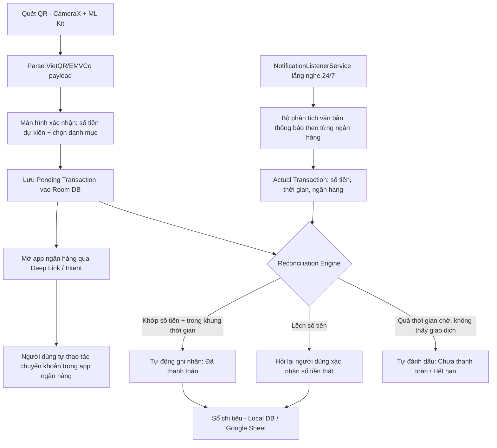

# Thiết kế kỹ thuật: App Android — Quét QR thanh toán & tự động đối soát chi tiêu

## 1. Mục tiêu

Xây dựng một ứng dụng Android cá nhân (không cần đăng Google Play) cho phép:

1. Quét mã QR thanh toán (chuẩn VietQR/Napas247).
2. Người dùng chọn danh mục chi tiêu ngay tại thời điểm quét.
3. Mở app ngân hàng tương ứng để người dùng tự thực hiện chuyển khoản.
4. **Tự động phát hiện giao dịch thật** đã xảy ra (qua thông báo ngân hàng), đối chiếu với khoản dự kiến, và tự ghi nhận vào sổ chi tiêu — kể cả khi số tiền thực trả khác với số tiền trên QR hoặc người dùng không thanh toán.

Cách tiếp cận: dùng `NotificationListenerService` của Android để đọc thông báo push từ app ngân hàng/ví — đây là nguồn dữ liệu "sự thật" (ground truth), không phụ thuộc vào việc người dùng có khai đúng hay không.

---

## 2. Kiến trúc tổng thể



---

## 3. Các thành phần chi tiết

### 3.1. Module quét & giải mã QR

- **Công nghệ:** CameraX (androidx.camera) + ML Kit Barcode Scanning (`com.google.mlkit:barcode-scanning`) để quét realtime, độ chính xác cao, chạy on-device (không cần mạng).
- **Parsing dữ liệu VietQR:** Mã QR VietQR tuân theo chuẩn EMVCo QR Code (định dạng TLV — Tag-Length-Value), tương tự chuẩn NAPAS 247. Cần viết bộ parser TLV để tách các trường:
  - Tag `38`: thông tin merchant (chứa BIN ngân hàng, số tài khoản thụ hưởng — sub-tag theo chuẩn NAPAS).
  - Tag `54`: số tiền giao dịch (nếu QR có cố định số tiền).
  - Tag `62`: nội dung chuyển khoản / mã tham chiếu.
  - Tag `63`: CRC checksum (nên verify để tránh QR lỗi).
- Có thể tham khảo các thư viện mã nguồn mở EMVCo QR parser (Java/Kotlin) có sẵn trên GitHub thay vì viết từ đầu, để giảm rủi ro parse sai.
- Lưu ý: không phải QR nào cũng có sẵn số tiền — nhiều QR chỉ có số tài khoản, người dùng tự nhập số tiền trong app ngân hàng. App cần xử lý cả 2 trường hợp (có/không có số tiền cố định).

### 3.2. Màn hình xác nhận & chọn danh mục

- UI đơn giản hiện ra ngay sau khi quét: tên ngân hàng, số tài khoản thụ hưởng, số tiền (nếu có), ô chọn danh mục chi tiêu (dropdown/chip: Ăn uống, Di chuyển, Mua sắm...).
- Cho phép người dùng sửa số tiền dự kiến nếu QR không có sẵn (trường hợp họ định trả bao nhiêu).

### 3.3. Lưu "Pending Transaction"

- **Room Database** (SQLite wrapper chính thức của Android) — bảng `pending_transactions`:

| Trường | Kiểu | Ghi chú |
|---|---|---|
| id | UUID | khóa chính |
| bank_bin | String | mã BIN ngân hàng thụ hưởng |
| expected_amount | Long | số tiền dự kiến (VNĐ) |
| category | String | danh mục người dùng chọn |
| created_at | Timestamp | thời điểm quét QR |
| status | Enum | PENDING / MATCHED / MISMATCH / EXPIRED |
| timeout_minutes | Int | mặc định 15–30 phút chờ đối soát |

### 3.4. Mở app ngân hàng

- Dùng **VietQR Deeplink API** (`https://api.vietqr.io/v2/android-app-deeplinks`) để tra cứu scheme/package tương ứng với từng BIN ngân hàng, sau đó gọi `Intent` với `ACTION_VIEW` hoặc `startActivity` trực tiếp vào package ngân hàng.
- **Giới hạn cần biết:** deep link chỉ mở được app, không tự điền số tài khoản/số tiền (giới hạn từ phía app ngân hàng). Có 2 lựa chọn:
  - (a) Chấp nhận người dùng tự nhập tay trong app ngân hàng.
  - (b) Dùng workaround: tạo ảnh QR ngay trên máy rồi gọi `Intent.ACTION_SEND` (share ảnh) để người dùng chọn "mở bằng app ngân hàng" hoặc lưu ảnh rồi vào app ngân hàng chọn "Quét QR từ thư viện ảnh" — cách này giúp app ngân hàng tự điền đủ vì đọc trực tiếp từ ảnh QR gốc.

### 3.5. NotificationListenerService — trái tim của cơ chế đối soát

- Kế thừa `android.service.notification.NotificationListenerService`, khai báo trong `AndroidManifest.xml` với quyền `BIND_NOTIFICATION_LISTENER_SERVICE`.
- Người dùng cần cấp quyền thủ công 1 lần trong **Settings → Apps → Special access → Notification access** (Android không cho cấp quyền này qua runtime permission dialog thông thường).
- Override `onNotificationPosted(StatusBarNotification sbn)`:
  - Lọc theo `sbn.getPackageName()` — chỉ xử lý thông báo từ package của các app ngân hàng/ví đã cài (VD: `com.VCB`, `com.mbmobile`, `vn.momo.platform`...).
  - Lấy nội dung: `sbn.getNotification().extras.getCharSequence(Notification.EXTRA_TEXT)` và `EXTRA_TITLE`.
- **Bộ phân tích văn bản (Parser theo từng ngân hàng):** Mỗi ngân hàng có định dạng thông báo khác nhau và **có thể thay đổi theo thời gian**, nên cần thiết kế dạng cấu hình (config-driven), không hard-code:
  - Lưu một bảng `bank_notification_patterns` chứa regex mẫu cho từng `package_name`, ví dụ dạng tổng quát: bắt cụm số tiền (số + "đ"/"VND"), từ khóa "GD:", "-", "trừ", "TK...", thời gian giao dịch nếu có trong nội dung.
  - Vì định dạng thực tế thay đổi theo từng bản cập nhật app ngân hàng, nên xây cơ chế cho phép cập nhật pattern từ xa (VD: load file JSON regex từ Google Sheet/Firebase Remote Config) thay vì phải build lại app mỗi lần ngân hàng đổi mẫu tin.
- Lưu kết quả vào bảng `actual_transactions`: package_name, amount_detected, raw_text, detected_at.

### 3.6. Reconciliation Engine (bộ đối soát)

Chạy dưới dạng `WorkManager` định kỳ (VD mỗi 1 phút) hoặc trigger ngay khi có `actual_transaction` mới:

```
for each pending_transaction (status = PENDING):
    tìm actual_transaction có:
        - cùng bank_bin (map package_name -> BIN)
        - detected_at nằm trong [created_at, created_at + timeout_minutes]
        - chưa được gán cho pending_transaction nào khác
    nếu tìm thấy:
        nếu amount_detected == expected_amount (hoặc lệch trong ngưỡng sai số nhỏ):
            status = MATCHED -> ghi vào sổ chi tiêu với expected_amount
        nếu lệch:
            status = MISMATCH -> đẩy notification hỏi người dùng xác nhận số tiền thật (amount_detected), người dùng bấm xác nhận -> ghi vào sổ với amount_detected
    nếu quá timeout_minutes mà không tìm thấy:
        status = EXPIRED -> hỏi người dùng "Bạn đã không thanh toán giao dịch này?" hoặc để họ tự đóng
```

- Ghép đôi ưu tiên theo: cùng ngân hàng → gần thời gian nhất → số tiền gần khớp nhất (trường hợp có nhiều giao dịch dự kiến cùng lúc).

### 3.7. Lưu sổ chi tiêu

- Local: Room DB bảng `expenses` (amount, category, matched_status, timestamp).
- Tùy chọn đồng bộ ngoài: Google Sheets API (dễ triển khai bằng Apps Script Web App nhận POST JSON) hoặc Notion API — để xem báo cáo trên nhiều thiết bị.

---

## 4. Quyền (Permissions) cần khai báo

| Quyền | Mục đích |
|---|---|
| `CAMERA` | quét QR |
| `BIND_NOTIFICATION_LISTENER_SERVICE` | đọc thông báo ngân hàng |
| `QUERY_ALL_PACKAGES` hoặc khai báo `<queries>` cụ thể | kiểm tra app ngân hàng nào đã cài để mở deep link đúng |
| `INTERNET` | gọi VietQR API tra cứu deep link, đồng bộ pattern từ xa (nếu có) |
| `POST_NOTIFICATIONS` (Android 13+) | app tự gửi thông báo hỏi xác nhận khi MISMATCH |

---

## 5. Rủi ro & hạn chế cần lường trước

- **Google Play Console không duyệt** app công khai xin quyền đọc Notification/SMS cho mục đích tài chính cá nhân trừ khi giải trình rõ và đáp ứng chính sách nghiêm ngặt — vì đây là app tự dùng cá nhân, nên cài trực tiếp qua APK (sideload), không cần đăng Store.
- **Định dạng thông báo ngân hàng thay đổi** khi họ update app → parser có thể "gãy" bất kỳ lúc nào. Bắt buộc thiết kế theo hướng cấu hình từ xa (mục 3.5) và có cơ chế log lại thông báo chưa parse được để tự cập nhật pattern.
- **Một số ngân hàng gửi thông báo dạng ảnh/rút gọn** (không đủ số tiền trong text) → cần fallback: nếu không parse được số tiền, vẫn ghi nhận "có giao dịch xảy ra vào thời điểm X" để người dùng tự xác nhận thủ công.
- **Không hoạt động khi thanh toán bằng ví điện tử khác cơ chế thông báo** (ví dụ thanh toán qua NFC/thẻ) — phạm vi ban đầu nên giới hạn ở chuyển khoản ngân hàng qua QR.
- **Bảo mật dữ liệu:** nội dung thông báo ngân hàng có thể chứa số dư, số tài khoản một phần — nên mã hóa dữ liệu lưu trong Room DB (SQLCipher) nếu định chia sẻ hoặc sao lưu lên cloud.

---

## 6. Lộ trình triển khai đề xuất (MVP → mở rộng)

1. **MVP:** quét QR (không parse sâu) → chọn danh mục → lưu pending → mở app ngân hàng qua deep link cơ bản (chỉ 3–5 ngân hàng phổ biến bạn hay dùng).
2. **V2:** thêm NotificationListenerService, parser cho đúng các ngân hàng bạn dùng, reconciliation engine đối soát tự động.
3. **V3:** thêm cơ chế cập nhật pattern từ xa, đồng bộ Google Sheets, thống kê báo cáo theo danh mục/tháng.
4. **V4 (tùy chọn):** thêm cơ chế OCR đọc màn hình xác nhận giao dịch trong app ngân hàng làm phương án dự phòng khi notification không đủ thông tin.

---

## 7. Ngăn xếp công nghệ tóm tắt

- **Ngôn ngữ:** Kotlin (khuyến nghị cho Android hiện đại).
- **UI:** Jetpack Compose.
- **Quét QR:** CameraX + ML Kit Barcode Scanning.
- **Parse VietQR:** custom EMVCo TLV parser (Kotlin).
- **DB local:** Room (SQLite).
- **Nền chạy đối soát:** WorkManager.
- **Lắng nghe thông báo:** NotificationListenerService.
- **API bên ngoài:** VietQR Deeplink API (tra cứu app ngân hàng theo BIN), tùy chọn Google Sheets API / Notion API để đồng bộ sổ chi tiêu.
- **Phân phối:** sideload APK cá nhân (không qua Play Store) do dùng quyền nhạy cảm.
